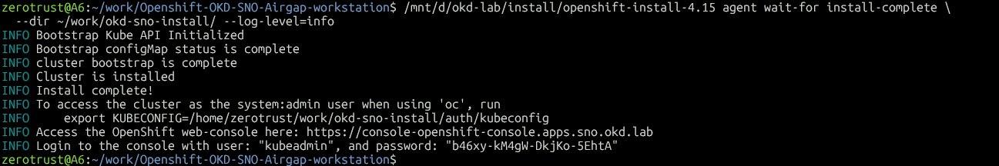
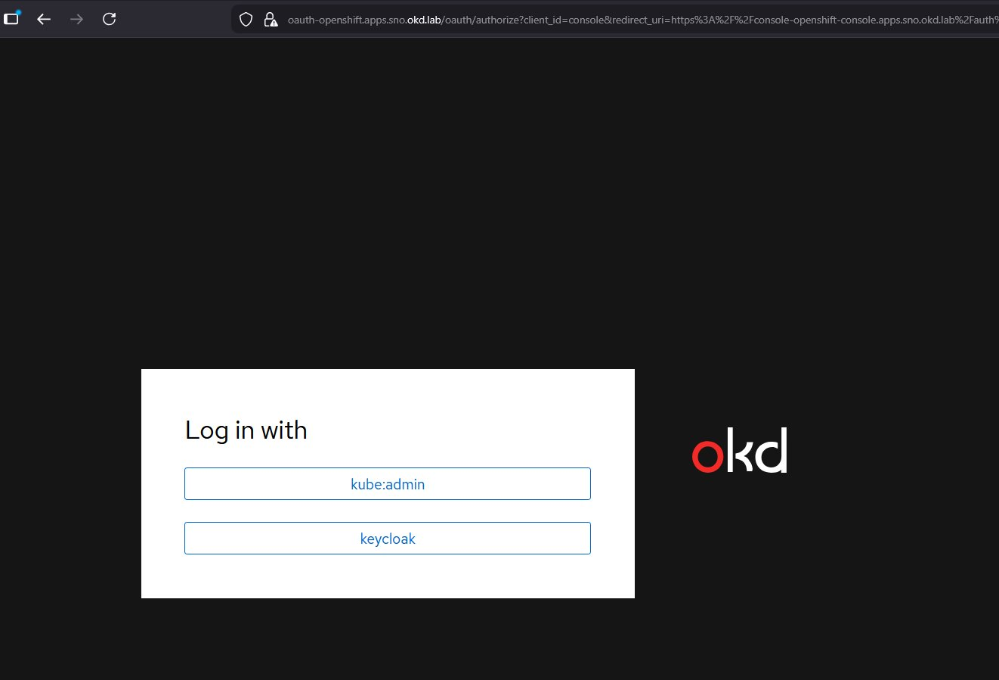
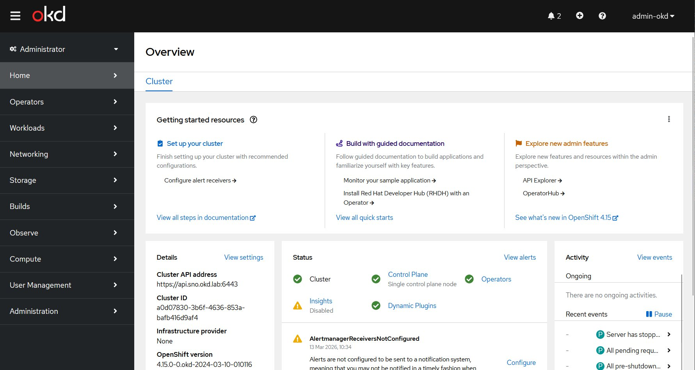

# OKD Single Node OpenShift — Airgap Lab on VMware Workstation

> **Portfolio project** — Demonstrates end-to-end OpenShift/OKD expertise for on-premise, airgap, and IaC-driven enterprise deployments.

[](https://www.okd.io/)
[](https://argoproj.github.io/cd/)
[](https://www.vaultproject.io/)
[](https://goharbor.io/)
[](https://www.keycloak.org/)
[](LICENSE)

---

## 🎯 Objectives

This lab provisions a **fully airgap-capable Single Node OpenShift (SNO)** cluster on VMware Workstation using the **Agent-based Installer** (UPI, no vCenter API required).

The project covers the full stack required for **enterprise Kubernetes/OpenShift missions** (on-premise, grands comptes, défense, telecom) :

| Domain | Tools |
|--------|-------|
| Cluster provisioning | OKD 4.15, Agent-based Installer, FCOS |
| Load Balancing | HAProxy (API + Ingress) |
| Airgap | `oc-mirror`, mirror-registry, Harbor, ImageContentSourcePolicy |
| Operator lifecycle | OperatorHub (airgap mode), CatalogSource, OLM |
| Container registry | Harbor (images OCI + Helm OCI + Trivy CVE scan + Cosign signing) |
| Identity & SSO | Keycloak 26.5.5, OAuth Server OKD → Keycloak OIDC |
| GitOps | ArgoCD (OpenShift GitOps Operator), ApplicationSets |
| Secrets management | HashiCorp Vault, Vault Agent Injector |
| CI/CD | GitLab CI, Kaniko, GitLab Runners |
| Container security | Trivy (Harbor), Grype, Syft, Checkov, Falco |
| Image signing | Cosign + Kyverno policy enforcement |
| Policy enforcement | Kyverno |
| Storage | MinIO (S3-compatible CSI) |
| Observability | Prometheus, Grafana, Loki |

---

## 🏗️ Architecture

```
  Browser / oc CLI
        │
        ▼
┌───────────────────────────────────────────────────────────┐
│                  Windows Host (GEEKOM A6)                  │
│                                                           │
│  ┌────────────────────────────────────────────────────┐   │
│  │                  Ubuntu WSL2                       │   │
│  │                                                    │   │
│  │  /etc/hosts       HAProxy         oc-mirror        │   │
│  │  *.okd.lab   :6443 (API)     (pre-airgap mirror)   │   │
│  │  → .10       :22623 (MCS)                          │   │
│  │              :80/:443                              │   │
│  └───────────────────┬────────────────────────────────┘   │
│                      │ VMnet8 NAT (192.168.241.0/24)       │
│  ┌───────────────────▼────────────────────────────────┐   │
│  │           OKD SNO VM — 192.168.241.10              │   │
│  │         FCOS │ vCPU: 8 │ RAM: 24G │ Disk: 120G    │   │
│  │                                                    │   │
│  │   ┌──────────────────────────────────────────┐    │   │
│  │   │       OpenShift Ingress Controller        │    │   │
│  │   └──┬───────┬───────┬───────┬───────┬────────┘   │   │
│  │      ▼       ▼       ▼       ▼       ▼            │   │
│  │   console  argocd  vault  keycloak  harbor        │   │
│  │   .apps.*  .apps.* .apps.* .apps.*  .apps.*        │   │
│  │                                                    │   │
│  │  ┌─────────────────────────────────────────────┐  │   │
│  │  │  Keycloak (IDP OIDC)                        │  │   │
│  │  │  ├── Realm okd                              │  │   │
│  │  │  ├── Client openshift (OKD SSO)             │  │   │
│  │  │  ├── Client argocd                          │  │   │
│  │  │  └── Client vault                           │  │   │
│  │  └─────────────────────────────────────────────┘  │   │
│  │                                                    │   │
│  │  ┌─────────────────────────────────────────────┐  │   │
│  │  │  Harbor VM — 192.168.241.20                 │  │   │
│  │  │  ├── Images OCI (toutes les images cluster) │  │   │
│  │  │  ├── Helm charts OCI (source ArgoCD)        │  │   │
│  │  │  ├── Trivy → scan CVE auto à chaque push    │  │   │
│  │  │  └── Cosign → signing + vérification        │  │   │
│  │  └─────────────────────────────────────────────┘  │   │
│  │                                                    │   │
│  │  ┌──────────────┐  ┌────────────────────────────┐ │   │
│  │  │   GitLab     │  │   ArgoCD                   │ │   │
│  │  │  (source of  │◄─┤  Git source → GitLab ✅    │ │   │
│  │  │   truth Git) │  │  Helm source → Harbor ✅   │ │   │
│  │  └──────────────┘  └────────────────────────────┘ │   │
│  │                                                    │   │
│  │  ┌──────────┐ ┌─────────┐ ┌──────────────────┐    │   │
│  │  │  Kyverno │ │  Falco  │ │   Prometheus      │    │   │
│  │  │ (verify  │ │(runtime │ │   + Grafana       │    │   │
│  │  │  Cosign) │ │security)│ │   + Loki          │    │   │
│  │  └──────────┘ └─────────┘ └──────────────────┘    │   │
│  └────────────────────────────────────────────────────┘   │
└───────────────────────────────────────────────────────────┘
```

**Flux airgap (Phase 3+) :**
1. `*.apps.sno.okd.lab` → `/etc/hosts` résout vers `192.168.241.10`
2. VM sans accès Internet — VMnet1 Host-only
3. ArgoCD → source Git depuis `gitlab.apps.sno.okd.lab`
4. ArgoCD → Helm charts depuis `harbor.apps.sno.okd.lab` (OCI)
5. Tout pull d'image → `harbor.apps.sno.okd.lab` (ICSP redirige docker.io, quay.io...)
6. Chaque push Harbor → scan Trivy automatique + vérification Cosign via Kyverno

---

## 📋 Prerequisites

### Host (Windows + WSL2 Ubuntu)
- VMware Workstation Pro 17+
- RAM : 32 Go minimum (24 Go alloués à la VM SNO)
- Disk : 120 Go disponibles sur D:\
- `openshift-install` binary (OKD 4.15.0-0.okd-2024-03-10-010116)
- `oc` CLI + `oc-mirror` plugin
- HAProxy (load balancer — API + Ingress)

### ⚠️ Notes spécifiques VMware Workstation + WSL2

| Problème | Solution retenue |
|----------|-----------------|
| IP VM aléatoire à chaque boot | Réservation DHCP dans `C:\ProgramData\VMware\vmnetdhcp.conf` |
| `nmstatectl` cassé dans WSL2 | Ne pas utiliser `networkConfig` dans `agent-config.yaml` |
| DNS `*.okd.lab` non résolu | `/etc/hosts` (plus robuste que dnsmasq avec Tailscale) |
| Bug socket PostgreSQL dans assisted-service-db | Script wrapper Podman avec `--tmpfs /var/run/postgresql` |
| Certificats kubelet expirés après reboot | Script `scripts/okd-approve-csr.sh` |

### DNS entries (`/etc/hosts` WSL2 + Windows)

```
192.168.241.10  api.sno.okd.lab api-int.sno.okd.lab
192.168.241.10  console-openshift-console.apps.sno.okd.lab
192.168.241.10  oauth-openshift.apps.sno.okd.lab
192.168.241.10  keycloak.apps.sno.okd.lab
192.168.241.10  harbor.apps.sno.okd.lab
192.168.241.10  gitlab.apps.sno.okd.lab
192.168.241.10  argocd.apps.sno.okd.lab
192.168.241.10  vault.apps.sno.okd.lab
192.168.241.20  harbor.okd.lab
```

---

## 🚀 Phases du projet

### Phase 1 — SNO Bootstrap ✅ COMPLETE
> Provisionner le cluster OKD SNO via Agent-based Installer

- [x] Génération `install-config.yaml` + `agent-config.yaml`
- [x] Réservation DHCP VMware (`vmnetdhcp.conf`) — IP statique sans nmstate
- [x] Configuration DNS via `/etc/hosts`
- [x] Création de l'ISO avec `openshift-install agent create image`
- [x] Création VM VMware Workstation (UEFI, vmxnet3, 8vCPU/24GB/120GB)
- [x] Fix PostgreSQL container (assisted-service-db — socket `/var/run/postgresql`)
- [x] Boot ISO + bootstrap cluster
- [x] Validation cluster (`oc get nodes`, console web, 30/30 COs)


*`INFO Install complete!` — Cluster OKD SNO 4.15 FCOS opérationnel sur `192.168.241.10` ✅*

→ [Guide d'installation complet](docs/phase1-bootstrap.md)

---

### Phase Harbor — Registry VM ✅ COMPLETE
> Harbor 2.11.0 sur VM dédiée avec MinIO S3 backend

- [x] VM Ubuntu 24.04 (4vCPU / 8GB RAM / 100GB) — IP statique `192.168.241.20`
- [x] Docker 29.3.0 + Docker Compose v5.1.0
- [x] MinIO standalone — bucket `harbor-registry`
- [x] Certificats TLS auto-signés (CA Z3ROX Lab, SAN `harbor.okd.lab`)
- [x] Harbor 2.11.0 — 11/11 containers healthy
- [x] Trivy scan CVE automatique (validé : 6 CVEs alpine:3.19)
- [x] Cosign v2.2.4 — image signée et vérifiée ✅

→ [Guide Harbor VM](docs/harbor-vm-installation-guide.md)

---

### Phase 2 — Identity, SSO & Secrets 🔄 IN PROGRESS

#### Phase 2a — Keycloak OIDC ✅ COMPLETE
> SSO unifié OKD via Keycloak 26.5.5

- [x] Keycloak Operator 26.5.5 installé via OperatorHub (channel fast, namespace keycloak)
- [x] Instance Keycloak déployée avec wildcard cert `*.apps.sno.okd.lab`
- [x] Realm `okd` créé
- [x] Client OIDC `openshift` configuré (Standard flow, redirect URIs, client secret)
- [x] OAuth CR OKD → Keycloak OIDC (fix CA x509 via ConfigMap `keycloak-ca`)
- [x] Utilisateur `admin-okd` créé + droits `cluster-admin`
- [x] SSO validé — login console OKD via Keycloak ✅


*Page login OKD — bouton "keycloak" aux côtés de "kube:admin"*


*Console OKD — `admin-okd` connecté via SSO Keycloak ✅*

→ [Guide Phase 2a — Keycloak OIDC](docs/phase2a-keycloak-oidc.md)

#### Phase 2b — HashiCorp Vault 🔜
- [ ] Déploiement Vault via OperatorHub
- [ ] Vault Agent Injector + auth Kubernetes
- [ ] Intégration secrets Keycloak + ArgoCD

#### Phase 2c — CI/CD GitLab + Kaniko 🔜
- [ ] GitLab Runner sur OKD (Kubernetes executor)
- [ ] Pipeline Kaniko (build images sans Docker daemon)
- [ ] Intégration Trivy + Grype + Syft dans la CI
- [ ] ArgoCD sync depuis GitLab

---

### Phase 3 — Airgap Simulation 🔜
> Reproduire un environnement déconnecté grands comptes (défense, banque, télécom)

- [ ] `oc-mirror` : OKD + Harbor images + community-operator-index
- [ ] mirror-registry WSL2 (Quay, bootstrap temporaire)
- [ ] Désactivation CatalogSources + CatalogSource mirror
- [ ] Coupure réseau VM (VMnet8 → VMnet1)
- [ ] Migration images mirror-registry → Harbor
- [ ] ICSP : redirection docker.io / quay.io → Harbor
- [ ] Cosign signing + Kyverno policy enforce
- [ ] ArgoCD airgap (Git → GitLab interne, Helm → Harbor OCI)

→ [Documentation Phase 3](docs/phase3-airgap.md)

---

### Phase 4 — Security & Scanning 🔜
> Kyverno, Falco, supply chain security

- [ ] Kyverno policies enforce + vérification signatures Cosign
- [ ] Falco runtime security rules
- [ ] Checkov dans les pipelines GitLab
- [ ] SBOM generation avec Syft

→ [Documentation Phase 4](docs/phase4-security.md)

---

### Phase 5 — Portfolio & Demo 🔜
> Documentation, screenshots, vidéo démo

- [ ] Architecture diagrams
- [ ] Demo script
- [ ] Vidéo walkthrough

→ [Documentation Phase 5](docs/phase5-demo.md)

---

## 📁 Repository Structure

```
.
├── install/
│   ├── install-config.yaml             # Config cluster
│   └── agent-config.yaml               # Interface ens160, MAC statique
├── scripts/
│   ├── fix-assisted-db.sh              # Fix bug PostgreSQL socket OKD 4.15
│   └── okd-approve-csr.sh             # Approbation CSR kubelet après reboot
├── manifests/
│   └── keycloak/
│       ├── 01-tls-secret.sh            # Copie wildcard cert + CA configmap
│       ├── 02-keycloak-instance.yaml   # CR Keycloak instance
│       ├── 03-client-secret.yaml       # Placeholder secret client
│       └── 04-oauth-cluster.yaml       # OAuth CR OKD → Keycloak OIDC
├── haproxy/
│   ├── haproxy.cfg
│   └── haproxy-setup.md
├── airgap/
│   └── imagesets/
│       └── okd-4.15-imageset.yaml
├── harbor/
│   └── cosign-policy.yaml
├── gitops/
│   ├── argocd/
│   └── applications/
├── vault/
├── ci-cd/
│   ├── gitlab/
│   ├── kaniko/
│   └── scanners/
├── security/
│   ├── kyverno/
│   └── falco/
└── docs/
    ├── phase1-bootstrap.md             ✅
    ├── harbor-vm-installation-guide.md ✅
    ├── phase2a-keycloak-oidc.md        ✅
    ├── phase3-airgap.md
    ├── phase4-security.md
    ├── phase5-demo.md
    └── screenshots/
```

---

## ⚠️ Post-reboot checklist

Après chaque redémarrage de la VM OKD SNO :

```bash
export KUBECONFIG=~/work/okd-sno-install/auth/kubeconfig

# 1. Approuver les CSR kubelet expirés
./scripts/okd-approve-csr.sh

# 2. Vérifier le cluster
oc get nodes
oc get co | grep -v "True.*False.*False"

# 3. Recréer le secret TLS Keycloak si nécessaire
./manifests/keycloak/01-tls-secret.sh
```

---

## 🔧 Key Lessons Learned

| Problème | Cause | Solution |
|----------|-------|----------|
| `AttributeError: 'NoneType' ...SettingBond` | nmstatectl absent dans WSL2 | Supprimer `networkConfig` de agent-config.yaml |
| Interface `ens33` introuvable | vmxnet3 génère `ens160` | Utiliser `ens160` |
| IP VM aléatoire | Pas de réservation DHCP VMware | Ajouter entrée dans `vmnetdhcp.conf` |
| `assisted-service-db` crash | Bug socket `/var/run/postgresql` | `--tmpfs /var/run/postgresql:rw,mode=0777` |
| dnsmasq conflits Tailscale | Port 53 partagé | `/etc/hosts` |
| OKD 4.17 SCOS bloqué sur VMware | `release-image-pivot` ne peut pas remount `/sysroot` | **Utiliser OKD 4.15 FCOS** |
| Certificats kubelet expirés après reboot | Cluster éteint > 24h | `scripts/okd-approve-csr.sh` |
| Router pod Pending après reboot | Certificats kubelet expirés → hostPort bloqué | Approuver CSRs + restart kubelet |
| OAuth CO Degraded : x509 unknown authority | Keycloak self-signed cert non reconnu | ConfigMap `keycloak-ca` dans `openshift-config` |

---

## 🎓 Skills Demonstrated

- ✅ OpenShift UPI deployment (`platform: none`, Agent-based Installer)
- ✅ FCOS (Fedora CoreOS) bare-metal provisioning via Ignition
- ✅ Airgap cluster operations (`oc-mirror`, disconnected OperatorHub, ICSP)
- ✅ Harbor 2.11.0 : registry OCI + MinIO S3 backend + Trivy CVE scan + Cosign signing
- ✅ Supply chain security (Cosign + Kyverno enforce)
- ✅ SSO with Keycloak 26.5.5 — OAuth Server OKD → Keycloak OIDC (realm okd, x509 CA fix)
- ✅ GitOps airgap : ArgoCD + GitLab interne + Harbor OCI Helm
- ✅ Secrets management with HashiCorp Vault
- ✅ Container image build with Kaniko (daemonless)
- ✅ Runtime security with Falco
- ✅ Policy enforcement with Kyverno
- ✅ CSI storage with MinIO

---

## 👤 Author

**Z3ROX** — Lead SecOps / Cloud Security Architect  
CCSP | AWS Solutions Architect | ISO 27001 Lead Implementer  
[GitHub](https://github.com/Z3ROX-lab) | [LinkedIn](#)

---

## 📄 License

MIT — see [LICENSE](LICENSE)
