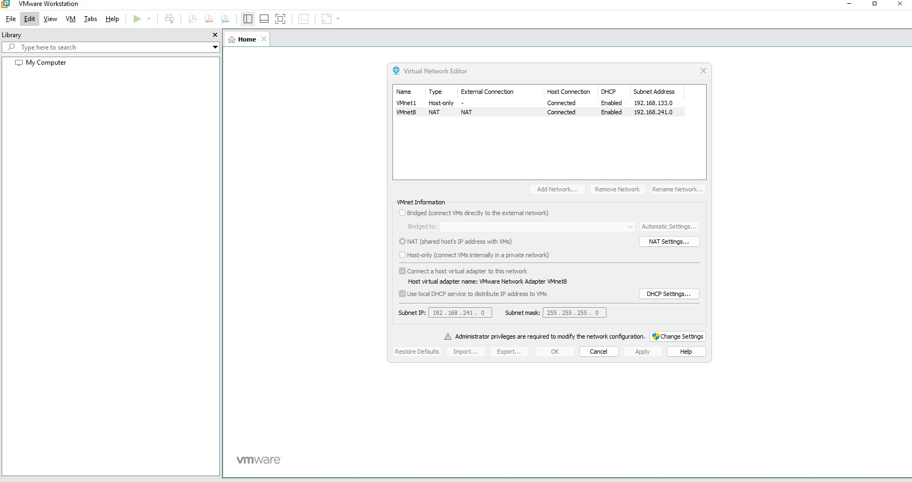

# Guide d'Installation — OKD SNO sur VMware Workstation

> Guide pas-à-pas avec captures d'écran — Phase 1 Bootstrap
> Version 2.0 — Corrections issues de l'installation réelle

---

## Table des matières

1. [Prérequis](#1-prérequis)
2. [Configuration VMware Workstation — VMnet8](#2-configuration-vmware-workstation--vmnet8)
3. [Réservation IP DHCP VMware](#3-réservation-ip-dhcp-vmware)
4. [Configuration WSL2 — MTU Fix](#4-configuration-wsl2--mtu-fix)
5. [Téléchargement des binaires OKD](#5-téléchargement-des-binaires-okd)
6. [Génération de la clé SSH](#6-génération-de-la-clé-ssh)
7. [Configuration DNS — /etc/hosts](#7-configuration-dns--etchosts)
8. [Préparation des fichiers d'installation](#8-préparation-des-fichiers-dinstallation)
9. [Création de la VM VMware](#9-création-de-la-vm-vmware)
10. [Génération de l'ISO Agent-based](#10-génération-de-liso-agent-based)
11. [Boot et installation](#11-boot-et-installation)
12. [Fix PostgreSQL — Assisted Service DB](#12-fix-postgresql--assisted-service-db)
13. [Validation du cluster](#13-validation-du-cluster)

---

## 1. Prérequis

### Hôte Windows (GEEKOM A6)
- VMware Workstation Pro 17+
- Ubuntu WSL2
- RAM disponible : 32 Go (24 Go alloués à la VM SNO)
- Espace disque D: : 528 Go disponibles

### Informations réseau

| Paramètre | Valeur |
|-----------|--------|
| Subnet VMnet8 | `192.168.241.0/24` |
| Gateway VMnet8 | `192.168.241.2` |
| IP nœud SNO | `192.168.241.10` (réservée DHCP VMware) |
| MAC VM | `00:50:56:27:c8:0b` |
| Interface VM | `ens160` |

> ⚠️ **Tailscale** : si Tailscale est installé sur WSL2, il peut écraser `/etc/resolv.conf`. La solution retenue ici (section 7) utilise `/etc/hosts` — aucune configuration Tailscale requise.

---

## 2. Configuration VMware Workstation — VMnet8

VMnet8 est le réseau NAT de VMware Workstation. La VM OKD SNO sera connectée à ce réseau, qui est également accessible depuis WSL2.

### Vérification du subnet VMnet8

**VMware Workstation → Edit → Virtual Network Editor → VMnet8**



*VMnet8 configuré en mode NAT avec le subnet `192.168.241.0/24`*

### Points importants

- **Type** : NAT — la VM partage l'IP de l'hôte Windows pour accéder à Internet
- **Subnet** : `192.168.241.0/24`
- **Gateway** : `192.168.241.2` — adresse standard VMware NAT (toujours `.2`)
- **DHCP** : activé, mais on utilise une **réservation d'IP statique** (section 3)

---

## 3. Réservation IP DHCP VMware

> ⚠️ **Critique** : Sans cette réservation, la VM reçoit une IP aléatoire à chaque reboot (ex: `.134` au lieu de `.10`). OKD détecte alors qu'elle n'est pas le `rendezvousHost` et ne démarre pas les services d'installation.

### Pourquoi ne pas utiliser networkConfig dans agent-config.yaml ?

L'approche `networkConfig` (nmstate) nécessite `nmstatectl`, qui requiert NetworkManager. NetworkManager n'est pas disponible dans WSL2. La commande `openshift-install agent create image` échoue avec :

```
AttributeError: 'NoneType' object has no attribute 'SettingBond'
```

La solution propre est de configurer l'IP statique **côté VMware** via une réservation DHCP.

### Procédure

Depuis PowerShell Windows (administrateur) :

```powershell
notepad "C:\ProgramData\VMware\vmnetdhcp.conf"
```

Ajouter ces lignes **avant le dernier `# End`** :

```
host okd-sno-master {
    hardware ethernet 00:50:56:27:c8:0b;
    fixed-address 192.168.241.10;
}
```

Le fichier doit terminer ainsi :

```
host VMnet8 {
    hardware ethernet 00:50:56:C0:00:08;
    fixed-address 192.168.241.1;
    option domain-name-servers 0.0.0.0;
    option domain-name "";
    option routers 0.0.0.0;
}
host okd-sno-master {
    hardware ethernet 00:50:56:27:c8:0b;
    fixed-address 192.168.241.10;
}
# End
```

Puis redémarrer le service DHCP VMware :

```powershell
Restart-Service VMnetDHCP
```

> **Note** : Cette réservation est spécifique à la MAC `00:50:56:27:c8:0b`. D'autres VMs avec d'autres MACs continuent de recevoir des IPs normalement. Aucun impact sur les autres projets VMware.

---

## 4. Configuration WSL2 — MTU Fix

### Le problème

WSL2 utilise un MTU de 1360 par défaut. Ce MTU trop élevé provoque des erreurs TLS sur les gros téléchargements :

```
error:0A000119:SSL routines::decryption failed or bad record mac
```

### La solution

```bash
# Réduire le MTU
sudo ip link set eth0 mtu 1280

# Vérifier
cat /sys/class/net/eth0/mtu
# → 1280
```

> Le script `scripts/setup-dns-okd.sh` applique ce fix automatiquement.

---

## 5. Téléchargement des binaires OKD

### Binaires requis

| Binaire | Rôle | Utilisé quand |
|---------|------|---------------|
| `openshift-install` | Génère l'ISO + surveille l'installation | Pendant le bootstrap |
| `oc` | CLI pour piloter le cluster | Après installation |

### Méthode — PowerShell Windows (recommandé)

Le téléchargement via PowerShell contourne les problèmes TLS de WSL2 car il utilise directement le stack réseau Windows.

```powershell
$OKD_VERSION = "4.17.0-okd-scos.0"
$BASE = "https://github.com/okd-project/okd/releases/download/$OKD_VERSION"

Invoke-WebRequest "$BASE/openshift-client-linux-$OKD_VERSION.tar.gz" `
  -OutFile "D:\okd-lab\install\openshift-client-linux-$OKD_VERSION.tar.gz"

Invoke-WebRequest "$BASE/openshift-install-linux-$OKD_VERSION.tar.gz" `
  -OutFile "D:\okd-lab\install\openshift-install-linux-$OKD_VERSION.tar.gz"
```

### Extraction et installation depuis WSL2

```bash
cd /mnt/d/okd-lab/install
OKD_VERSION=4.17.0-okd-scos.0

tar xvf openshift-client-linux-${OKD_VERSION}.tar.gz
tar xvf openshift-install-linux-${OKD_VERSION}.tar.gz
sudo mv oc kubectl openshift-install /usr/local/bin/

# Vérification
openshift-install version
# openshift-install 4.17.0-okd-scos.0

oc version
# Client Version: 4.17.0-okd-scos.0
```

---

## 6. Génération de la clé SSH

SCOS (CentOS Stream CoreOS) est un OS **immuable** — la seule façon d'accéder au nœud est via SSH avec une clé publique, injectée au boot via Ignition.

```bash
ssh-keygen -t ed25519 -C "okd-sno-lab" -f ~/.ssh/okd-sno -N ""

# Afficher la clé publique (à copier dans install-config.yaml)
cat ~/.ssh/okd-sno.pub
```

---

## 7. Configuration DNS — /etc/hosts

### Pourquoi /etc/hosts plutôt que dnsmasq ?

| Approche | Complexité | Tailscale | WSL2 |
|----------|-----------|-----------|------|
| dnsmasq | Élevée — conflits port 53, forwarding, NM | Problèmes de coexistence | Fragile |
| `/etc/hosts` | Minimale | Aucun impact | Permanent et robuste |

`/etc/hosts` a toujours la priorité sur le DNS, Tailscale ne le touche jamais.

### Configuration

```bash
sudo tee -a /etc/hosts << 'EOF'
192.168.241.10 api.sno.okd.lab api-int.sno.okd.lab console-openshift-console.apps.sno.okd.lab oauth-openshift.apps.sno.okd.lab
EOF
```

### Validation

```bash
# nslookup ne lit PAS /etc/hosts — utiliser ping
ping -c1 api.sno.okd.lab
# PING api.sno.okd.lab (192.168.241.10) ✅
```

> ⚠️ `nslookup` et `dig` bypassent `/etc/hosts`. Seul `ping`, `curl`, et les navigateurs le respectent.

### Nettoyage en fin de projet

Pour supprimer les entrées OKD de `/etc/hosts` :

```bash
sudo sed -i '/okd\.lab/d' /etc/hosts
```

---

## 8. Préparation des fichiers d'installation

### Structure des répertoires

```bash
mkdir -p ~/work/okd-sno-install
mkdir -p /mnt/d/okd-lab/{install,mirror,vm}
```

### install-config.yaml

```yaml
apiVersion: v1
baseDomain: okd.lab
metadata:
  name: sno
compute:
  - architecture: amd64
    hyperthreading: Enabled
    name: worker
    replicas: 0                          # SNO: no workers
controlPlane:
  architecture: amd64
  hyperthreading: Enabled
  name: master
  replicas: 1                            # SNO: single master
networking:
  clusterNetwork:
    - cidr: 10.128.0.0/14
      hostPrefix: 23
  machineNetwork:
    - cidr: 192.168.241.0/24             # VMnet8 NAT subnet
  networkType: OVNKubernetes
  serviceNetwork:
    - 172.30.0.0/16
platform:
  none: {}
pullSecret: '{"auths":{"fake":{"auth":"aGVsbG86d29ybGQ="}}}'
sshKey: |
  ssh-ed25519 AAAAC3NzaC1lZDI1NTE5AAAAIMfYWQYhU/AfkK5U+URfW5Huvg4BeZUKlnKZSlYW7VqW okd-sno-lab
```

### agent-config.yaml

> ⚠️ **Pas de `networkConfig`** — nmstate ne fonctionne pas dans WSL2. L'IP statique est gérée par la réservation DHCP VMware (section 3).

```yaml
apiVersion: v1alpha1
kind: AgentConfig
metadata:
  name: sno
rendezvousIP: 192.168.241.10
hosts:
  - hostname: sno-master
    role: master
    interfaces:
      - name: ens160
        macAddress: "00:50:56:27:c8:0b"
```

> ⚠️ L'interface s'appelle **`ens160`** (vmxnet3), et non `ens33` comme dans les guides génériques VMware.

---

## 9. Création de la VM VMware Workstation

### Specs

| Paramètre | Valeur | Raison |
|-----------|--------|--------|
| Guest OS | CentOS 8 64-bit | SCOS = CentOS Stream CoreOS |
| vCPU | 8 | Minimum OKD SNO |
| RAM | 24 576 MB | Confort + etcd |
| Disk | 120 Go | NVMe sur D:\ |
| Réseau | NAT (VMnet8) | Même subnet que WSL2 |
| Firmware | UEFI | SCOS ne supporte pas BIOS legacy |
| Secure Boot | ❌ Désactivé | Kernel OKD non signé |
| Network Adapter | vmxnet3 | Interface `ens160` dans SCOS |

### ⚠️ Paramètres critiques

**1. UEFI + Secure Boot OFF**

```
VM Settings → Options → Advanced → Firmware type
→ UEFI ✅
→ Enable secure boot : décoché ✅
```

**2. Boot order — forcer le boot sur CD**

Éditer le fichier VMX depuis PowerShell :

```powershell
notepad "D:\okd-lab\vm\okd-sno-master.vmx"
```

Ajouter après `firmware = "efi"` :

```
bios.bootOrder = "cdrom,hdd"
```

Supprimer le fichier nvram pour reset UEFI :

```powershell
Remove-Item "D:\okd-lab\vm\okd-sno-master.nvram" -ErrorAction SilentlyContinue
```

**3. Récupérer la MAC address**

```
VM Settings → Network Adapter → Advanced → MAC Address
→ Copier la valeur (ex: 00:50:56:27:C8:0B)
```


*VM Settings — vérifier MAC address, UEFI, et CD/DVD*

---

## 10. Génération de l'ISO Agent-based

### Copier les configs dans le répertoire de travail

```bash
mkdir -p ~/work/okd-sno-install

# IMPORTANT : openshift-install consomme et supprime ces fichiers !
# Toujours travailler depuis des copies, garder les originaux dans le repo
cp ~/work/Openshift-OKD-SNO-Airgap-workstation/install/install-config.yaml ~/work/okd-sno-install/
cp ~/work/Openshift-OKD-SNO-Airgap-workstation/install/agent-config.yaml ~/work/okd-sno-install/
```

### Générer l'ISO

```bash
openshift-install agent create image \
  --dir ~/work/okd-sno-install/ --log-level=info
```


*Génération ISO réussie — noter "The rendezvous host IP is 192.168.241.10"*

### Résultat attendu

```
WARNING Release Image Architecture not detected    ← Normal pour OKD
INFO The rendezvous host IP (node0 IP) is 192.168.241.10
INFO Extracting base ISO from release payload
INFO Using cached base ISO                         ← Cache utilisé si déjà téléchargé
INFO Generated ISO at ~/work/okd-sno-install/agent.x86_64.iso
```

### Copier l'ISO vers Windows

```bash
cp ~/work/okd-sno-install/agent.x86_64.iso /mnt/d/okd-lab/install/
```

### Monter l'ISO dans VMware

```
VM Settings → CD/DVD (IDE)
→ Use ISO image file : D:\okd-lab\install\agent.x86_64.iso
→ Connect at power on : ✅
```


*CD/DVD pointant sur le nouvel ISO*

---

## 11. Boot et installation

### Démarrer la VM

Power On la VM. Sur la console VMware, attendre le message :

```
This host (192.168.241.10) is the rendezvous host.
```


*La VM a bien obtenu l'IP 192.168.241.10 et se reconnaît comme rendezvous host*

> ⚠️ Si la console affiche **"This host is not the rendezvous host"** avec une IP différente de `.10`, la réservation DHCP VMware n'a pas pris effet — vérifier la section 3.

### Nettoyer known_hosts SSH (si reboot VM)

```bash
ssh-keygen -f '/home/zerotrust/.ssh/known_hosts' -R '192.168.241.10'
```

### Surveiller l'installation depuis WSL2

```bash
openshift-install agent wait-for install-complete \
  --dir ~/work/okd-sno-install/ --log-level=info
```

### Timeline attendue

| Temps | Étape | Message wait-for |
|-------|-------|-----------------|
| 0-5 min | Boot SCOS | `Cluster is not ready` |
| 5-10 min | NTP sync | `Host NTP is synced` |
| 10-15 min | Validation host | `Host is ready to be installed` |
| 15-20 min | Préparation | `preparing-for-installation` |
| 20-30 min | Bootstrap | `Installing: bootstrap` |
| 30-60 min | Installation OS | `Installing: write image to disk` |
| 60-90 min | Cluster Operators | `Bootstrap is complete` |
| 90-120 min | Finalisation | `Install complete!` |


*Installation en cours — "Cluster installation in progress"*

### ⚠️ Validation NTP

Au démarrage, l'hôte peut momentanément échouer la validation NTP :

```
WARNING Host sno-master validation: Host couldn't synchronize with any NTP server
```

Si le message persiste plus de 5 minutes, forcer la synchro :

```bash
ssh -i ~/.ssh/okd-sno core@192.168.241.10 \
  "sudo chronyc makestep"
```

---

## 12. Fix PostgreSQL — Assisted Service DB

> ⚠️ **Bug connu** dans OKD 4.17 SNO sur VMware : le container PostgreSQL (`assisted-service-db`) échoue au démarrage car le répertoire `/var/run/postgresql/` n'existe pas dans le container, empêchant la création du socket de verrouillage.

Ce fix est **automatiquement appliqué** si tu utilises le script `scripts/fix-assisted-db.sh`. Il est nécessaire si les services ne démarrent pas automatiquement après un reboot de l'ISO.

### Symptôme

```
assisted-service: failed to connect to DB, error: dial tcp 127.0.0.1:5432: connect: connection refused
assisted-service-db: pg_ctl: could not start server
PostgreSQL FATAL: could not create lock file "/var/run/postgresql/.s.PGSQL.5432.lock": No such file or directory
```

### Fix — Script wrapper Podman

```bash
ssh -i ~/.ssh/okd-sno core@192.168.241.10 << 'ENDSSH'
# Script wrapper qui ajoute --tmpfs /var/run/postgresql
sudo tee /usr/local/bin/start_db_wrapper.sh > /dev/null << 'EOF'
#!/bin/bash
source /usr/local/share/assisted-service/agent-images.env
exec /usr/bin/podman run --net host --user=postgres \
  --cidfile=$1 --cgroups=no-conmon --log-driver=journald \
  --rm --pod-id-file=$2 \
  --sdnotify=conmon --replace -d --name=assisted-db \
  --env-file=/usr/local/share/assisted-service/assisted-db.env \
  --tmpfs /var/run/postgresql:rw,mode=0777 \
  ${SERVICE_IMAGE} /bin/bash start_db.sh
EOF
sudo chmod +x /usr/local/bin/start_db_wrapper.sh

# Drop-in systemd
sudo mkdir -p /etc/systemd/system/assisted-service-db.service.d/
sudo tee /etc/systemd/system/assisted-service-db.service.d/fix-initdb.conf > /dev/null << 'EOF'
[Service]
ExecStartPre=
ExecStartPre=/bin/rm -f %t/%n.ctr-id
ExecStart=
ExecStart=/usr/local/bin/start_db_wrapper.sh %t/%n.ctr-id %t/assisted-service-pod.pod-id
EOF

sudo systemctl daemon-reload
sudo systemctl restart assisted-service-db
ENDSSH
```

### Vérification

```bash
ssh -i ~/.ssh/okd-sno core@192.168.241.10 \
  "sudo systemctl status assisted-service-pod assisted-service-db assisted-service --no-pager | grep Active"
# Active: active (running) ✅ pour les 3 services
```

### Re-enregistrement du cluster

Après correction de la DB :

```bash
ssh -i ~/.ssh/okd-sno core@192.168.241.10 \
  "sudo systemctl start agent-register-cluster && sleep 10 && \
   sudo systemctl start agent-register-infraenv && sleep 5 && \
   sudo systemctl restart agent"
```

---

## 13. Validation du cluster

### Message de succès

```
INFO Install complete!
INFO To access the cluster as the system:admin user:
     export KUBECONFIG=~/work/okd-sno-install/auth/kubeconfig
INFO Access the OpenShift web-console here:
     https://console-openshift-console.apps.sno.okd.lab
INFO Login to the console with user: "kubeadmin"
     password: xxxxx-xxxxx-xxxxx-xxxxx
```

### Commandes de validation

```bash
export KUBECONFIG=~/work/okd-sno-install/auth/kubeconfig

# État du nœud
oc get nodes
# NAME         STATUS   ROLES                         AGE   VERSION
# sno-master   Ready    control-plane,master,worker   1h    v1.30.x

# Version cluster
oc get clusterversion
# AVAILABLE=True  PROGRESSING=False

# Cluster Operators (~30, tous Available)
oc get co

# Pods en erreur (doit être vide)
oc get pods -A | grep -v Running | grep -v Completed

# Accès SSH
ssh -i ~/.ssh/okd-sno core@192.168.241.10
```

### Accès console web

```
URL      : https://console-openshift-console.apps.sno.okd.lab
User     : kubeadmin
Password : cat ~/work/okd-sno-install/auth/kubeadmin-password
```

> ⚠️ Ajouter `console-openshift-console.apps.sno.okd.lab` dans `/etc/hosts` Windows (`C:\Windows\System32\drivers\etc\hosts`) pour accéder depuis le navigateur Windows.

---

## Récapitulatif des fichiers

```
Repo :  ~/work/Openshift-OKD-SNO-Airgap-workstation/
├── install/
│   ├── install-config.yaml      # config cluster (originaux — ne pas supprimer)
│   └── agent-config.yaml        # config nœud (originaux — ne pas supprimer)
├── scripts/
│   ├── setup-dns-okd.sh         # (legacy — remplacé par /etc/hosts)
│   ├── restore-dns-default.sh   # (legacy — restauration WSL2)
│   └── fix-assisted-db.sh       # fix PostgreSQL container

VMware :  D:\okd-lab\
├── install\
│   └── agent.x86_64.iso         # ISO générée par openshift-install
└── vm\
    └── okd-sno-master\          # fichiers VMware (.vmdk, .vmx)

WSL2 :  ~/work/okd-sno-install/  # répertoire de travail (copie)
├── agent.x86_64.iso
└── auth/
    ├── kubeconfig               # credentials admin
    └── kubeadmin-password       # mot de passe console

SSH :  ~/.ssh/
├── okd-sno                      # clé privée
└── okd-sno.pub                  # clé publique (dans install-config.yaml)
```

---

## Problèmes connus et solutions

| Problème | Cause | Solution |
|----------|-------|----------|
| IP VM change à chaque reboot | Pas de réservation DHCP | Section 3 — vmnetdhcp.conf |
| `nmstatectl` crash à la génération ISO | NetworkManager absent dans WSL2 | Ne pas utiliser `networkConfig` dans agent-config.yaml |
| `assisted-service-db` fail au boot | Bug socket PostgreSQL dans container | Section 12 — script wrapper |
| `nslookup api.sno.okd.lab` échoue | Normal — nslookup bypass /etc/hosts | Utiliser `ping` pour valider |
| SSH "host key changed" après reboot | Nouvelle clé SCOS à chaque boot ISO | `ssh-keygen -R 192.168.241.10` |
| "This host is not the rendezvous host" | IP DHCP différente de rendezvousIP | Vérifier vmnetdhcp.conf + Restart-Service VMnetDHCP |

---

## Prochaine étape

→ [Phase 2 — Keycloak SSO + HashiCorp Vault](phase2-identity-sso-secrets.md)

---

*Projet `Z3ROX-lab/Openshift-OKD-SNO-Airgap-workstation`*
*Version 2.0 — Mars 2026*
