# Harbor Registry — VM Dédiée Ubuntu 24.04

> Installation Harbor 2.11 + MinIO (S3) + Trivy + Cosign sur VM VMware
> Version 1.1 — Mars 2026

---

## Architecture

```
                    Z3ROX Lab CA (ca.crt)
                    ┌─────────────────┐
                    │  ca.key         │  ← secret, reste sur harbor-vm
                    │  ca.crt         │  ← distribué à tout le monde
                    └────────┬────────┘
                             │ signe
                    ┌────────▼────────┐
                    │ harbor.okd.lab  │
                    │  .crt + .key    │
                    └────────┬────────┘
                             │ utilisé par
          ┌──────────────────▼──────────────────────────┐
          │           harbor-vm  192.168.241.20          │
          │                                             │
          │   Harbor :443 ◄──── MinIO :9000 (S3)        │
          │   (registry)         (stockage blobs)       │
          │   + Trivy (scan CVE auto au push)           │
          │   + Cosign (stocke signatures OCI)          │
          └───────────────┬─────────────────────────────┘
                          │
              VMnet8 NAT 192.168.241.0/24
                          │
          ┌───────────────▼─────────────────────────────┐
          │   Clients qui font confiance à ca.crt       │
          │                                             │
          │  WSL2 / Docker Desktop                      │
          │  insecure-registries (lab)                  │
          │                                             │
          │  OKD SNO .10                                │
          │  ConfigMap openshift-config                 │
          │  + Kyverno (vérifie signatures Cosign)      │
          │                                             │
          │  Windows (navigateur console Harbor)        │
          │  Import CA → Trusted Root                   │
          └─────────────────────────────────────────────┘
```

**Flux d'une image signée :**
```
  Dev / GitLab CI
    │
    ├─ docker push harbor.okd.lab/project/image:tag
    │       └─► Harbor reçoit → stocke dans MinIO → Trivy scanne auto
    │
    ├─ cosign sign --key cosign.key harbor.okd.lab/project/image:tag
    │       └─► signature OCI attachée à l'image dans Harbor
    │           colonne "Signed" = ✅
    │
    └─ OKD deploy image
            └─► Kyverno policy vérifie cosign.pub avant deploy ✅
```

---

## Table des matières

1. [VM VMware — Specs](#1-vm-vmware--specs)
2. [Ubuntu 24.04 — Post-install](#2-ubuntu-2404--post-install)
3. [LVM — Étendre le disque](#3-lvm--étendre-le-disque)
4. [Docker + Docker Compose](#4-docker--docker-compose)
5. [MinIO — Backend S3](#5-minio--backend-s3)
6. [Certificats TLS — Pourquoi et comment](#6-certificats-tls--pourquoi-et-comment)
7. [Harbor — Téléchargement](#7-harbor--téléchargement)
8. [Harbor — Configuration harbor.yml](#8-harbor--configuration-harboryml)
9. [Harbor — Démarrage](#9-harbor--démarrage)
10. [Validation — Health + Push + Trivy](#10-validation--health--push--trivy)
11. [Cosign — Signature d'images](#11-cosign--signature-dimages)
12. [Distribution de la CA](#12-distribution-de-la-ca)

---

## 1. VM VMware — Specs

| Paramètre | Valeur |
|-----------|--------|
| Guest OS | Ubuntu 64-bit |
| VM Name | `harbor-vm` |
| Location | `D:\okd-lab\vm\harbor-vm\` |
| vCPU | 4 |
| RAM | 8 192 MB |
| Disk | 100 Go thin — NVMe |
| Réseau | VMnet8 NAT |
| Adaptateur | e1000 (ens33) |
| Firmware | UEFI |
| MAC | `00:50:56:34:a0:cb` |
| IP | `192.168.241.20` (statique via Netplan) |

### Réservation DHCP VMware

`C:\ProgramData\VMware\vmnetdhcp.conf` :

```
host harbor-vm {
    hardware ethernet 00:50:56:34:a0:cb;
    fixed-address 192.168.241.20;
}
```

> ⚠️ L'IP statique a été configurée via Netplan pendant l'install Ubuntu. L'adaptateur e1000 génère `ens33` et non `ens160` — sans impact fonctionnel pour Ubuntu.

---

## 2. Ubuntu 24.04 — Post-install

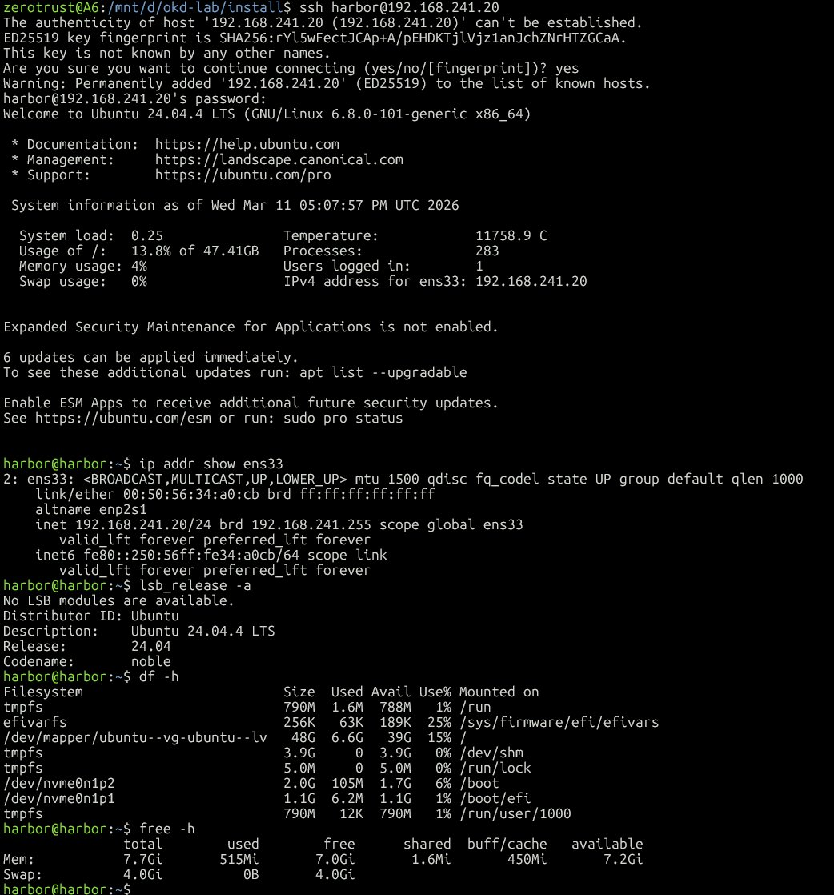

```
OS      : Ubuntu 24.04.4 LTS (Noble Numbat)
Kernel  : 6.8.0-101-generic x86_64
IP      : 192.168.241.20/24 sur ens33
RAM     : 7.7 Gi total, 7.2 Gi disponible
Swap    : 4 Gi
```

---

## 3. LVM — Étendre le disque

Ubuntu 24.04 LVM alloue ~50% du disque par défaut. Étendre à 100% :

```bash
sudo lvextend -l +100%FREE /dev/mapper/ubuntu--vg-ubuntu--lv
sudo resize2fs /dev/mapper/ubuntu--vg-ubuntu--lv
df -h /
# → 96G disponibles ✅
```

---

## 4. Docker + Docker Compose

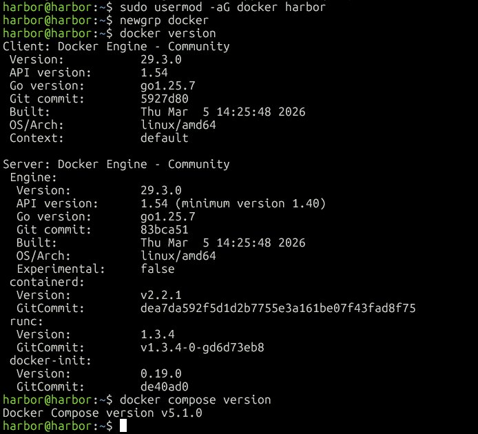

```bash
sudo apt install -y ca-certificates curl gnupg
sudo install -m 0755 -d /etc/apt/keyrings
curl -fsSL https://download.docker.com/linux/ubuntu/gpg | \
  sudo gpg --dearmor -o /etc/apt/keyrings/docker.gpg
sudo chmod a+r /etc/apt/keyrings/docker.gpg

echo \
  "deb [arch=$(dpkg --print-architecture) signed-by=/etc/apt/keyrings/docker.gpg] \
  https://download.docker.com/linux/ubuntu \
  $(. /etc/os-release && echo "$VERSION_CODENAME") stable" | \
  sudo tee /etc/apt/sources.list.d/docker.list > /dev/null

sudo apt update
sudo apt install -y docker-ce docker-ce-cli containerd.io docker-compose-plugin
sudo usermod -aG docker harbor
newgrp docker
```

**Versions installées :**
- Docker Engine : `29.3.0`
- Docker Compose : `v5.1.0`

---

## 5. MinIO — Backend S3

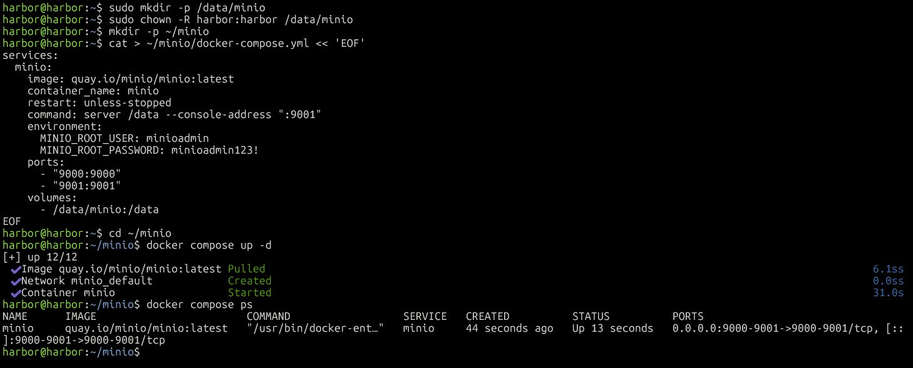

Harbor stocke les blobs d'images dans MinIO (compatible S3). MinIO doit être démarré **avant** Harbor.

```bash
sudo mkdir -p /data/minio
sudo chown -R harbor:harbor /data/minio
mkdir -p ~/minio

cat > ~/minio/docker-compose.yml << 'EOF'
services:
  minio:
    image: quay.io/minio/minio:latest
    container_name: minio
    restart: unless-stopped
    command: server /data --console-address ":9001"
    environment:
      MINIO_ROOT_USER: minioadmin
      MINIO_ROOT_PASSWORD: minioadmin123!
    ports:
      - "9000:9000"
      - "9001:9001"
    volumes:
      - /data/minio:/data
EOF

cd ~/minio && docker compose up -d
```

### Créer le bucket Harbor

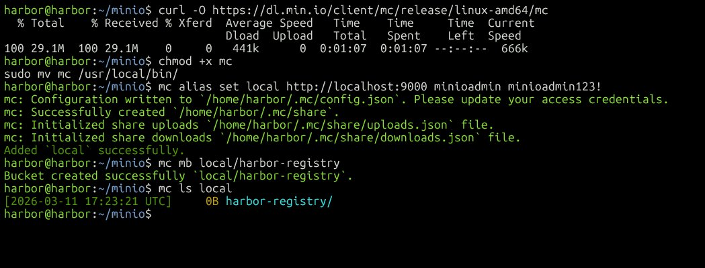

```bash
curl -O https://dl.min.io/client/mc/release/linux-amd64/mc
chmod +x mc && sudo mv mc /usr/local/bin/

mc alias set local http://localhost:9000 minioadmin minioadmin123!
mc mb local/harbor-registry
mc ls local
# → [2026-03-11 17:23:21 UTC]   0B harbor-registry/ ✅
```

> 💡 Console MinIO : `http://192.168.241.20:9001` — `minioadmin` / `minioadmin123!`

---

## 6. Certificats TLS — Pourquoi et comment

### Pourquoi des certificats ?

Harbor expose son registry en **HTTPS obligatoire**. Tout client (Docker, OKD, Cosign) vérifie que le certificat TLS est signé par une CA de confiance.

On ne peut pas utiliser Let's Encrypt sur un réseau local → on crée une **CA privée Z3ROX Lab** et on la distribue à tous les clients.

### Les fichiers générés

| Fichier | Rôle | À distribuer ? |
|---------|------|----------------|
| `ca.key` | Clé privée CA | ❌ Jamais — reste sur harbor-vm |
| `ca.crt` | Certificat CA | ✅ À tous les clients |
| `harbor.okd.lab.key` | Clé privée Harbor | ❌ Reste sur harbor-vm |
| `harbor.okd.lab.crt` | Certificat Harbor signé | Utilisé par Harbor |

### Génération

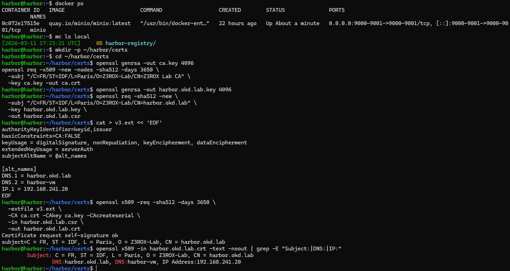

```bash
mkdir -p ~/harbor/certs && cd ~/harbor/certs

# CA
openssl genrsa -out ca.key 4096
openssl req -x509 -new -nodes -sha512 -days 3650 \
  -subj "/C=FR/ST=IDF/L=Paris/O=Z3ROX-Lab/CN=Z3ROX Lab CA" \
  -key ca.key -out ca.crt

# Clé Harbor
openssl genrsa -out harbor.okd.lab.key 4096

# CSR
openssl req -sha512 -new \
  -subj "/C=FR/ST=IDF/L=Paris/O=Z3ROX-Lab/CN=harbor.okd.lab" \
  -key harbor.okd.lab.key \
  -out harbor.okd.lab.csr

# SAN (Subject Alternative Names)
cat > v3.ext << 'EOF'
authorityKeyIdentifier=keyid,issuer
basicConstraints=CA:FALSE
keyUsage = digitalSignature, nonRepudiation, keyEncipherment, dataEncipherment
extendedKeyUsage = serverAuth
subjectAltName = @alt_names

[alt_names]
DNS.1 = harbor.okd.lab
DNS.2 = harbor-vm
IP.1 = 192.168.241.20
EOF

# Signer
openssl x509 -req -sha512 -days 3650 \
  -extfile v3.ext \
  -CA ca.crt -CAkey ca.key -CAcreateserial \
  -in harbor.okd.lab.csr \
  -out harbor.okd.lab.crt
```

**Vérification :**
```
Subject: CN=harbor.okd.lab, O=Z3ROX-Lab, L=Paris, ST=IDF, C=FR
DNS: harbor.okd.lab, DNS: harbor-vm, IP: 192.168.241.20 ✅
```

### Copier le cert pour Docker sur harbor-vm

```bash
sudo mkdir -p /etc/docker/certs.d/harbor.okd.lab
sudo cp ~/harbor/certs/harbor.okd.lab.crt \
        /etc/docker/certs.d/harbor.okd.lab/ca.crt
```

---

## 7. Harbor — Téléchargement

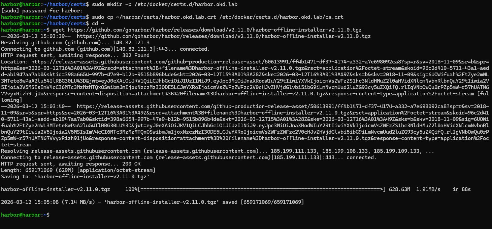

```bash
cd ~
wget https://github.com/goharbor/harbor/releases/download/v2.11.0/harbor-offline-installer-v2.11.0.tgz
tar xzvf harbor-offline-installer-v2.11.0.tgz
```

**Harbor 2.11.0** — 629 Mo ✅

---

## 8. Harbor — Configuration harbor.yml

```bash
cd ~/harbor
cp harbor.yml.tmpl harbor.yml
```

Sections modifiées :

```yaml
hostname: harbor.okd.lab

https:
  port: 443
  certificate: /home/harbor/harbor/certs/harbor.okd.lab.crt
  private_key: /home/harbor/harbor/certs/harbor.okd.lab.key

harbor_admin_password: Harbor12345!

data_volume: /data/harbor

storage_service:
  s3:
    accesskey: minioadmin
    secretkey: minioadmin123!
    region: us-east-1
    regionendpoint: http://192.168.241.20:9000
    bucket: harbor-registry
    secure: false
    v4auth: true
    chunksize: 5242880
    rootdirectory: /
  redirect:
    disable: true
```

```bash
sudo mkdir -p /data/harbor
sudo chown -R harbor:harbor /data/harbor
```

---

## 9. Harbor — Démarrage

```bash
cd ~/harbor
sudo ./prepare --with-trivy
sudo ./install.sh --with-trivy
```

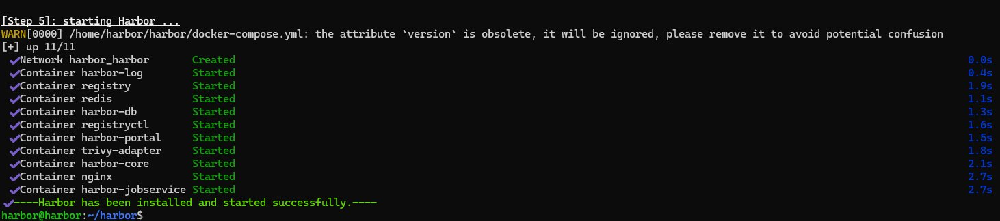

```
[+] up 11/11
✔ Container harbor-log        Started
✔ Container registry          Started
✔ Container redis             Started
✔ Container harbor-db         Started
✔ Container registryctl       Started
✔ Container harbor-portal     Started
✔ Container trivy-adapter     Started
✔ Container harbor-core       Started
✔ Container nginx             Started
✔ Container harbor-jobservice Started
✔ ----Harbor has been installed and started successfully.----
```

---

## 10. Validation — Health + Push + Trivy

### Health check

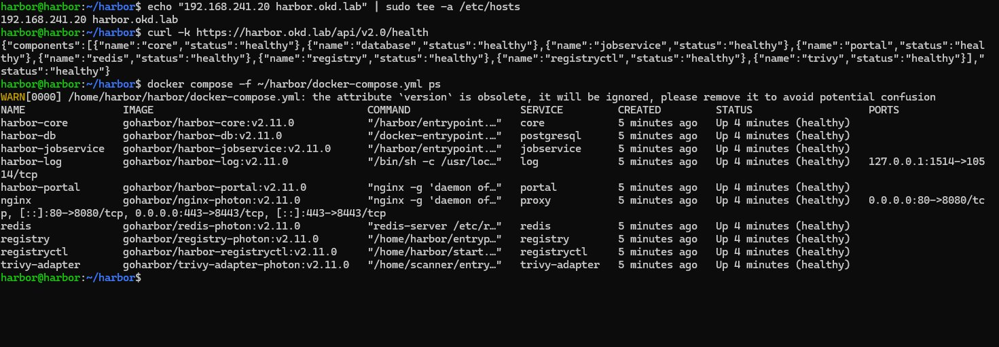

```bash
echo "192.168.241.20 harbor.okd.lab" | sudo tee -a /etc/hosts
curl -k https://harbor.okd.lab/api/v2.0/health
# → {"status":"healthy"} — tous composants healthy ✅

docker compose -f ~/harbor/docker-compose.yml ps
# → 11/11 containers Up (healthy) ✅
```

### Console Web

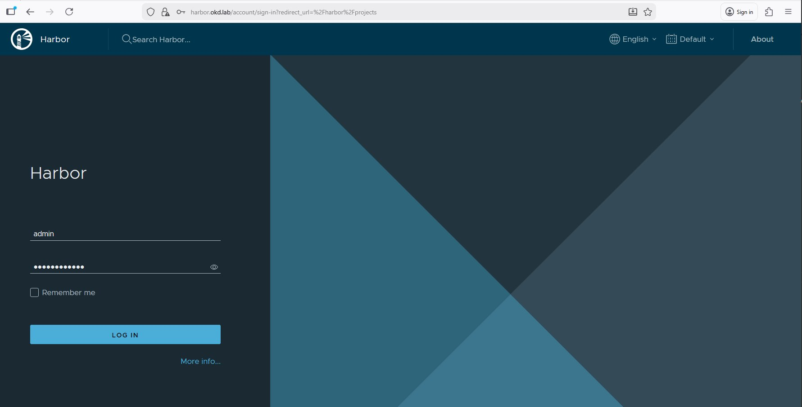

```
URL   : https://harbor.okd.lab
User  : admin
Pass  : Harbor12345!
```

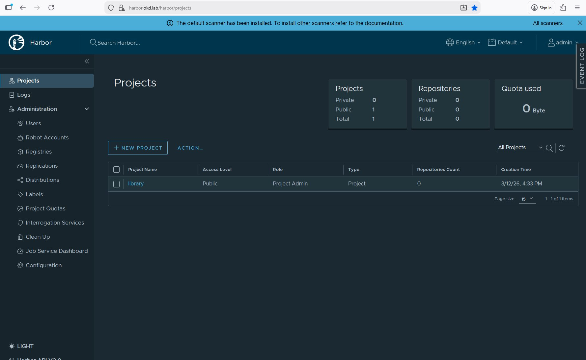

### Push image test

**Prérequis Docker Desktop Windows :**

```
Docker Desktop → Settings → Docker Engine
→ Ajouter : "insecure-registries": ["harbor.okd.lab"]
→ Apply & Restart
```

> ⚠️ Known limitation lab : Docker Desktop n'utilise pas `/etc/docker/certs.d/` WSL2
> ni le store Windows pour les self-signed certs. `insecure-registries` est le workaround.
> En production : certificat signé par une CA reconnue ou Let's Encrypt.

```powershell
Add-Content "C:\Windows\System32\drivers\etc\hosts" "192.168.241.20 harbor.okd.lab"

docker login harbor.okd.lab -u admin -p Harbor12345!
# → Login Succeeded ✅

docker pull alpine:3.19
docker tag alpine:3.19 harbor.okd.lab/library/alpine:3.19
docker push harbor.okd.lab/library/alpine:3.19
```

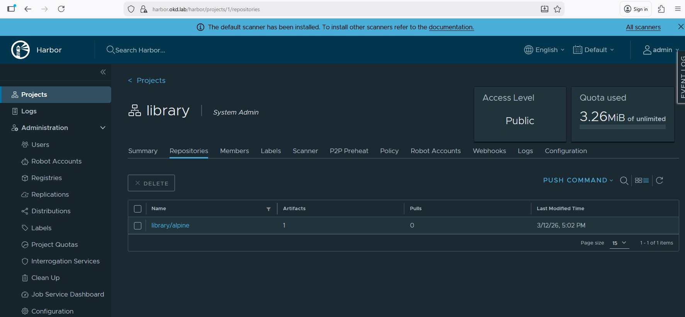

### Trivy — Scan CVE automatique

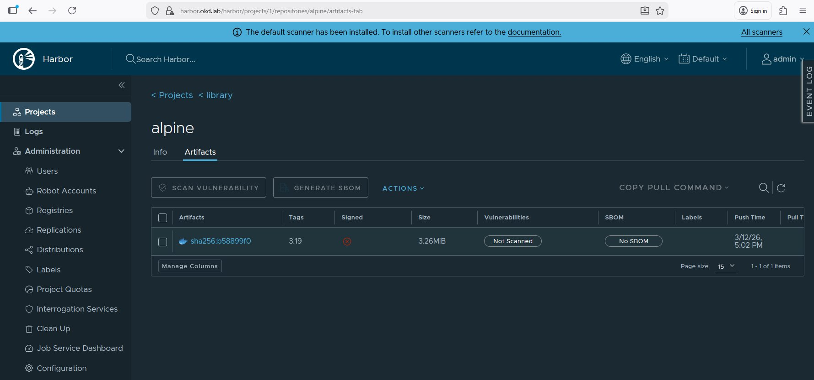

Au push, l'image apparaît d'abord avec le statut **Not Scanned**. Cliquer sur **Scan Vulnerability** pour déclencher manuellement, ou attendre le scan automatique.

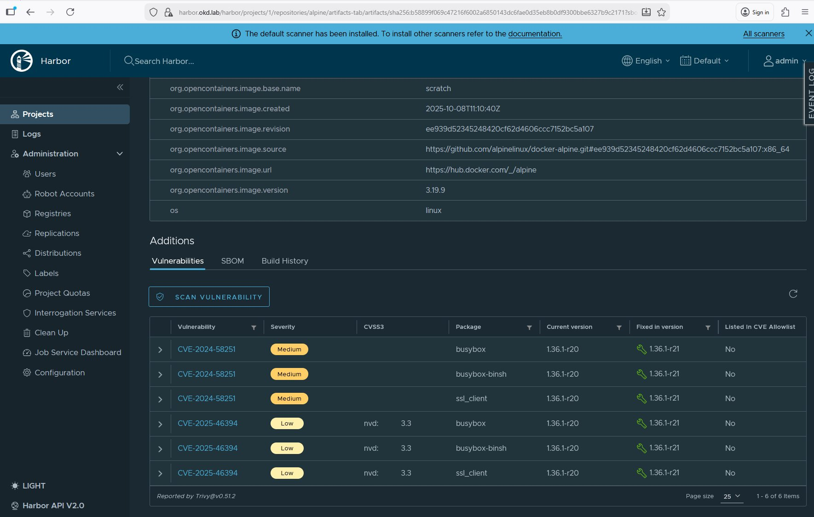

Harbor scanne automatiquement les images au push via Trivy.
Résultats sur `alpine:3.19` : **6 CVEs** détectés (3x Medium busybox, 3x Low), tous fixables.
Reporté par `Trivy v0.51.2`.

---

## 11. Cosign — Signature d'images

### Concept

```
Harbor (serveur)          Cosign CLI (client)
├── Affiche "Signed" ✅   └── Signe les images → à installer
├── Stocke signatures OCI    sur la machine qui signe
└── Vérifie au pull          (harbor-vm pour le lab,
                              image Docker dans GitLab CI)
```

### Installation

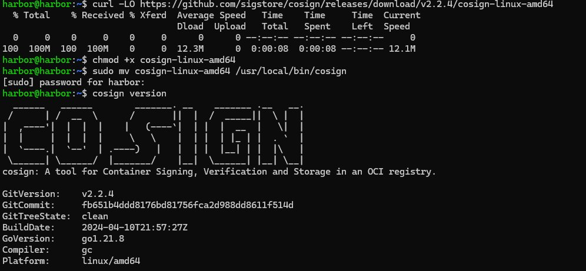

```bash
curl -LO https://github.com/sigstore/cosign/releases/download/v2.2.4/cosign-linux-amd64
chmod +x cosign-linux-amd64
sudo mv cosign-linux-amd64 /usr/local/bin/cosign
cosign version
# → v2.2.4 ✅
```

### Générer la paire de clés

```bash
cd ~/harbor
cosign generate-key-pair
# → cosign.key  (privée — protégée par mot de passe → COSIGN_PASSWORD)
# → cosign.pub  (publique — à distribuer à Kyverno OKD)
```

### Signer une image

```bash
docker login harbor.okd.lab -u admin -p Harbor12345!

cosign sign --key ~/harbor/cosign.key \
  --allow-insecure-registry \
  harbor.okd.lab/library/alpine:3.19
```

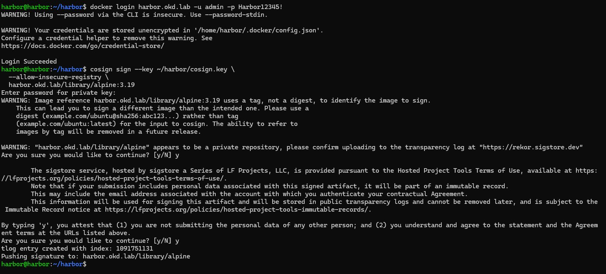

```
tlog entry created with index: 1091751131
Pushing signature to: harbor.okd.lab/library/alpine ✅
```

### Vérifier la signature

```bash
cosign verify --key ~/harbor/cosign.pub \
  --allow-insecure-registry \
  harbor.okd.lab/library/alpine:3.19 | jq .
```

### Résultat dans Harbor

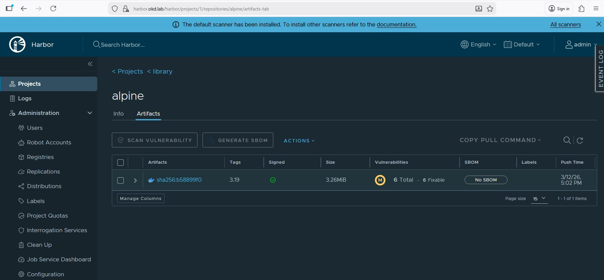

```
Signed         : ✅ (cercle vert)
Vulnerabilities: M — 6 Total, 6 Fixable
```

### Intégration GitLab CI (Phase 4)

```yaml
sign-image:
  stage: sign
  image:
    name: gcr.io/projectsigstore/cosign:v2.2.4
    entrypoint: [""]
  script:
    - cosign sign --key $COSIGN_PRIVATE_KEY
        harbor.okd.lab/myproject/myapp:$CI_COMMIT_SHA
  variables:
    COSIGN_PASSWORD: $COSIGN_PASSWORD
```

Secrets GitLab CI/CD Variables :
- `COSIGN_PRIVATE_KEY` → contenu de `cosign.key` (masked, protected)
- `COSIGN_PASSWORD` → mot de passe clé privée (masked, protected)

---

## 12. Distribution de la CA

### harbor-vm → Docker local

```bash
sudo mkdir -p /etc/docker/certs.d/harbor.okd.lab
sudo cp ~/harbor/certs/harbor.okd.lab.crt \
        /etc/docker/certs.d/harbor.okd.lab/ca.crt
```

### Windows — Store certificats

```powershell
scp harbor@192.168.241.20:~/harbor/certs/ca.crt "$env:TEMP\harbor-ca.crt"
Import-Certificate -FilePath "$env:TEMP\harbor-ca.crt" `
  -CertStoreLocation Cert:\LocalMachine\Root
# → CN=Z3ROX Lab CA, O=Z3ROX-Lab ✅
```

### OKD SNO (Phase 3)

```bash
export KUBECONFIG=~/work/okd-sno-install/auth/kubeconfig

scp harbor@192.168.241.20:~/harbor/certs/ca.crt /tmp/harbor-ca.crt

oc create configmap harbor-ca \
  --from-file=harbor.okd.lab=/tmp/harbor-ca.crt \
  -n openshift-config

oc patch image.config.openshift.io/cluster \
  --type=merge \
  --patch='{"spec":{"additionalTrustedCA":{"name":"harbor-ca"}}}'
```

---

## Screenshots — Index

| Fichier | Contenu |
|---------|---------|
| `harbor-vm-post-install.png` | SSH post-install — IP + OS + RAM + disk |
| `harbor-vm-docker-install.png` | Docker 29.3.0 + Compose v5.1.0 |
| `harbor-vm-minio-up.png` | MinIO container up — ports 9000/9001 |
| `harbor-vm-minio-bucket.png` | Bucket `harbor-registry` créé |
| `harbor-vm-certs-generated.png` | Certificats TLS générés + vérification SAN |
| `harbor-vm-harbor-download.png` | Harbor 2.11.0 téléchargé — 629 Mo |
| `harbor-vm-harbor-up.png` | Harbor 11/11 containers started successfully |
| `harbor-vm-harbor-health.png` | API health + docker compose ps — tous healthy |
| `harbor-vm-console-login.png` | Page login Harbor console |
| `harbor-vm-console-dashboard.png` | Dashboard — projet library, quota 3.26 MiB |
| `harbor-vm-trivy-not-scanned.png` | alpine:3.19 avant scan — Not Scanned |
| `harbor-vm-trivy-results.png` | Trivy — 6 CVEs alpine:3.19 (Medium+Low) |
| `harbor-vm-cosign-install.png` | Cosign v2.2.4 installé |
| `harbor-vm-cosign-sign.png` | Cosign sign — tlog + pushing signature |
| `harbor-vm-signed-trivy.png` | Harbor — Signed ✅ + 6 CVEs Trivy |
| `harbor-vm-library-alpine.png` | Repository library/alpine — 1 artifact |

---

## Problèmes connus

| Problème | Cause | Solution |
|----------|-------|----------|
| `x509: certificate signed by unknown authority` (Docker Desktop) | Docker Desktop ignore `/etc/docker/certs.d/` WSL2 | Ajouter `insecure-registries` dans Docker Engine settings |
| `Could not resolve host: harbor.okd.lab` | `/etc/hosts` manquant | `echo "192.168.241.20 harbor.okd.lab" >> /etc/hosts` |
| Harbor storage error au démarrage | Bucket MinIO non créé avant | `mc mb local/harbor-registry` avant `./install.sh` |
| `UNAUTHORIZED` Cosign sign | Pas de `docker login` avant | `docker login harbor.okd.lab` puis resigneer |
| WSL2 ne ping plus VMnet8 après crash VMware | Routes réseau perdues | Redémarrer Windows complètement |

---

*Projet `Z3ROX-lab/Openshift-OKD-SNO-Airgap-workstation`*
*Harbor VM Installation — Version 1.1 — Mars 2026*
