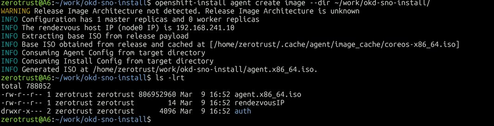
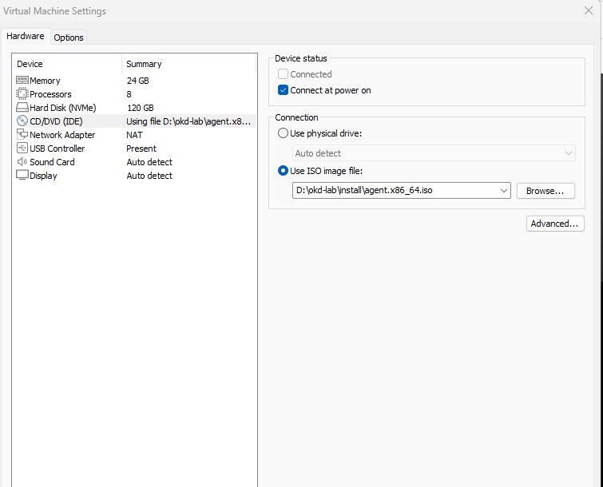
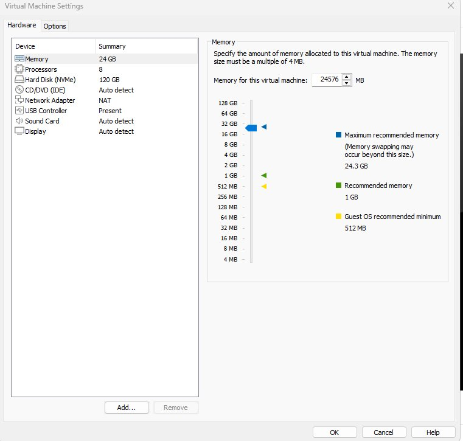
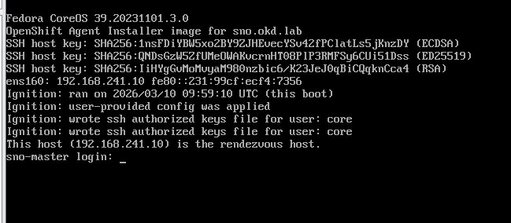
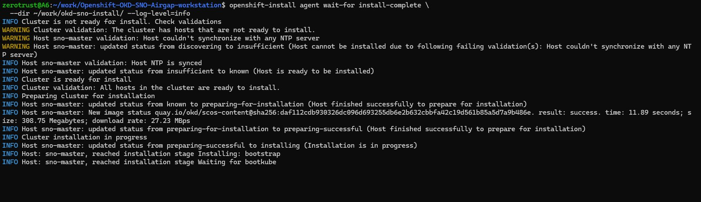

# Phase 1 — Guide Complet : Bootstrap OKD SNO sur VMware Workstation

> Document pédagogique — Comprendre chaque étape avant de l'exécuter
> Version 2.0 — Corrections issues de l'installation réelle

---

## Table des matières

1. [Architecture globale](#1-architecture-globale)
2. [Pourquoi ces deux binaires ?](#2-pourquoi-ces-deux-binaires-)
3. [Le problème MTU sur WSL2](#3-le-problème-mtu-sur-wsl2)
4. [Pourquoi une clé SSH ?](#4-pourquoi-une-clé-ssh-)
5. [install-config.yaml — Anatomie complète](#5-install-configyaml--anatomie-complète)
6. [agent-config.yaml — Anatomie complète](#6-agent-configyaml--anatomie-complète)
7. [IP statique — Réservation DHCP VMware](#7-ip-statique--réservation-dhcp-vmware)
8. [Configuration DNS — /etc/hosts](#8-configuration-dns--etchosts)
9. [Génération de l'ISO Agent-based](#9-génération-de-liso-agent-based)
10. [Création de la VM VMware Workstation](#10-création-de-la-vm-vmware-workstation)
11. [Surveillance de l'installation](#11-surveillance-de-linstallation)
12. [Fix PostgreSQL — Assisted Service DB](#12-fix-postgresql--assisted-service-db)
13. [Validation du cluster](#13-validation-du-cluster)

---

## 1. Architecture globale

Avant de toucher au moindre fichier, il faut comprendre ce qu'on construit et pourquoi.

### Ce qu'est OKD SNO

**OKD** (Origin Kubernetes Distribution) est la version communautaire open-source d'OpenShift. C'est l'upstream de Red Hat OpenShift Container Platform (OCP) — même codebase, sans licence commerciale.

**SNO** (Single Node OpenShift) est une topologie où les rôles `control-plane`, `master` et `worker` sont tous fusionnés sur **un seul nœud**. En production, un cluster OpenShift normal a minimum 3 masters + 2 workers. En SNO, tout tourne sur une seule VM.

```
Cluster OpenShift normal          OKD SNO (notre cas)
─────────────────────────         ──────────────────
master-1 (control plane)
master-2 (control plane)    →     sno-master (control plane + worker)
master-3 (control plane)
worker-1
worker-2
```

### L'OS du nœud : SCOS

Depuis OKD 4.17, l'OS des nœuds est **SCOS** (CentOS Stream CoreOS). C'est un OS :

- **Immuable** : le filesystem système est en lecture seule. On ne peut pas installer de paquets manuellement
- **Géré par Ignition** : toute la configuration initiale (users, fichiers, services) est injectée au premier boot via un fichier JSON appelé *ignition config*
- **Auto-mis à jour** : le MCO (Machine Config Operator) gère les mises à jour OS via GitOps

C'est exactement l'OS utilisé en production chez les grands comptes — Nokia, Orange, Telefónica utilisent tous des nœuds CoreOS/SCOS sur leurs clusters OpenShift.

### Le flux complet de l'installation

```
WSL2 Ubuntu
    │
    ├── 1. install-config.yaml     ← configuration du cluster
    ├── 2. agent-config.yaml       ← configuration du nœud (hostname, MAC, role)
    │
    ▼
openshift-install agent create image
    │
    ▼
agent.x86_64.iso                  ← ISO bootable (~1 Go)
    │
    ▼
VMware Workstation                ← on monte l'ISO dans la VM
    │
    ▼
VM boot → Assisted Installer      ← agent embarqué dans l'ISO
    │    détecte le hardware
    │    configure le réseau
    │    applique les ignition configs
    │
    ▼
OKD SNO opérationnel              ← ~60-90 minutes
    │
    ▼
openshift-install agent wait-for install-complete
    │
    ▼
Console : https://console-openshift-console.apps.sno.okd.lab
```

---

## 2. Pourquoi ces deux binaires ?

### openshift-install

C'est le **cerveau de l'installation**. Il fait deux choses :

**Avant l'installation :**
- Lit `install-config.yaml` et `agent-config.yaml`
- Génère les *manifests* Kubernetes (objets YAML de configuration du cluster)
- Génère les *ignition configs* (fichiers JSON qui configurent l'OS SCOS au boot)
- Assemble tout dans une **ISO bootable** (~1 Go) contenant l'agent d'installation

**Pendant l'installation :**
- Se connecte à l'agent qui tourne dans la VM
- Surveille la progression en temps réel
- Valide que chaque composant démarre correctement

### oc (OpenShift CLI)

C'est le **couteau suisse** pour piloter le cluster une fois installé. C'est une extension de `kubectl` avec des commandes spécifiques OpenShift.

```bash
oc get pods -A
oc get nodes
oc get routes -A                    # Routes OpenShift
oc get clusterversion               # Version et état du cluster
oc get co                           # Cluster Operators
oc adm top nodes
```

### Pourquoi OKD 4.17.0-okd-scos.0 spécifiquement ?

C'est la **première release stable SCOS** d'OKD 4.17. Les versions `4.17.0-0.okd-scos-YYYY-MM-DD` sont des builds nightlies — fonctionnels mais sans garantie de stabilité.

```
4.17.0-okd-scos.0   ← version stable (notre choix ✅)
4.17.0-okd-scos.1   ← patch stable
4.17.0-0.okd-scos-2025-02-23-210454  ← nightly (instable ❌)
```

---

## 3. Le problème MTU sur WSL2

### Qu'est-ce que le MTU ?

**MTU** (Maximum Transmission Unit) = la taille maximale d'un paquet réseau en octets.

Si un paquet est plus grand que le MTU du réseau, il est **fragmenté**. Sur TLS (HTTPS), cette fragmentation peut corrompre les enregistrements cryptographiques → erreur `bad record mac`.

### Pourquoi WSL2 est affecté ?

WSL2 utilise une interface réseau virtuelle (`eth0`) avec un MTU de **1500 par défaut**. Mais le réseau Windows sous-jacent (Hyper-V virtual switch) a ses propres en-têtes, réduisant l'espace disponible. Résultat : les gros fichiers (>100 Mo) via TLS échouent aléatoirement.

### La solution

```bash
sudo ip link set eth0 mtu 1280
```

Cela force des paquets plus petits → moins de fragmentation → plus d'erreurs TLS.

### Pourquoi PowerShell contourne le problème

PowerShell télécharge directement via le stack réseau Windows, sans passer par la couche Hyper-V de WSL2. Pas de double encapsulation → pas de fragmentation. C'est la méthode recommandée pour les gros téléchargements depuis un hôte WSL2.

---

## 4. Pourquoi une clé SSH ?

### SCOS est immuable, pas de mot de passe

Sur SCOS :
- Pas de root password configuré
- Pas d'accès console avec mot de passe
- Filesystem système en lecture seule

La **seule façon d'accéder** au nœud SCOS est SSH avec une clé publique.

### Comment la clé est injectée

```
install-config.yaml
└── sshKey: "ssh-ed25519 AAAA..."    ← clé publique
          │
          ▼
openshift-install génère master.ign   ← fichier Ignition JSON
          │
          ▼
SCOS boot → Ignition configure ~/.ssh/authorized_keys pour user "core"
          │
          ▼
ssh -i ~/.ssh/okd-sno core@192.168.241.10  ✅
```

### Génération

```bash
ssh-keygen -t ed25519 -C "okd-sno-lab" -f ~/.ssh/okd-sno -N ""

# ~/.ssh/okd-sno     ← clé PRIVÉE (ne jamais partager !)
# ~/.ssh/okd-sno.pub ← clé PUBLIQUE (va dans install-config.yaml)
```

---

## 5. install-config.yaml — Anatomie complète

```yaml
apiVersion: v1
baseDomain: okd.lab
# Toutes les URLs du cluster seront sous ce domaine :
#   API     : api.sno.okd.lab:6443
#   Console : console-openshift-console.apps.sno.okd.lab

metadata:
  name: sno
# Nom du cluster → sous-domaine :
#   api.SNO.okd.lab
#   *.apps.SNO.okd.lab

compute:
  - name: worker
    replicas: 0
# En SNO : 0 workers séparés. Le master est schedulable.

controlPlane:
  name: master
  replicas: 1
# 1 seul master = SNO

networking:
  clusterNetwork:
    - cidr: 10.128.0.0/14
      hostPrefix: 23
  # Réseau interne des pods — interne au cluster, invisible depuis l'extérieur

  machineNetwork:
    - cidr: 192.168.241.0/24
  # ⚠️ Réseau physique de la VM (VMnet8)
  # L'IP du nœud DOIT être dans ce CIDR

  networkType: OVNKubernetes
  # CNI standard OpenShift 4.12+

  serviceNetwork:
    - 172.30.0.0/16
  # Réseau des Services Kubernetes (ClusterIP) — virtuel

platform:
  none: {}
# UPI pur — pas de cloud provider, pas d'API hyperviseur
# Mode utilisé sur baremetal en production

pullSecret: '{"auths":{"fake":{"auth":"aGVsbG86d29ybGQ="}}}'
# OKD ne nécessite pas de vrai pull secret Red Hat
# Ce JSON fake est le standard pour OKD

sshKey: |
  ssh-ed25519 AAAAC3NzaC1lZDI1NTE5AAAAIMfYWQYhU/AfkK5U+URfW5Huvg4BeZUKlnKZSlYW7VqW okd-sno-lab
# Clé publique injectée dans SCOS via Ignition
```

---

## 6. agent-config.yaml — Anatomie complète

> ⚠️ **Différences importantes par rapport aux guides génériques VMware** — issues de l'installation réelle sur VMware Workstation Pro 17.

```yaml
apiVersion: v1alpha1
kind: AgentConfig
metadata:
  name: sno

rendezvousIP: 192.168.241.10
# IP du nœud "rendez-vous" — en SNO, c'est l'unique nœud
# L'agent bootstrap utilise cette IP pour se contacter
# DOIT correspondre à l'IP réservée dans vmnetdhcp.conf

hosts:
  - hostname: sno-master
    role: master

    interfaces:
      - name: ens160
        macAddress: "00:50:56:27:c8:0b"
      # ⚠️ L'interface s'appelle ens160 (adaptateur vmxnet3), PAS ens33
      # ens33 = ancien adaptateur e1000 — vmxnet3 génère ens160
      # La MAC est visible dans VM Settings → Network Adapter → Advanced
```

### Pourquoi PAS de networkConfig ?

Les guides officiels OpenShift incluent une section `networkConfig` avec nmstate pour configurer l'IP statique directement dans l'ISO :

```yaml
# ❌ NE PAS UTILISER SUR WSL2
networkConfig:
  interfaces:
    - name: ens160
      ipv4:
        dhcp: false
        address:
          - ip: 192.168.241.10
```

**Problème** : `networkConfig` requiert `nmstatectl` + NetworkManager. NetworkManager n'est pas disponible dans WSL2. La commande `openshift-install agent create image` échoue avec :

```
AttributeError: 'NoneType' object has no attribute 'SettingBond'
ERROR failed to generate asset "NMState Config": staticNetwork configuration is not valid
```

**Solution** : ne pas utiliser `networkConfig` et configurer l'IP statique côté VMware (section 7).

### Pourquoi l'IP statique est critique

OpenShift génère des certificats TLS et des entrées DNS basés sur l'IP du nœud lors de l'installation. Si l'IP change (DHCP), les certificats deviennent invalides et le cluster devient inutilisable.

De plus, l'agent vérifie que son IP correspond à `rendezvousIP`. Si l'IP DHCP est différente (ex: `.134` au lieu de `.10`), l'agent affiche :

```
This host is not the rendezvous host. The rendezvous host is at 192.168.241.10
```

Et les services d'installation ne démarrent pas.

---

## 7. IP statique — Réservation DHCP VMware

### Le mécanisme

VMware Workstation gère son propre serveur DHCP via `vmnetdhcp.conf`. On peut y ajouter une **réservation statique** : "cette MAC → toujours cette IP". C'est transparent pour la VM — elle fait une requête DHCP normale et reçoit toujours `.10`.

Cette approche est :
- **Compatible avec nmstate absent** dans WSL2
- **Persistante** à travers les reboots de la VM
- **Non intrusive** sur les autres VMs VMware (seule la MAC `00:50:56:27:c8:0b` est concernée)

### Procédure

Depuis PowerShell Windows (administrateur) :

```powershell
notepad "C:\ProgramData\VMware\vmnetdhcp.conf"
```

Ajouter avant le dernier `# End` :

```
host okd-sno-master {
    hardware ethernet 00:50:56:27:c8:0b;
    fixed-address 192.168.241.10;
}
```

Résultat final :

```
host VMnet8 {
    hardware ethernet 00:50:56:C0:00:08;
    fixed-address 192.168.241.1;
    ...
}
host okd-sno-master {
    hardware ethernet 00:50:56:27:c8:0b;
    fixed-address 192.168.241.10;
}
# End
```

Redémarrer le service DHCP VMware :

```powershell
Restart-Service VMnetDHCP
```

### Validation

Après le premier boot de la VM, vérifier sur la console VMware :

```
ens160: 192.168.241.10       ← IP correcte ✅
This host (192.168.241.10) is the rendezvous host.  ← confirmation ✅
```

---

## 8. Configuration DNS — /etc/hosts

### Pourquoi /etc/hosts plutôt que dnsmasq ?

dnsmasq est l'approche documentée dans les guides OKD. Mais sur une machine avec **Tailscale**, dnsmasq génère des conflits complexes :

- Tailscale écrase `/etc/resolv.conf` via son propre daemon DNS
- Port 53 partagé entre dnsmasq et systemd-resolved
- `tailscale set --accept-dns=false` désactive le MagicDNS (fonctionnalité utile)

**`/etc/hosts` est plus simple, plus robuste, et Tailscale ne le touche jamais** :

```bash
sudo tee -a /etc/hosts << 'EOF'
192.168.241.10 api.sno.okd.lab api-int.sno.okd.lab console-openshift-console.apps.sno.okd.lab oauth-openshift.apps.sno.okd.lab
EOF
```

### ⚠️ nslookup vs ping

`nslookup` et `dig` **bypasse** `/etc/hosts` et interroge directement le DNS. Pour valider, utiliser `ping` :

```bash
# ❌ Ne pas utiliser pour valider /etc/hosts
nslookup api.sno.okd.lab
# → NXDOMAIN (normal — bypasse /etc/hosts)

# ✅ Utiliser ping
ping -c1 api.sno.okd.lab
# PING api.sno.okd.lab (192.168.241.10) ✅
```

### Accès depuis Windows

Pour accéder à la console web depuis le navigateur Windows, ajouter les mêmes entrées dans :

```
C:\Windows\System32\drivers\etc\hosts
```

```
192.168.241.10 api.sno.okd.lab console-openshift-console.apps.sno.okd.lab oauth-openshift.apps.sno.okd.lab
```

### Nettoyage en fin de projet

```bash
# WSL2
sudo sed -i '/okd\.lab/d' /etc/hosts

# Windows (PowerShell admin)
(Get-Content C:\Windows\System32\drivers\etc\hosts) |
  Where-Object { $_ -notmatch 'okd\.lab' } |
  Set-Content C:\Windows\System32\drivers\etc\hosts
```

---

## 9. Génération de l'ISO Agent-based

### Qu'est-ce que l'Agent-based Installer ?

L'ISO contient tout le nécessaire pour bootstrapper le cluster sans infrastructure externe :
- Kernel Linux minimal (SCOS)
- Agent d'installation (Assisted Installer en mode local)
- Tes configurations compilées en ignition configs

Au boot, l'agent :
1. Détecte le hardware
2. Configure le réseau
3. Démarre les composants OpenShift
4. S'auto-bootstrap sans VM bootstrap séparée, sans S3, sans API cloud

C'est le mode utilisé pour les installations **baremetal** en production — valorisé sur les missions grands comptes.

### La commande

```bash
mkdir -p ~/work/okd-sno-install

# ⚠️ openshift-install CONSUME et SUPPRIME install-config.yaml et agent-config.yaml
# Toujours travailler depuis des COPIES, garder les originaux dans le repo Git
cp ~/work/Openshift-OKD-SNO-Airgap-workstation/install/install-config.yaml ~/work/okd-sno-install/
cp ~/work/Openshift-OKD-SNO-Airgap-workstation/install/agent-config.yaml ~/work/okd-sno-install/

openshift-install agent create image \
  --dir ~/work/okd-sno-install/ --log-level=info
```

### Output attendu

```
WARNING Release Image Architecture not detected   ← Normal pour OKD
INFO The rendezvous host IP (node0 IP) is 192.168.241.10
INFO Extracting base ISO from release payload
INFO Using cached base ISO                        ← Cache utilisé si déjà téléchargé
INFO Generated ISO at ~/work/okd-sno-install/agent.x86_64.iso
```



### Copier vers Windows et monter dans VMware

```bash
cp ~/work/okd-sno-install/agent.x86_64.iso /mnt/d/okd-lab/install/
```

```
VM Settings → CD/DVD (IDE)
→ Use ISO image file : D:\okd-lab\install\agent.x86_64.iso
→ Connect at power on : ✅
```



---

## 10. Création de la VM VMware Workstation

### Specs

| Paramètre | Valeur | Raison |
|-----------|--------|--------|
| OS Guest | CentOS 8 64-bit | SCOS basé sur CentOS Stream — le plus proche disponible |
| vCPU | 8 | Minimum OKD SNO |
| RAM | 24 576 MB | Confort + etcd |
| Disk | 120 Go thin | `/var` OpenShift peut grossir significativement |
| Réseau | VMnet8 NAT | Même subnet que WSL2 |
| Adaptateur réseau | vmxnet3 | Génère l'interface `ens160` dans SCOS |
| Firmware | UEFI | SCOS ne supporte pas BIOS legacy |
| Secure Boot | ❌ Désactivé | Kernel OKD non signé |

### ⚠️ Paramètres critiques

**1. UEFI + Secure Boot OFF**

```
VM Settings → Options → Advanced
→ Firmware type : UEFI ✅
→ Enable secure boot : décoché ✅
```

**2. Boot order — forcer le CD en premier**

VMware UEFI n'a pas d'interface graphique de boot order. Éditer le VMX :

```powershell
notepad "D:\okd-lab\vm\okd-sno-master.vmx"
```

Ajouter après `firmware = "efi"` :

```
bios.bootOrder = "cdrom,hdd"
```

Supprimer le fichier nvram pour reset UEFI (obligatoire si la VM a déjà booté) :

```powershell
Remove-Item "D:\okd-lab\vm\okd-sno-master.nvram" -ErrorAction SilentlyContinue
```

**3. Récupérer la MAC address**

```
VM Settings → Network Adapter → Advanced → MAC Address
→ Copier la valeur exacte (ex: 00:50:56:27:C8:0B)
→ Mettre à jour agent-config.yaml (en minuscules)
```



---

## 11. Surveillance de l'installation

### Démarrer la VM

Power On. Sur la console VMware, attendre :

```
This host (192.168.241.10) is the rendezvous host.
```



> Si la console affiche **"This host is not the rendezvous host"** avec une IP différente → réservation DHCP VMware non appliquée. Vérifier `vmnetdhcp.conf` et relancer `Restart-Service VMnetDHCP`.

### Nettoyer known_hosts (si reboot VM)

À chaque boot ISO, SCOS génère de nouvelles clés SSH → SSH refuse la connexion avec "host key changed" :

```bash
ssh-keygen -f '/home/zerotrust/.ssh/known_hosts' -R '192.168.241.10'
```

### Lancer le wait-for

```bash
openshift-install agent wait-for install-complete \
  --dir ~/work/okd-sno-install/ --log-level=info
```

### Timeline des messages

| Message | Signification |
|---------|---------------|
| `Cluster is not ready for install` | Services en démarrage |
| `Host NTP is synced` | Validation NTP passée |
| `Host is ready to be installed` | Host validé |
| `Cluster is ready for install` | Prêt à installer |
| `preparing-for-installation` | Pull images |
| `Installing: bootstrap` | Bootstrap Kubernetes |
| `Waiting for bootkube` | Démarrage etcd + API server |
| `Bootstrap is complete` | Control plane opérationnel |
| `Install complete!` | ✅ Cluster prêt |



### ⚠️ Validation NTP

Si le message NTP persiste plus de 5 minutes :

```bash
ssh -i ~/.ssh/okd-sno core@192.168.241.10 "sudo chronyc makestep"
```

---

## 12. Fix PostgreSQL — Assisted Service DB

> ⚠️ **Bug connu OKD 4.17 SNO sur VMware** — non documenté dans les guides officiels.

### Symptôme

Si les services d'installation ne démarrent pas automatiquement après le boot de l'ISO :

```bash
ssh -i ~/.ssh/okd-sno core@192.168.241.10 \
  "sudo journalctl -u assisted-service-db -n 5 --no-pager"
```

```
FATAL: could not create lock file "/var/run/postgresql/.s.PGSQL.5432.lock": No such file or directory
```

### Cause

Le container PostgreSQL (`assisted-service-db`) démarre avec `--user=postgres` mais le répertoire `/var/run/postgresql/` n'existe pas dans le container. `pg_ctl` ne peut pas créer le socket de verrouillage.

C'est un bug du container OKD 4.17 — l'entrypoint `start_db.sh` ne crée pas ce répertoire avant de lancer PostgreSQL.

### Fix — Script wrapper Podman

```bash
ssh -i ~/.ssh/okd-sno core@192.168.241.10 << 'ENDSSH'
sudo tee /usr/local/bin/start_db_wrapper.sh > /dev/null << 'EOF'
#!/bin/bash
source /usr/local/share/assisted-service/agent-images.env
exec /usr/bin/podman run --net host --user=postgres \
  --cidfile=$1 --cgroups=no-conmon --log-driver=journald \
  --rm --pod-id-file=$2 \
  --sdnotify=conmon --replace -d --name=assisted-db \
  --env-file=/usr/local/share/assisted-service/assisted-db.env \
  --tmpfs /var/run/postgresql:rw,mode=0777 \
  ${SERVICE_IMAGE} /bin/bash start_db.sh
EOF
sudo chmod +x /usr/local/bin/start_db_wrapper.sh

sudo mkdir -p /etc/systemd/system/assisted-service-db.service.d/
sudo tee /etc/systemd/system/assisted-service-db.service.d/fix-initdb.conf > /dev/null << 'EOF'
[Service]
ExecStartPre=
ExecStartPre=/bin/rm -f %t/%n.ctr-id
ExecStart=
ExecStart=/usr/local/bin/start_db_wrapper.sh %t/%n.ctr-id %t/assisted-service-pod.pod-id
EOF

sudo systemctl daemon-reload
sudo systemctl restart assisted-service-db
ENDSSH
```

### Pourquoi `--tmpfs /var/run/postgresql` ?

`--tmpfs` monte un filesystem temporaire en mémoire sur le chemin spécifié, **à l'intérieur du container**. Ce répertoire :
- Est créé automatiquement au démarrage du container
- Appartient à l'UID/GID correct (`mode=0777` pour postgres)
- Disparaît à l'arrêt du container (pas de persistance nécessaire — c'est un socket)

### Re-enregistrement après fix

```bash
ssh -i ~/.ssh/okd-sno core@192.168.241.10 \
  "sudo systemctl restart assisted-service && sleep 5 && \
   sudo systemctl start agent-register-cluster && sleep 10 && \
   sudo systemctl start agent-register-infraenv && sleep 5 && \
   sudo systemctl restart agent"
```

---

## 13. Validation du cluster

### Message de succès

```
INFO Install complete!
INFO To access the cluster as the system:admin user:
     export KUBECONFIG=~/work/okd-sno-install/auth/kubeconfig
INFO Access the OpenShift web-console here:
     https://console-openshift-console.apps.sno.okd.lab
INFO Login to the console with user: "kubeadmin"
     password: xxxxx-xxxxx-xxxxx-xxxxx
```

### Commandes de vérification

```bash
export KUBECONFIG=~/work/okd-sno-install/auth/kubeconfig

# État du nœud
oc get nodes
# NAME         STATUS   ROLES                         AGE   VERSION
# sno-master   Ready    control-plane,master,worker   1h    v1.30.x
# ROLES = control-plane,master,worker → confirmation SNO ✅

# Version du cluster
oc get clusterversion
# AVAILABLE=True, PROGRESSING=False → cluster stable ✅

# Cluster Operators (~30, tous doivent être Available)
oc get co

# Pods en erreur (doit être vide)
oc get pods -A | grep -v Running | grep -v Completed

# Accès SSH nœud
ssh -i ~/.ssh/okd-sno core@192.168.241.10
```

### Accès console web

```
URL      : https://console-openshift-console.apps.sno.okd.lab
User     : kubeadmin
Password : cat ~/work/okd-sno-install/auth/kubeadmin-password
```

> ⚠️ `kubeadmin` est un compte temporaire de bootstrap. Il sera supprimé en Phase 2 après configuration de Keycloak SSO.

---

## Récapitulatif des dépendances

```
Repo Git :  ~/work/Openshift-OKD-SNO-Airgap-workstation/
├── install/
│   ├── install-config.yaml    ← originaux (ne jamais supprimer)
│   └── agent-config.yaml      ← interface ens160, MAC 00:50:56:27:c8:0b
├── scripts/
│   └── fix-assisted-db.sh     ← fix bug PostgreSQL socket OKD 4.17

VMware :  D:\okd-lab\
├── install\
│   └── agent.x86_64.iso       ← ISO générée, à monter dans VMware
└── vm\okd-sno-master\
    └── okd-sno-master.vmx     ← bios.bootOrder = "cdrom,hdd" ajouté

WSL2 :  ~/work/okd-sno-install/
└── auth/
    ├── kubeconfig             ← export KUBECONFIG=...
    └── kubeadmin-password     ← mot de passe console

SSH :  ~/.ssh/
├── okd-sno                    ← clé privée (accès nœud SCOS)
└── okd-sno.pub                ← dans install-config.yaml

Windows :  C:\ProgramData\VMware\vmnetdhcp.conf
└── host okd-sno-master { fixed-address 192.168.241.10; }
```

---

## Problèmes connus

| Symptôme | Cause | Solution |
|----------|-------|----------|
| `AttributeError: 'NoneType' object has no attribute 'SettingBond'` | nmstatectl cassé dans WSL2 | Supprimer `networkConfig` de agent-config.yaml |
| IP VM = `.134` au lieu de `.10` | Pas de réservation DHCP | Ajouter entrée dans `vmnetdhcp.conf` |
| "This host is not the rendezvous host" | IP DHCP ≠ rendezvousIP | Réservation DHCP + `Restart-Service VMnetDHCP` |
| `assisted-service-db` crash en boucle | Bug socket `/var/run/postgresql` | Section 12 — wrapper `--tmpfs` |
| `nslookup api.sno.okd.lab` → NXDOMAIN | nslookup bypasse /etc/hosts | Normal — utiliser `ping` |
| SSH "host key changed" après reboot | SCOS regénère les clés à chaque boot ISO | `ssh-keygen -R 192.168.241.10` |
| NTP validation bloquée | Démarrage lent chrony | `chronyc makestep` sur la VM |

---

*Document généré dans le cadre du projet `Z3ROX-lab/Openshift-OKD-SNO-Airgap-workstation`*
*Phase 1 — Bootstrap OKD SNO sur VMware Workstation — Version 2.0 — Mars 2026*
