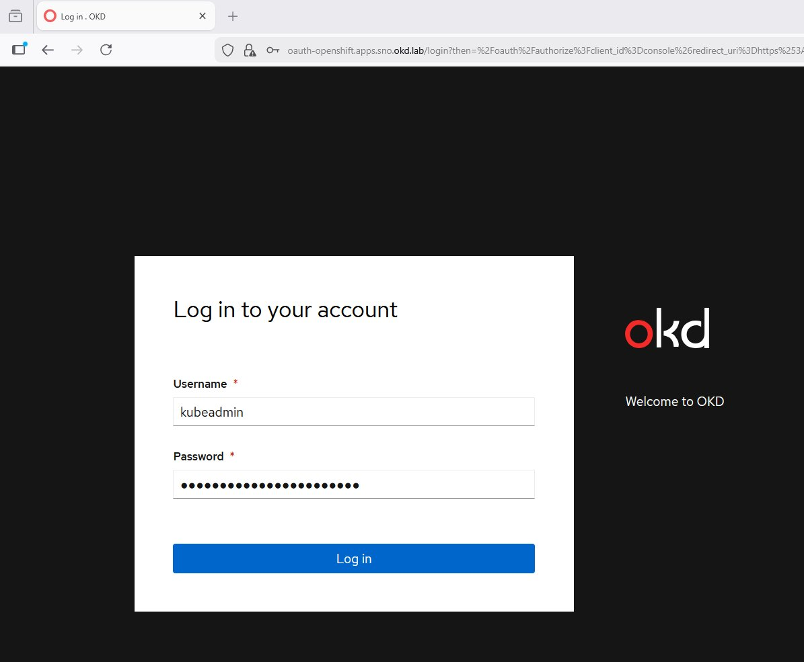
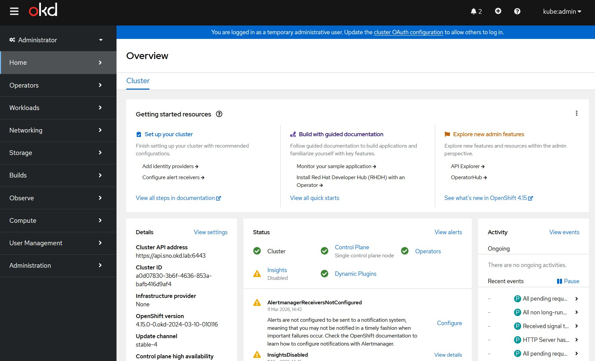
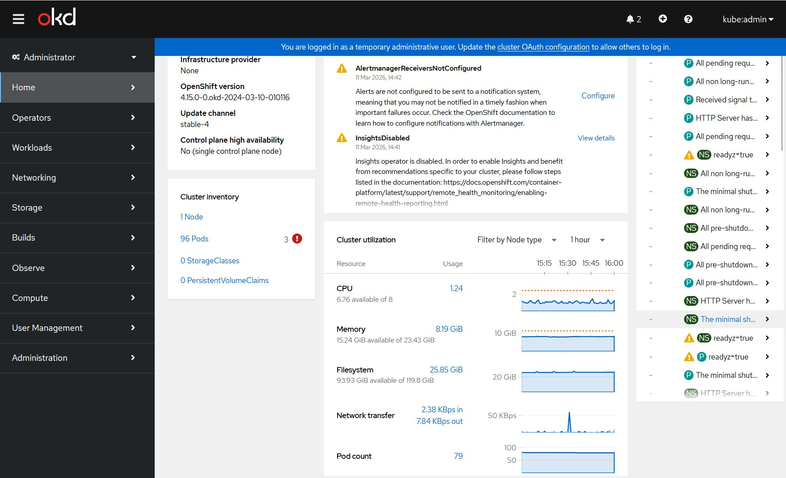
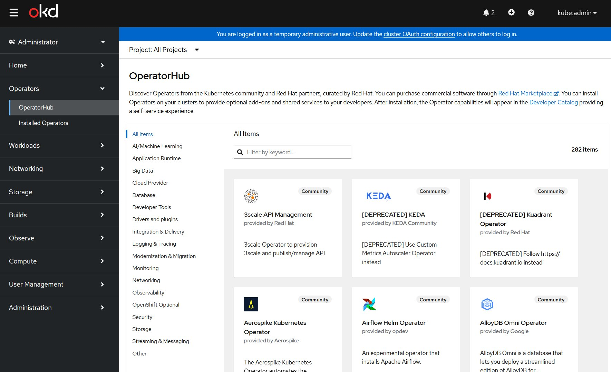
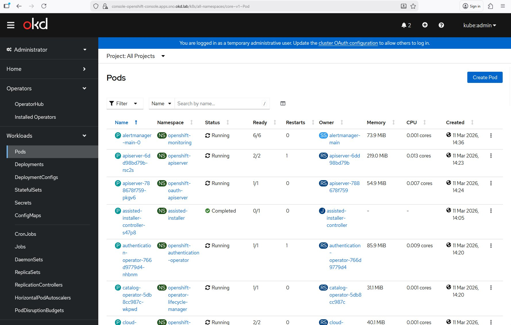
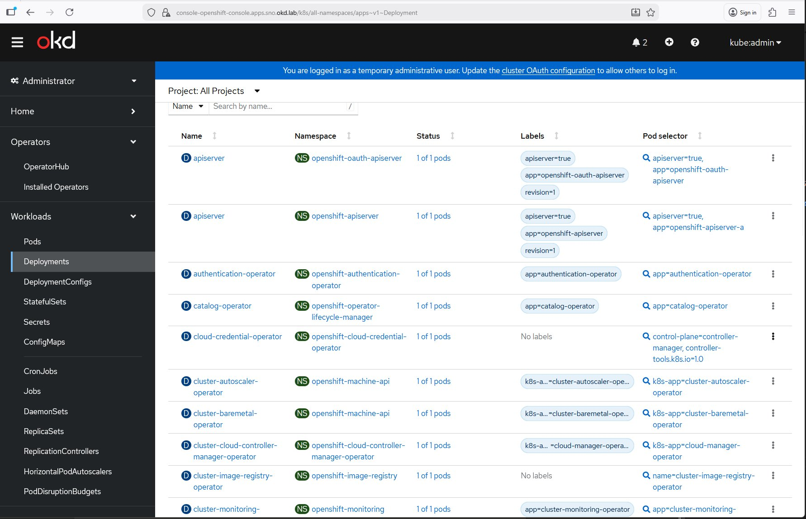
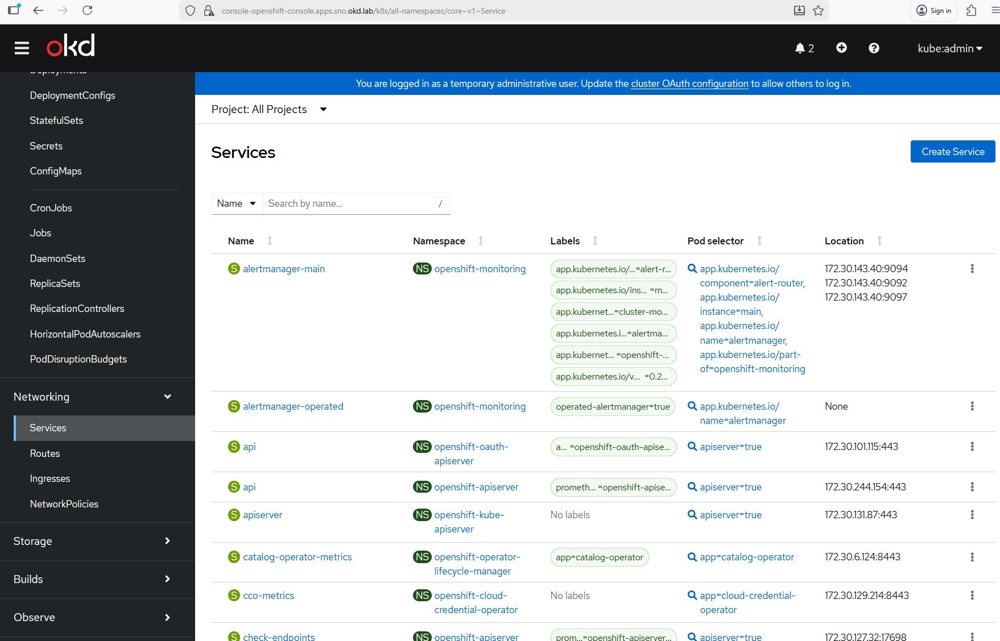
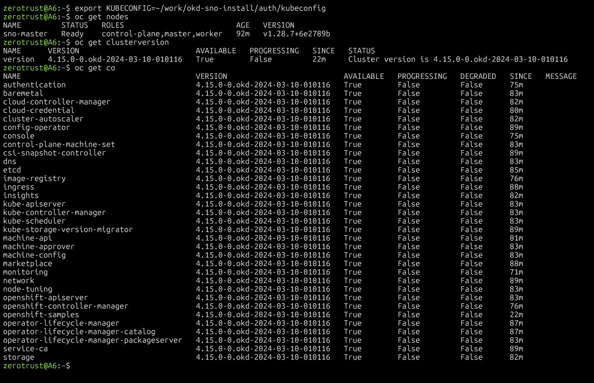

# Phase 1 — Validation Console OKD SNO

> Preuves visuelles du cluster OKD 4.15 FCOS opérationnel
> 11 Mars 2026 — `sno-master` @ `192.168.241.10`

---

## 1. Accès console web — Login OKD



**URL :** `https://oauth-openshift.apps.sno.okd.lab/login`  
**User :** `kubeadmin` (compte bootstrap temporaire — sera supprimé en Phase 2 après Keycloak SSO)

> ℹ️ OKD intègre un **OAuth Server** mais pas un IAM complet. Il délègue l'authentification à un Identity Provider externe. Par défaut, seul `kubeadmin` existe. La Phase 2 configurera Keycloak comme IDP OIDC, puis `kubeadmin` sera supprimé.

---

## 2. Dashboard — Vue d'ensemble du cluster



Points clés visibles :

| Champ | Valeur |
|-------|--------|
| Cluster API address | `https://api.sno.okd.lab:6443` |
| OpenShift version | `4.15.0-0.okd-2024-03-10-010116` |
| Infrastructure provider | `None` (UPI / `platform: none`) |
| Update channel | `stable-4` |
| Control plane HA | Single control plane node (SNO) |
| Cluster status | ✅ Green |
| Control Plane | ✅ Green |
| Operators | ✅ Green |

> ⚠️ La bannière bleue rappelle que `kubeadmin` est un compte temporaire — action prévue en Phase 2.

---

## 3. OperatorHub — Catalogue disponible



**282 operators** disponibles dans le catalogue community, couvrant :
- AI/Machine Learning, Security, Monitoring, Observability
- Storage, Networking, Streaming & Messaging
- Database, Integration & Delivery, CI/CD...

Les operators Phase 2+ qui nous intéressent :
- `Keycloak Operator` (Security)
- `HashiCorp Vault` (Security)
- `OpenShift GitOps` (ArgoCD) (Integration & Delivery)
- `OpenShift Logging` (Loki) (Logging & Tracing)

---

## 4. Workloads — Pods (All Namespaces)



Tous les pods système sont en état **Running** ou **Completed** :

| Pod | Namespace | Status | Note |
|-----|-----------|--------|------|
| alertmanager-main-0 | openshift-monitoring | Running 6/6 | ✅ |
| apiserver-* | openshift-apiserver | Running 2/2 | ✅ |
| apiserver-* | openshift-oauth-apiserver | Running 1/1 | ✅ |
| assisted-installer-controller | assisted-installer | **Completed** | ✅ Normal — job terminé |
| authentication-operator | openshift-authentication-operator | Running 1/1 | ✅ |
| catalog-operator | openshift-operator-lifecycle-manager | Running 1/1 | ✅ |

> `assisted-installer-controller` en **Completed** est normal — c'est le job bootstrap de l'Agent-based Installer, il a terminé son travail.

---

## 5. Workloads — Deployments (All Namespaces)



Tous les Deployments système affichent **"1 of 1 pods"** — aucun pod manquant :

- `apiserver` (openshift-oauth-apiserver) ✅
- `apiserver` (openshift-apiserver) ✅
- `authentication-operator` ✅
- `catalog-operator` ✅
- `cloud-credential-operator` ✅
- `cluster-autoscaler-operator` ✅
- `cluster-baremetal-operator` ✅ (présent en SNO — gère le lifecycle baremetal)
- `cluster-image-registry-operator` ✅
- `cluster-monitoring-operator` ✅

---

## 6. Networking — Services (All Namespaces)



Les Services réseau clés sont opérationnels :

| Service | Namespace | Adresse |
|---------|-----------|---------|
| alertmanager-main | openshift-monitoring | 172.30.143.40:9094/9092/9097 |
| api | openshift-oauth-apiserver | 172.30.101.115:443 |
| api | openshift-apiserver | 172.30.244.154:443 |
| apiserver | openshift-kube-apiserver | 172.30.131.87:443 |

> Le réseau `172.30.0.0/16` est le `serviceNetwork` défini dans `install-config.yaml` — tout est cohérent.

---

## 7. Compute — Nœud SNO



| Paramètre | Valeur | Attendu |
|-----------|--------|---------|
| Name | `sno-master` | ✅ |
| Status | **Ready** | ✅ |
| Roles | `control-plane, master, worker` | ✅ SNO confirmé |
| Pods | 79 | ✅ Normal |
| Memory | 8.25 GiB / 23.43 GiB | ✅ (24 Go alloués) |
| CPU | 0.651 cores / 8 cores | ✅ (8 vCPU alloués) |
| Filesystem | 25.93 GiB / 119.8 GiB | ✅ (120 Go disque) |
| Created | 11 Mar 2026, 14:19 | ✅ |

> **Rôles `control-plane, master, worker`** sur un seul nœud = confirmation SNO. En topologie multi-nœuds standard, ces rôles seraient séparés.

---

## 8. CLI — oc get nodes / clusterversion / co



### Nœud

```
NAME         STATUS   ROLES                         AGE   VERSION
sno-master   Ready    control-plane,master,worker   92m   v1.28.7+6e2789b
```

✅ `Ready` — rôles SNO confirmés — Kubernetes `v1.28.7`

### Cluster Version

```
NAME      VERSION                          AVAILABLE   PROGRESSING   SINCE   STATUS
version   4.15.0-0.okd-2024-03-10-010116   True        False         22m     Cluster version is 4.15.0-...
```

✅ `AVAILABLE=True`, `PROGRESSING=False` — cluster stable

### Cluster Operators — 30/30 ✅

Tous les 30 Cluster Operators sont `AVAILABLE=True / PROGRESSING=False / DEGRADED=False` :

| Operator | Available | Progressing | Degraded |
|----------|-----------|-------------|----------|
| authentication | ✅ True | False | False |
| baremetal | ✅ True | False | False |
| cloud-controller-manager | ✅ True | False | False |
| cloud-credential | ✅ True | False | False |
| cluster-autoscaler | ✅ True | False | False |
| config-operator | ✅ True | False | False |
| console | ✅ True | False | False |
| control-plane-machine-set | ✅ True | False | False |
| csi-snapshot-controller | ✅ True | False | False |
| dns | ✅ True | False | False |
| etcd | ✅ True | False | False |
| image-registry | ✅ True | False | False |
| ingress | ✅ True | False | False |
| insights | ✅ True | False | False |
| kube-apiserver | ✅ True | False | False |
| kube-controller-manager | ✅ True | False | False |
| kube-scheduler | ✅ True | False | False |
| kube-storage-version-migrator | ✅ True | False | False |
| machine-api | ✅ True | False | False |
| machine-approver | ✅ True | False | False |
| machine-config | ✅ True | False | False |
| marketplace | ✅ True | False | False |
| monitoring | ✅ True | False | False |
| network | ✅ True | False | False |
| node-tuning | ✅ True | False | False |
| openshift-apiserver | ✅ True | False | False |
| openshift-controller-manager | ✅ True | False | False |
| openshift-samples | ✅ True | False | False |
| operator-lifecycle-manager | ✅ True | False | False |
| operator-lifecycle-manager-catalog | ✅ True | False | False |
| operator-lifecycle-manager-packageserver | ✅ True | False | False |
| service-ca | ✅ True | False | False |
| storage | ✅ True | False | False |

> **30/30 COs Available** = cluster entièrement opérationnel, prêt pour Phase 2.

---

## Récapitulatif Phase 1 ✅

| Critère | Statut | Preuve |
|---------|--------|--------|
| Install complete | ✅ | `INFO Install complete!` (terminal) |
| Console accessible | ✅ | Login `oauth-openshift.apps.sno.okd.lab` |
| Cluster status Green | ✅ | Dashboard Overview |
| OperatorHub disponible | ✅ | 282 operators catalogue |
| Tous pods Running/Completed | ✅ | Pods All Namespaces |
| Tous deployments 1/1 | ✅ | Deployments All Namespaces |
| Node Ready | ✅ | `sno-master` Ready — `v1.28.7+6e2789b` |
| Rôles SNO corrects | ✅ | control-plane + master + worker |
| Ressources cohérentes | ✅ | 23.43 GiB / 8 cores / 119.8 GiB |
| ClusterVersion stable | ✅ | `AVAILABLE=True`, `PROGRESSING=False` |
| **30/30 Cluster Operators** | ✅ | Tous `Available=True`, `Degraded=False` |

---

## Prochaine étape — Phase 2

> **Action immédiate requise** : la bannière bleue "You are logged in as a temporary administrative user" rappelle que `kubeadmin` doit être remplacé par un IDP réel.

**Phase 2a — Keycloak** : déploiement via OperatorHub → Realm `okd` → clients openshift/argocd/vault/harbor → groupes → ClusterRoleBinding  
**Phase 2b — OAuth CR OKD** : pointer l'OAuth Server vers Keycloak OIDC → SSO unifié Console + `oc` CLI  
**Phase 2c — HashiCorp Vault** : secrets management pour les workloads  

→ [Documentation Phase 2](phase2-identity-sso-secrets.md)

---

## Screenshots — Index

| Fichier | Contenu |
|---------|---------|
| `phase1-install-complete.png` | Terminal — `INFO Install complete!` |
| `phase1-console-login.png` | Page de login OKD |
| `phase1-console-overview.png` | Dashboard — cluster status + version |
| `phase1-console-operatorhub.png` | OperatorHub — 282 operators |
| `phase1-console-pods.png` | Workloads → Pods (All Namespaces) |
| `phase1-console-deployments.png` | Workloads → Deployments (All Namespaces) |
| `phase1-console-services.png` | Networking → Services (All Namespaces) |
| `phase1-console-nodes.png` | Compute → Nodes — sno-master Ready |
| `phase1-oc-get-nodes-co.png` | CLI — oc get nodes + clusterversion + **30/30 COs** ✅ |

---

*Projet `Z3ROX-lab/Openshift-OKD-SNO-Airgap-workstation`*
*Phase 1 Validation — 11 Mars 2026*
