# Phase 2a — Keycloak OIDC : Identity Provider OKD SNO

## Pourquoi Keycloak comme IDP ?

OKD ne gère pas nativement les utilisateurs. Il dispose d'un **OAuth Server intégré** dont le seul rôle est de déléguer l'authentification à un **Identity Provider (IDP)** externe. Par défaut, seul le compte temporaire `kubeadmin` existe — ce n'est pas viable pour un vrai cluster.

**Keycloak** est l'IDP open-source de référence dans l'écosystème Red Hat / Kubernetes. Il centralise :
- La gestion des utilisateurs et des groupes
- L'authentification (username/password, MFA, fédération AD/LDAP)
- L'émission de tokens JWT via le protocole **OIDC (OpenID Connect)**

En configurant Keycloak comme IDP OIDC d'OKD, on obtient un SSO complet : un seul compte pour accéder à la console OKD, la CLI `oc`, ArgoCD, Vault, et toutes les applications du cluster.

## Comment ça fonctionne — schéma simplifié

```
┌─────────────────────────────────────────────────────────────┐
│                        AUTHENTIFICATION                      │
│                                                              │
│   Utilisateur                                                │
│       │                                                      │
│       │  1. "je veux accéder à OKD"                         │
│       ▼                                                      │
│   Console OKD / oc CLI                                       │
│       │                                                      │
│       │  2. redirect → OAuth Server OKD                      │
│       ▼                                                      │
│   oauth-openshift.apps.sno.okd.lab                          │
│   (OAuth Server OKD)                                         │
│       │                                                      │
│       │  3. "je ne sais pas qui tu es, va chez Keycloak"    │
│       ▼                                                      │
│   keycloak.apps.sno.okd.lab/realms/okd                      │
│   (Keycloak IDP)                                             │
│       │                                                      │
│       │  4. login/password → émission JWT token              │
│       ▼                                                      │
│   oauth-openshift.apps.sno.okd.lab                          │
│       │                                                      │
│       │  5. token validé → session OKD créée                 │
│       ▼                                                      │
│   Console OKD / oc CLI  ✅ connecté                          │
│                                                              │
└─────────────────────────────────────────────────────────────┘

┌─────────────────────────────────────────────────────────────┐
│                        SÉPARATION DES RÔLES                  │
│                                                              │
│   Keycloak  →  QUI ES-TU ?     (authentification)           │
│   OKD RBAC  →  QUE PEUX-TU FAIRE ? (autorisation)           │
│                                                              │
│   Exemple :                                                  │
│   admin-okd  ──Keycloak──▶  JWT token                       │
│              ──OKD──▶  cluster-admin role                    │
│                                                              │
└─────────────────────────────────────────────────────────────┘
```

**Pourquoi OIDC et pas SAML ou autre ?**

OIDC (OpenID Connect) est le protocole moderne basé sur OAuth2. Il est natif dans Kubernetes/OKD, léger, et utilise des JWT tokens facilement validables. SAML est plus lourd et plutôt utilisé pour les applications legacy enterprise.

## Objectif

Déployer Keycloak 26.5.5 sur OKD SNO via l'Operator Hub et le configurer comme Identity Provider OIDC pour la console OKD et la CLI `oc`.

## Composants déployés

| Composant | Version | Namespace | Status |
|-----------|---------|-----------|--------|
| Keycloak Operator | 26.5.5 | keycloak | ✅ Succeeded |
| Keycloak Instance | 26.5.5 | keycloak | ✅ Running |
| OAuth CR OKD | - | openshift-config | ✅ Configured |

## Prérequis

- OKD SNO 4.15 installé et opérationnel (Phase 1)
- Certificats kubelet valides (`scripts/okd-approve-csr.sh`)
- Router HAProxy up (port 443 accessible)

## Installation

### Étape 1 — Installer le Keycloak Operator

Via OperatorHub console OKD :

```
Operators → OperatorHub → "keycloak"
→ Keycloak Operator v26.5.5 (Community, Red Hat)
→ Update channel  : fast
→ Version         : 26.5.5
→ Installation mode : A specific namespace
→ Namespace       : keycloak (Create Project)
→ Update approval : Automatic
→ Install
```

Vérification :
```bash
oc get csv -n keycloak
# → keycloak-operator.v26.5.5   Succeeded
```

### Étape 2 — Copier le certificat TLS wildcard

```bash
./manifests/keycloak/01-tls-secret.sh
```

Ce script copie le wildcard cert `*.apps.sno.okd.lab` depuis `openshift-ingress` vers le namespace `keycloak`.

### Étape 3 — Déployer l'instance Keycloak

```bash
oc apply -f manifests/keycloak/02-keycloak-instance.yaml
```

L'instance Keycloak utilise le mode dev (H2 embarqué) — suffisant pour le lab portfolio.

Vérification :
```bash
oc get pods -n keycloak
# → keycloak-0   1/1   Running
oc get route -n keycloak
# → keycloak.apps.sno.okd.lab
```

Accès console : `https://keycloak.apps.sno.okd.lab`

Récupérer les credentials initiaux :
```bash
oc get secret keycloak-initial-admin -n keycloak \
  -o jsonpath='{.data.username}' | base64 -d && echo
oc get secret keycloak-initial-admin -n keycloak \
  -o jsonpath='{.data.password}' | base64 -d && echo
```

### Étape 4 — Configurer le Realm et le Client Keycloak

#### Créer le Realm `okd`

```
Administration Console → master dropdown → Create Realm
→ Realm name : okd
→ Create
```

#### Créer le Client OIDC `openshift`

```
Realm okd → Clients → Create client
→ Client type    : OpenID Connect
→ Client ID      : openshift
→ Next
→ Client authentication : On
→ Standard flow  : ✅
→ Next
→ Valid redirect URIs : https://oauth-openshift.apps.sno.okd.lab/*
→ Save
```

Récupérer le client secret :
```
Clients → openshift → Credentials → Client Secret
```

### Étape 5 — Configurer l'OAuth OKD

```bash
# Créer le secret avec le client secret Keycloak
oc create secret generic keycloak-client-secret \
  --from-literal=clientSecret=<CLIENT_SECRET> \
  -n openshift-config

# Appliquer la configuration OAuth
oc apply -f manifests/keycloak/04-oauth-cluster.yaml
```

Attendre le redémarrage du pod oauth :
```bash
watch oc get pods -n openshift-authentication
```

## Validation

### Test login console OKD via Keycloak

1. Ouvrir `https://console-openshift-console.apps.sno.okd.lab`
2. Cliquer sur "keycloak" (nouvel IDP)
3. Se connecter avec un utilisateur Keycloak du realm `okd`

### Créer un utilisateur de test dans Keycloak

```
Realm okd → Users → Add user
→ Username : admin-okd
→ Email    : admin-okd@okd.lab
→ Save
→ Credentials → Set password : Admin123!
→ Temporary : Off
```

### Donner les droits cluster-admin

```bash
oc adm policy add-cluster-role-to-user cluster-admin admin-okd
```

## DNS requis

Entrée dans `/etc/hosts` WSL2 et `C:\Windows\System32\drivers\etc\hosts` :

```
192.168.241.10 keycloak.apps.sno.okd.lab
```

## Fichiers manifests

| Fichier | Description |
|---------|-------------|
| `manifests/keycloak/01-tls-secret.sh` | Copie wildcard cert OKD → namespace keycloak |
| `manifests/keycloak/02-keycloak-instance.yaml` | CR Keycloak instance |
| `manifests/keycloak/03-client-secret.yaml` | Placeholder secret client (ne pas commiter la valeur réelle) |
| `manifests/keycloak/04-oauth-cluster.yaml` | OAuth CR OKD → Keycloak OIDC |

## Notes importantes

- Le secret `keycloak-initial-admin` est **temporaire** — créer un admin permanent puis supprimer `temp-admin`
- Le mode dev Keycloak (H2) ne persiste pas les données si le pod redémarre — Phase 3 ajoutera PostgreSQL avec PVC
- Le client secret ne doit **jamais** être commité en clair dans Git — utiliser SealedSecrets (Phase 4)
- Après chaque reboot OKD, relancer `./scripts/okd-approve-csr.sh` pour renouveler les certs kubelet

## Screenshots

### 1. Installation Operator

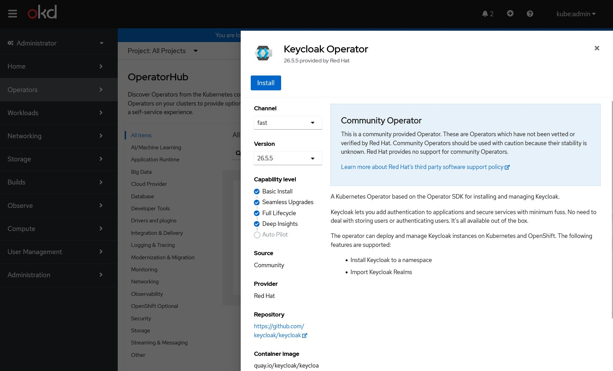
*Keycloak Operator v26.5.5 dans OperatorHub*

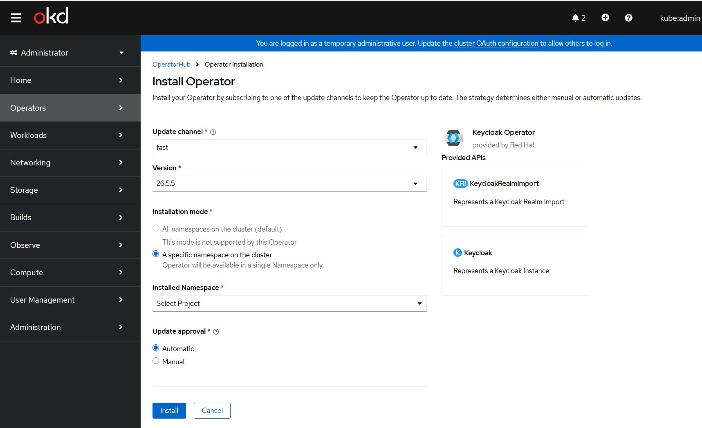
*Paramètres d'installation — channel fast, namespace keycloak*

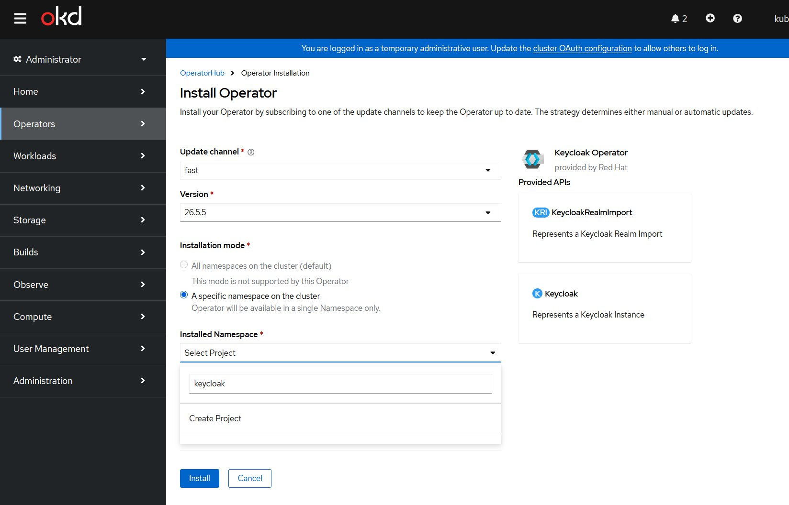
*Dropdown namespace — recherche "keycloak"*

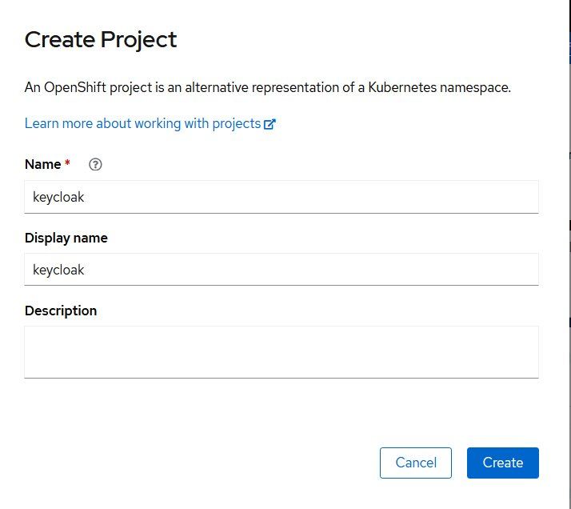
*Création du projet/namespace keycloak*

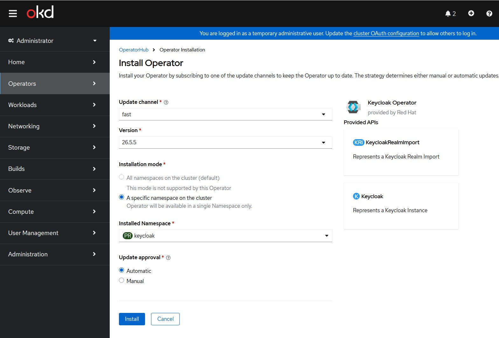
*Configuration finale avant installation*

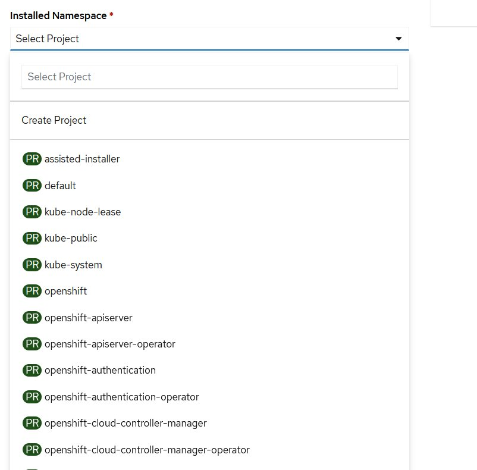
*"Installing Operator" en cours*

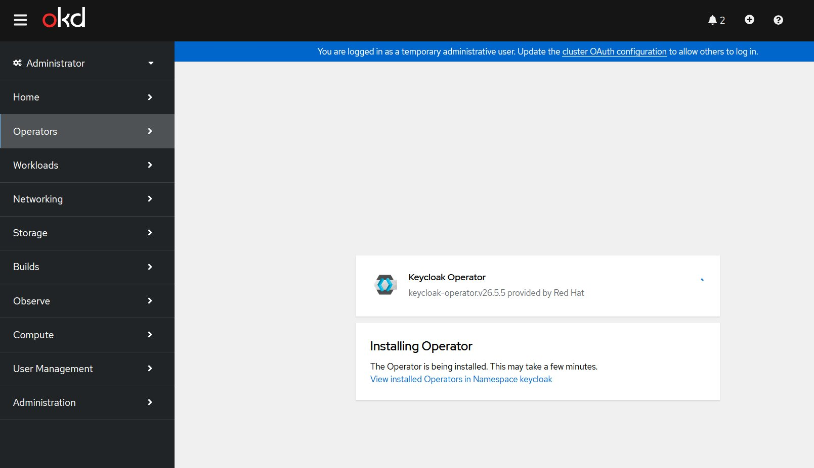
*"Installed operator: ready for use" ✅*

### 2. Validation Operator

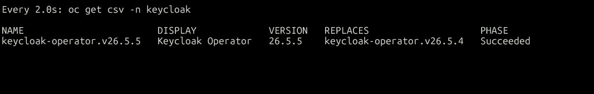
*`oc get csv -n keycloak` → Phase: Succeeded*

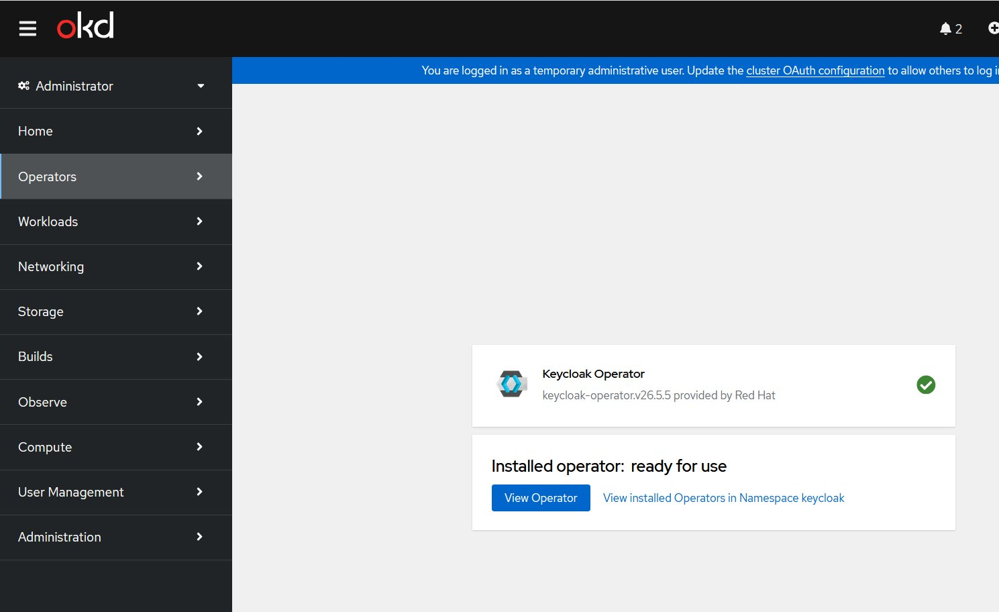
*Console — Operator ready for use*

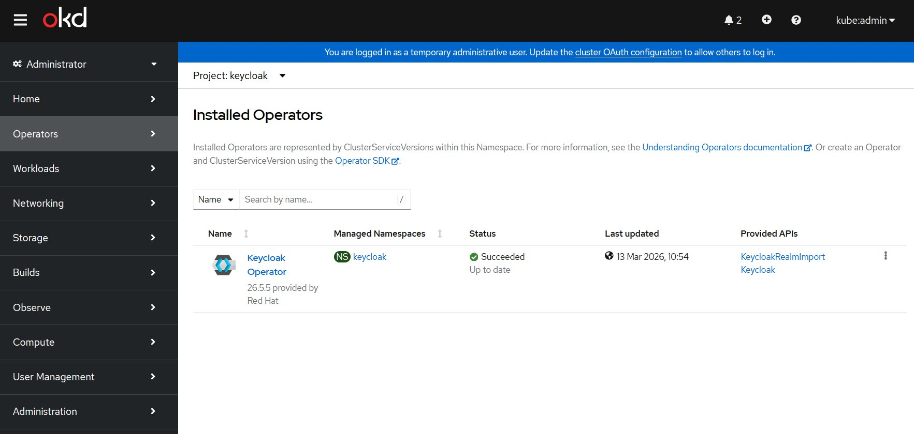
*Vue Installed Operators — namespace keycloak — Succeeded ✅*

### 3. Instance Keycloak

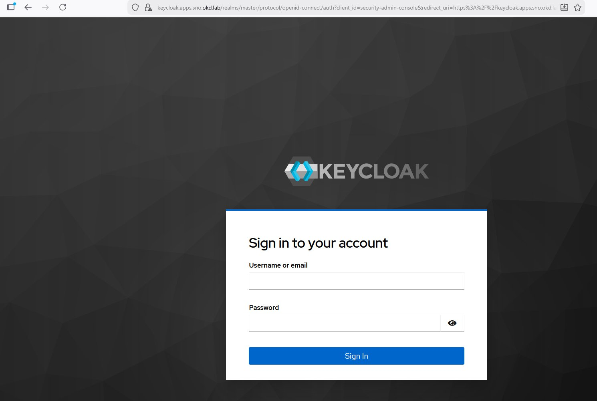
*Console Keycloak accessible sur `https://keycloak.apps.sno.okd.lab`*

### 4. Configuration Realm et Client

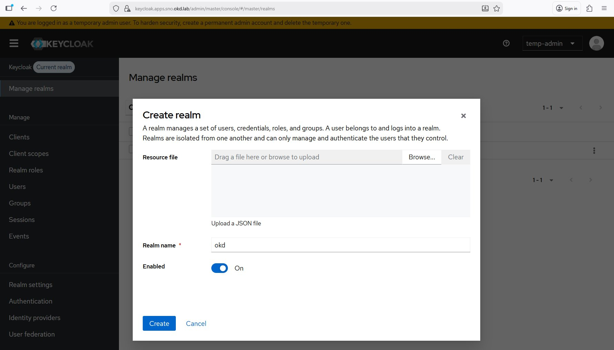
*Formulaire création realm — Realm name: okd*

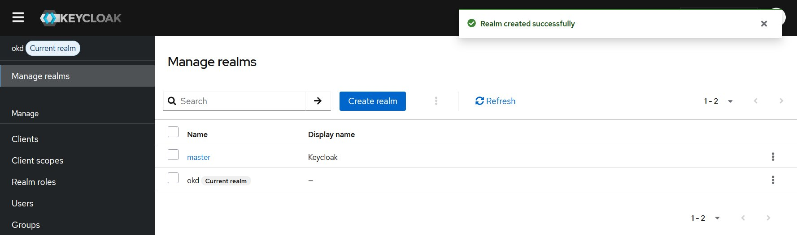
*"Realm created successfully" — realm okd actif*

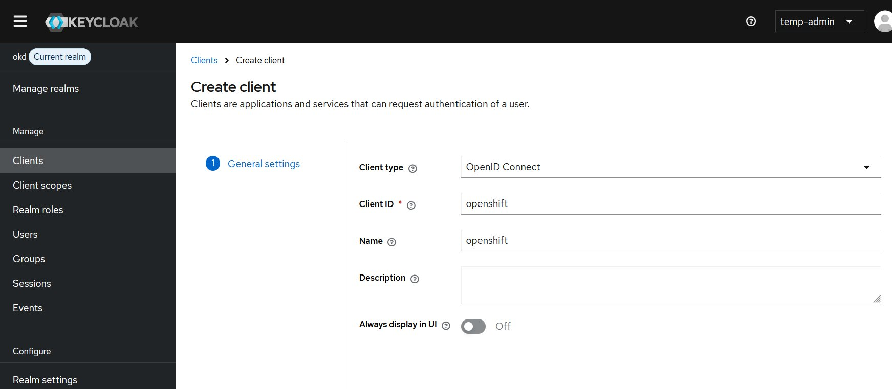
*Client openshift — General settings — Client type: OpenID Connect*

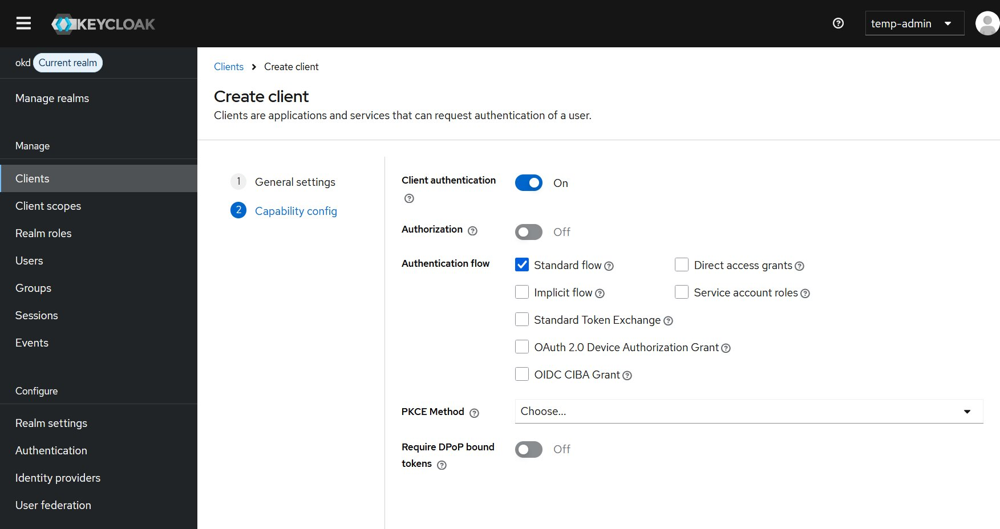
*Client openshift — Client authentication: On, Standard flow: ✅*

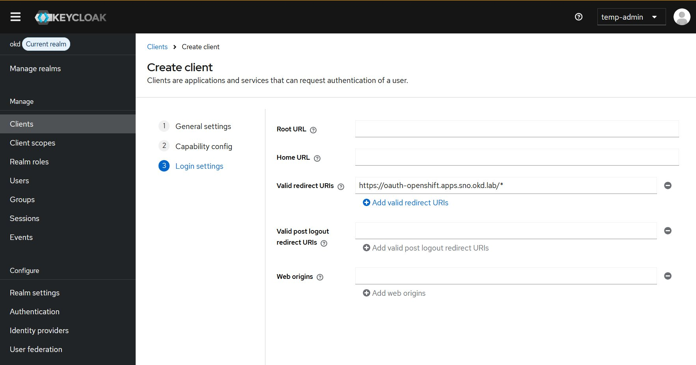
*Client openshift — Valid redirect URIs: `https://oauth-openshift.apps.sno.okd.lab/*`*

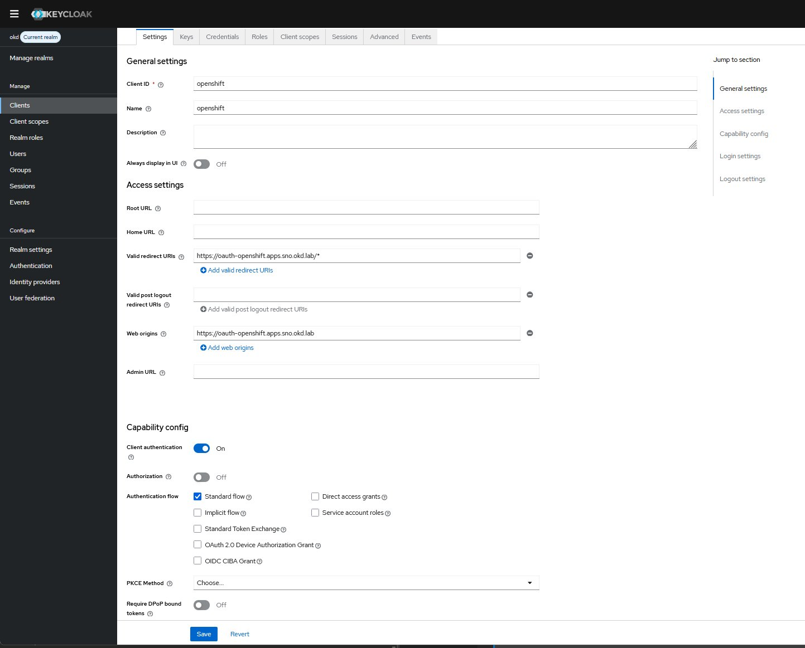
*Vue complète du client openshift configuré*

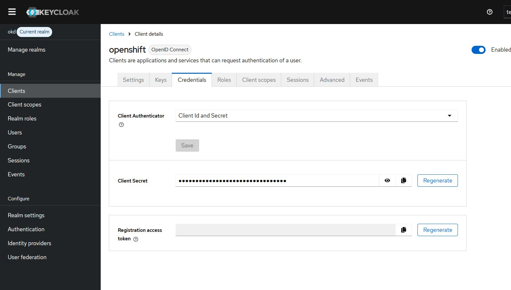
*Onglet Credentials — Client Secret récupéré*
