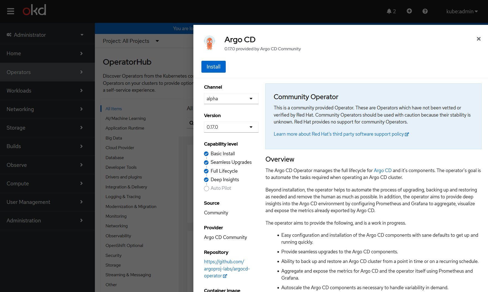
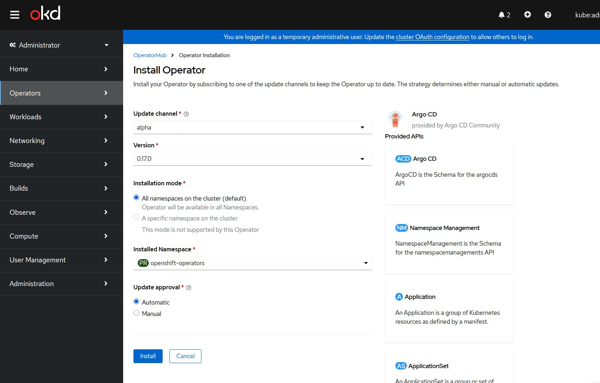
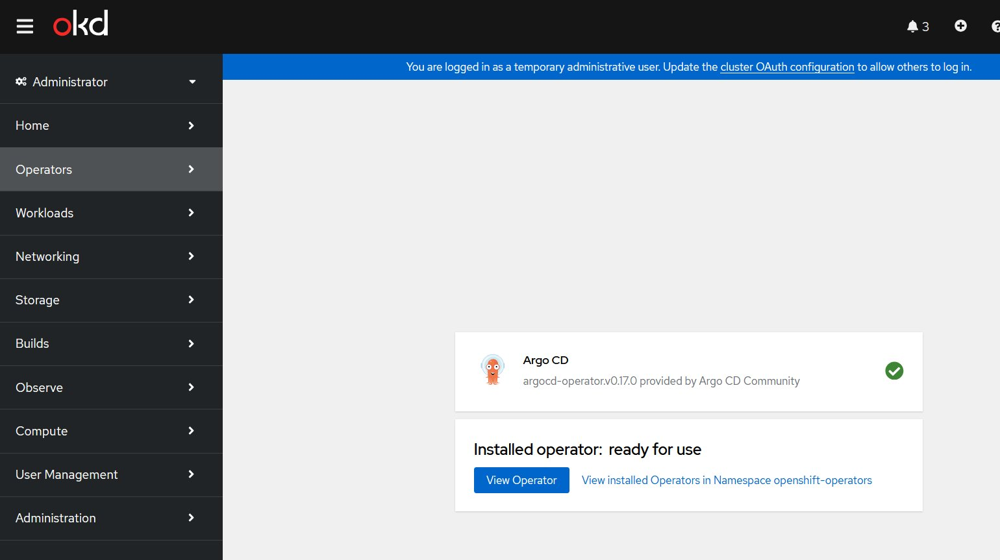
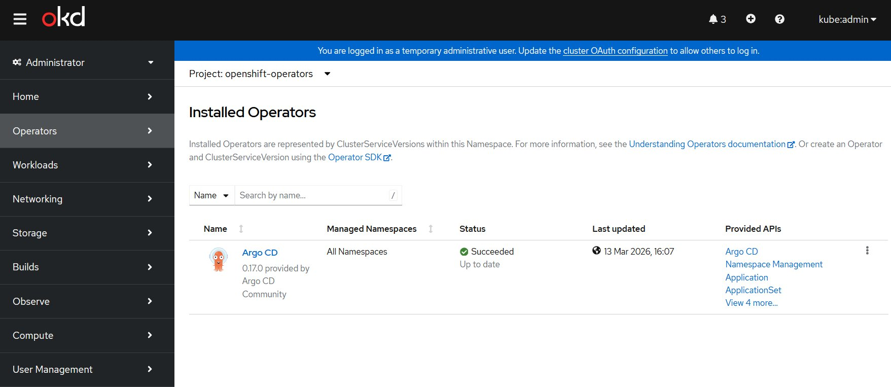
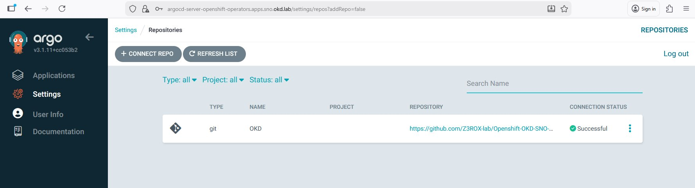

# Phase 2b-i — ArgoCD : Installation et connexion GitHub

## Composants déployés

| Composant | Version | Namespace | Status |
|-----------|---------|-----------|--------|
| Argo CD Operator | 0.17.0 | openshift-operators | ✅ Succeeded |
| ArgoCD Instance | v3.1.11 | openshift-operators | ✅ Available |

- **URL** : `https://argocd-server-openshift-operators.apps.sno.okd.lab`
- **Admin password** : secret `argocd-cluster` dans `openshift-operators`

---

## Problème réseau — pods OKD sans accès internet

### Symptôme

ArgoCD ne pouvait pas se connecter à GitHub :
```
Unable to connect HTTPS repository: error testing repository connectivity:
context deadline exceeded (Client.Timeout exceeded while awaiting headers)
```

### Diagnostic

OVN SNO ne configure pas de règle SNAT par défaut. Les pods sortent avec leur IP
`10.128.x.x` qui n'est pas routée par VMware NAT — les réponses ne reviennent jamais.

```
Pod (10.128.x.x) → GitHub (140.82.121.x)
                ← réponse perdue (10.128.x.x non routable)
```

### Ce qui ne fonctionne PAS

**SNAT OVN via `ovn-nbctl lr-nat-add`** — testé et abandonné :

```bash
# NE PAS UTILISER — casse les pods
ovn-nbctl lr-nat-add ovn_cluster_router snat 192.168.241.10 10.128.0.0/14
```

Ce SNAT intercepte aussi le trafic vers l'API Kubernetes (`172.30.0.1`), ce qui
provoque des `i/o timeout` sur tous les appels API depuis les pods → CrashLoopBackOff.

**MSS clamping iptables FORWARD** — testé et abandonné :

```bash
# NE PAS UTILISER — OVN bypasse netfilter FORWARD
sudo iptables -t mangle -A FORWARD -s 10.128.0.0/14 -p tcp --tcp-flags SYN,RST SYN -j TCPMSS --set-mss 1360
```

OVN implémente son propre dataplane et bypasse les règles iptables FORWARD.

### Solution retenue — tinyproxy sur le node

Le management port OVN (`ovn-k8s-mp0`, IP `10.128.0.2`) est accessible depuis les pods
et depuis le node. On lance tinyproxy en `--network host` sur le node — les pods l'atteignent
via `10.128.0.2:8888`.

```
Pod (10.128.x.x)
    │
    │  HTTPS_PROXY=http://10.128.0.2:8888
    ▼
tinyproxy (node OKD, --network host, port 8888)
    │
    │  via br-ex → VMware NAT → internet
    ▼
GitHub ✅
```

### Déploiement tinyproxy

```bash
ssh -i ~/.ssh/okd-sno core@192.168.241.10

podman run -d --name tinyproxy \
  --network host \
  --restart always \
  docker.io/vimagick/tinyproxy:latest

# Vérifier
ss -tlnp | grep 8888
```

### Persistance au reboot — systemd unit FCOS

Sur FCOS, tinyproxy est persisté via un systemd unit qui redémarre le container podman
automatiquement à chaque boot :

```bash
sudo tee /etc/systemd/system/tinyproxy-pod.service << 'EOF'
[Unit]
Description=Tinyproxy HTTP proxy for OKD pods
After=network-online.target
Wants=network-online.target

[Service]
Type=oneshot
RemainAfterExit=yes
ExecStartPre=-/usr/bin/podman rm -f tinyproxy
ExecStart=/usr/bin/podman run -d --name tinyproxy \
  --network host \
  docker.io/vimagick/tinyproxy:latest
ExecStop=/usr/bin/podman stop tinyproxy

[Install]
WantedBy=multi-user.target
EOF

sudo systemctl daemon-reload
sudo systemctl enable tinyproxy-pod.service
sudo systemctl start tinyproxy-pod.service
```

Status attendu : `Active: active (exited)` — normal pour un service `Type=oneshot`.

---

## Installation ArgoCD Operator

### OperatorHub

- **Operator** : Argo CD Community v0.17.0
- **Channel** : alpha
- **Installation mode** : All namespaces (specific namespace non supporté)
- **Namespace** : openshift-operators

> Note : Red Hat OpenShift GitOps Operator n'est pas disponible dans OKD community —
> uniquement dans OpenShift commercial. L'opérateur community Argo CD est l'équivalent
> fonctionnel pour le lab.

### Manifest instance

```yaml
apiVersion: argoproj.io/v1alpha1
kind: ArgoCD
metadata:
  name: argocd
  namespace: openshift-operators
spec:
  server:
    route:
      enabled: true   # Route OKD créée automatiquement
  dex:
    openShiftOAuth: true
  repo:
    env:
      - name: HTTPS_PROXY
        value: "http://10.128.0.2:8888"
      - name: HTTP_PROXY
        value: "http://10.128.0.2:8888"
      - name: NO_PROXY
        value: "10.128.0.0/14,172.30.0.0/16,192.168.241.0/24,.cluster.local,.sno.okd.lab"
```

> Le proxy est configuré uniquement sur `repo` (argocd-repo-server) — pas sur
> `server` (argocd-server). Le serveur ArgoCD ne fait pas de connexions externes,
> seul le repo-server clone les repos Git.

---

## Connexion repo GitHub

```
Settings → Repositories → + CONNECT REPO
Connection method : HTTPS
Type : git
Repository URL : https://github.com/Z3ROX-lab/Openshift-OKD-SNO-Airgap-workstation
Username : Z3ROX
Password : <GitHub PAT — scope repo>
```

---

## Post-reboot checklist

```bash
# 1. Approuver CSRs kubelet
./scripts/okd-approve-csr.sh

# 2. tinyproxy démarre automatiquement via systemd unit
#    Vérifier si nécessaire :
ssh -i ~/.ssh/okd-sno core@192.168.241.10 \
  "sudo systemctl status tinyproxy-pod.service | grep Active"

# 3. Vérifier ArgoCD
oc get pods -n openshift-operators | grep argocd
```

---

## Fichiers manifests

| Fichier | Description |
|---------|-------------|
| `manifests/argocd/01-argocd-instance.yaml` | CR ArgoCD avec proxy repo-server |
| `scripts/okd-network-fix.sh` | Script persistance tinyproxy post-reboot |

---

## Screenshots

### 1. OperatorHub — recherche gitops


*OperatorHub — recherche "gitops" : Argo CD Community visible, Red Hat OpenShift GitOps absent*

### 2. Argo CD detail


*Argo CD v0.17.0 — Community Operator*

### 3. Configuration installation


*All namespaces — openshift-operators — Automatic*

### 4. Operator Succeeded


*Argo CD operator Succeeded ✅*

### 5. Instance Available


*Instance argocd — Phase: Available ✅*

### 6. ArgoCD UI


*ArgoCD v3.1.11 — dashboard vide, prêt pour les applications*

### 7. Repo GitHub connecté


*Repo GitHub connecté — Connection Status: Successful ✅*
