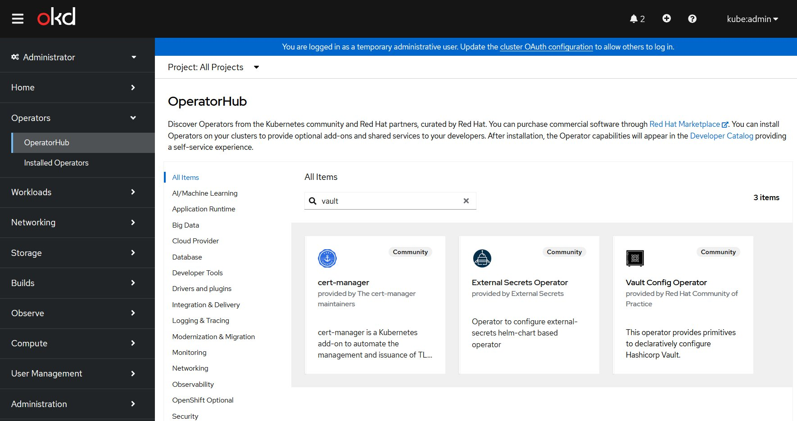
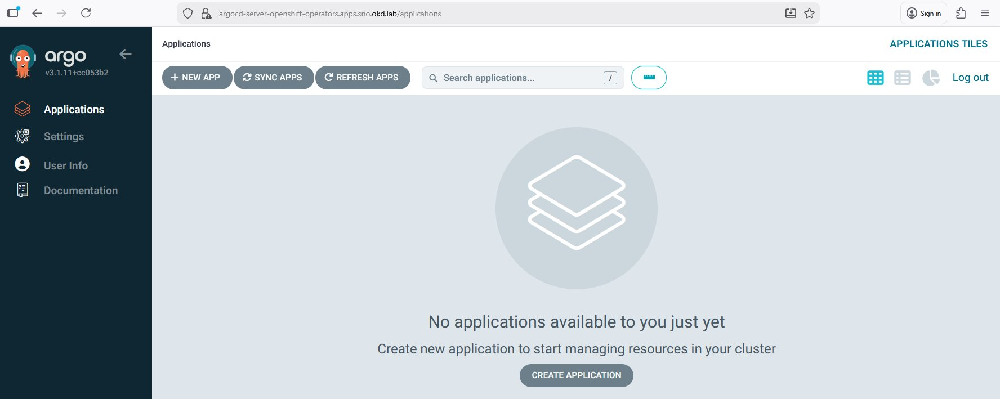

# Phase 2b — ArgoCD + HashiCorp Vault

## Pourquoi ArgoCD avant Vault ?

Jusqu'ici, tout a été appliqué manuellement (`oc apply -f`, `helm install`). C'est acceptable
pour bootstrapper les composants de base (Keycloak, certificats), mais ce n'est pas scalable
et ce n'est pas représentatif d'un cluster enterprise réel.

À partir de cette phase, **ArgoCD devient le seul vecteur de déploiement**. Cela signifie :

- Les manifests dans le repo Git sont la **source de vérité** (GitOps)
- Aucun `oc apply` ou `helm install` manuel en production
- Tout changement passe par un commit → ArgoCD synchronise automatiquement
- L'état du cluster est **auditable, reproductible, et versionné**

Vault est le premier composant déployé via ArgoCD — ce qui valide le pattern GitOps
end-to-end pour toutes les phases suivantes.

---

## Pourquoi Vault n'est pas dans l'OperatorHub OKD ?

Lors de la recherche `vault` dans OperatorHub, trois résultats apparaissent :

| Operator | Provider | Rôle |
|----------|----------|------|
| cert-manager | cert-manager maintainers | Gestion certificats TLS — sans rapport |
| External Secrets Operator | External Secrets | Synchro secrets externes → K8s Secrets |
| **Vault Config Operator** | Red Hat Community of Practice | Configure Vault (policies, auth, engines) |

**HashiCorp Vault lui-même n'est pas dans l'OperatorHub OKD.** Voici pourquoi :

HashiCorp considère que le **déploiement de Vault** est une responsabilité infrastructure,
pas applicative. Vault est un système de sécurité critique dont le cycle de vie
(installation, mise à jour, unseal, disaster recovery) doit être maîtrisé explicitement
par les équipes infra — pas délégué à un operator automatique.

C'est la même logique que pour les bases de données critiques : on ne déploie pas PostgreSQL
en production via un operator automatique sans contrôle, on utilise Helm avec des values
précisément configurées.

Le **Vault Config Operator** (Red Hat CoP) suppose donc que Vault est **déjà déployé**
et se concentre uniquement sur sa configuration déclarative via des CRDs Kubernetes :

```
Vault Config Operator gère :         Vault Config Operator ne gère PAS :
─────────────────────────────         ──────────────────────────────────────
✅ VaultAuthMethod (kubernetes)       ❌ Déploiement des pods Vault
✅ VaultPolicy (HCL policies)         ❌ Initialisation et unseal
✅ VaultSecretEngine (kv, pki...)     ❌ TLS et certificats Vault
✅ VaultRole                          ❌ HA et clustering Vault
✅ VaultSecret (sync → K8s Secret)    ❌ Backup et restauration
```

---

## Architecture de déploiement

```
┌─────────────────────────────────────────────────────────────┐
│                    GITOPS PATTERN                            │
│                                                              │
│  Git Repo (Z3ROX-lab)                                        │
│  └── gitops/                                                 │
│      ├── argocd/                                             │
│      │   └── applications/                                   │
│      │       ├── vault.yaml          ← ArgoCD App            │
│      │       └── vault-config.yaml   ← ArgoCD App            │
│      └── manifests/                                          │
│          ├── vault/                                          │
│          │   ├── values.yaml         ← Helm values Vault     │
│          │   └── helm-release.yaml                           │
│          └── vault-config/                                   │
│              ├── auth-kubernetes.yaml                        │
│              ├── secret-engine-kv.yaml                       │
│              └── policy-okd.yaml                             │
│                          │                                   │
│                          │ sync                              │
│                          ▼                                   │
│  ArgoCD (openshift-gitops)                                   │
│      │                                                       │
│      ├── App: vault ──────────────────────────────────────┐  │
│      │   Helm chart: hashicorp/vault                      │  │
│      │   Namespace: vault                                 │  │
│      │                                                    ▼  │
│      │                                           Vault Pods  │
│      │                                           (dev mode)  │
│      │                                                       │
│      └── App: vault-config ───────────────────────────────┐  │
│          Vault Config Operator CRDs                       │  │
│          Namespace: vault                                 ▼  │
│                                               Auth K8s ✅    │
│                                               KV Engine ✅   │
│                                               Policies ✅    │
└─────────────────────────────────────────────────────────────┘
```

---

## Sources de vérité — GitHub, GitLab CI et Harbor

Une question naturelle quand on a un GitLab Runner dans OKD et ArgoCD qui synchronise
depuis GitHub : **a-t-on deux sources de vérité ?**

Non — chaque composant a un rôle distinct et non overlapping.

### Les trois sources de vérité distinctes

| Composant | Type | Ce qu'il contient |
|-----------|------|-------------------|
| **GitHub** | Source de vérité infra | Manifests K8s, Helm values, ArgoCD Apps, policies |
| **Harbor** | Source de vérité artefacts | Images OCI versionnées, Helm charts OCI |
| **GitLab CI** | Pipeline de transformation | Pas une source de vérité — produit des artefacts |

GitLab CI n'est **jamais** une source de vérité. C'est un pipeline de transformation :
il prend du code source, produit une image, la pousse dans Harbor, puis met à jour
un tag dans GitHub. Il ne parle jamais directement au cluster.

### Flux complet GitOps — du commit au déploiement

```
┌─────────────────────────────────────────────────────────────────────┐
│           FLUX COMPLET : CODE → IMAGE → CLUSTER                     │
│                                                                      │
│  Développeur                                                         │
│      │                                                               │
│      │  1. git push (code applicatif)                               │
│      ▼                                                               │
│  GitLab (gitlab.com free tier)                                       │
│      │                                                               │
│      │  2. déclenche pipeline GitLab CI                             │
│      ▼                                                               │
│  GitLab Runner (pod dans OKD)                                        │
│      │                                                               │
│      ├── 3a. build image → Kaniko (sans Docker daemon)              │
│      ├── 3b. scan CVE   → Trivy                                     │
│      ├── 3c. sign image → Cosign                                    │
│      │                                                               │
│      │  4. push image + signature                                   │
│      ▼                                                               │
│  Harbor (harbor.okd.lab)  ◄──────────────────────────────────────┐  │
│      │                                                            │  │
│      │  scan Trivy automatique à chaque push                     │  │
│      │  stockage OCI : harbor.okd.lab/apps/myapp:v1.2.3          │  │
│      │                                                            │  │
│      │  5. pipeline met à jour le manifest GitHub                 │  │
│      ▼                                                            │  │
│  GitHub (Z3ROX-lab/Openshift-OKD-SNO-Airgap-workstation)         │  │
│      │                                                            │  │
│      │  manifests/apps/myapp/deployment.yaml                     │  │
│      │    image: harbor.okd.lab/apps/myapp:v1.2.3  ← commit auto │  │
│      │                                                            │  │
│      │  6. ArgoCD détecte le changement (polling ou webhook)     │  │
│      ▼                                                            │  │
│  ArgoCD (openshift-gitops)                                        │  │
│      │                                                            │  │
│      │  7. sync → applique le manifest mis à jour                │  │
│      ▼                                                            │  │
│  OKD — Kubernetes API                                             │  │
│      │                                                            │  │
│      │  8. Kyverno vérifie la signature Cosign de l'image        │  │
│      │     avant autorisation du déploiement                     │  │
│      │                                                            │  │
│      │  9. pull image depuis Harbor ─────────────────────────────┘  │
│      ▼                                                               │
│  Pod applicatif ✅ — image signée, scannée, versionnée              │
│                                                                      │
│ ┌──────────────────────────────────────────────────────────────┐    │
│ │  RÈGLE GITOPS STRICTE :                                       │    │
│ │  Le cluster ne reçoit d'ordres QUE depuis GitHub via ArgoCD  │    │
│ │  GitLab CI ne parle JAMAIS directement à l'API Kubernetes    │    │
│ │  Tout changement d'état du cluster = commit dans GitHub      │    │
│ └──────────────────────────────────────────────────────────────┘    │
└─────────────────────────────────────────────────────────────────────┘
```

### Pourquoi ce pattern est important en enterprise

En contexte grands comptes (défense, banque, télécom), ce pattern répond à trois exigences :

**Auditabilité** — chaque déploiement est tracé dans Git avec un auteur, une date,
et un diff lisible. L'audit trail est complet sans effort supplémentaire.

**Séparation des accès** — les développeurs poussent du code sur GitLab, jamais
de credentials Kubernetes. Seul ArgoCD a accès au cluster, via un ServiceAccount
dédié avec des droits minimaux.

**Reproductibilité** — l'état exact du cluster à n'importe quel instant est
reconstituable depuis Git + Harbor. En cas de disaster recovery, on repointe
ArgoCD sur le repo et le cluster se reconstruit seul.

---

## Séparation des responsabilités — récapitulatif

```
┌──────────────────┬────────────────────────────────────────────┐
│ Composant        │ Responsabilité                             │
├──────────────────┼────────────────────────────────────────────┤
│ ArgoCD           │ Déployer et synchroniser TOUT le reste     │
│                  │ depuis Git                                 │
├──────────────────┼────────────────────────────────────────────┤
│ Helm chart Vault │ Déployer les pods Vault (infrastructure)   │
│ (via ArgoCD)     │ Init, unseal, TLS, storage backend         │
├──────────────────┼────────────────────────────────────────────┤
│ Vault Config     │ Configurer Vault de façon déclarative      │
│ Operator         │ Auth Kubernetes, policies HCL, KV engine   │
│ (via ArgoCD)     │ Sync secrets Vault → K8s Secrets           │
├──────────────────┼────────────────────────────────────────────┤
│ Vault            │ Stocker et distribuer les secrets          │
│                  │ aux workloads du cluster                   │
└──────────────────┴────────────────────────────────────────────┘
```

---

## Flow Vault Agent Injector — comment un workload consomme un secret

```
┌─────────────────────────────────────────────────────────────────┐
│              VAULT AGENT INJECTOR — SECRET INJECTION             │
│                                                                  │
│  Développeur                                                     │
│      │                                                           │
│      │  1. commit manifest avec annotation Vault                │
│      │     vault.hashicorp.com/agent-inject: "true"             │
│      │     vault.hashicorp.com/role: "okd-app"                  │
│      ▼                                                           │
│  ArgoCD → applique le manifest                                   │
│      │                                                           │
│      │  2. crée le Pod                                           │
│      ▼                                                           │
│  Kubernetes API                                                  │
│      │                                                           │
│      │  3. webhook mutating → Vault Agent Injector              │
│      ▼                                                           │
│  Vault Agent Injector                                            │
│      │                                                           │
│      │  4. injecte un init container + sidecar dans le Pod      │
│      ▼                                                           │
│  Pod (init container vault-agent)                                │
│      │                                                           │
│      │  5. s'authentifie auprès de Vault                        │
│      │     via le ServiceAccount K8s (auth method kubernetes)   │
│      ▼                                                           │
│  Vault                                                           │
│      │                                                           │
│      │  6. valide le token ServiceAccount + policy              │
│      │  7. retourne le secret (ex: DB_PASSWORD)                 │
│      ▼                                                           │
│  Pod (sidecar vault-agent)                                       │
│      │                                                           │
│      │  8. écrit le secret dans /vault/secrets/config           │
│      │     (volume partagé dans le Pod)                         │
│      ▼                                                           │
│  Container applicatif                                            │
│      │                                                           │
│      │  9. lit le secret depuis /vault/secrets/config           │
│      │     → jamais de secret dans les env vars ou K8s Secrets  │
│      ▼                                                           │
│  Application ✅ — secret consommé sans jamais transiter         │
│                    par etcd ou Git                               │
│                                                                  │
│  ┌──────────────────────────────────────────────────────────┐   │
│  │  ZERO SECRET DANS :                                       │   │
│  │  ❌ Git (pas de Secret YAML commité)                      │   │
│  │  ❌ etcd (pas de K8s Secret en clair)                     │   │
│  │  ❌ Variables d'environnement (pas d'env injection)       │   │
│  │  ✅ Uniquement dans /vault/secrets/ — volume éphémère     │   │
│  └──────────────────────────────────────────────────────────┘   │
└─────────────────────────────────────────────────────────────────┘
```

---

## Plan de déploiement

### Étape 1 — OpenShift GitOps Operator (ArgoCD)

Installation via OperatorHub — **Red Hat OpenShift GitOps** (ArgoCD packagé Red Hat).

- Namespace : `openshift-gitops` (créé automatiquement)
- Route ArgoCD : `https://openshift-gitops-server-openshift-gitops.apps.sno.okd.lab`
- Auth : intégration Keycloak OIDC (realm `okd`, client `argocd`)

### Étape 2 — Connexion repo Git → ArgoCD

Configurer ArgoCD pour utiliser `Z3ROX-lab/Openshift-OKD-SNO-Airgap-workstation`
comme source de vérité.

### Étape 3 — Helm chart Vault via ArgoCD Application

```yaml
# gitops/applications/vault.yaml
apiVersion: argoproj.io/v1alpha1
kind: Application
metadata:
  name: vault
  namespace: openshift-gitops
spec:
  project: default
  source:
    repoURL: https://helm.releases.hashicorp.com
    chart: vault
    targetRevision: 0.28.0
    helm:
      valueFiles:
        - values.yaml
  destination:
    server: https://kubernetes.default.svc
    namespace: vault
  syncPolicy:
    automated:
      prune: true
      selfHeal: true
    syncOptions:
      - CreateNamespace=true
```

### Étape 4 — Vault Config Operator via ArgoCD

Installation du Vault Config Operator depuis OperatorHub via ArgoCD (Subscription CRD).
Configuration : auth Kubernetes, KV secret engine v2, policies.

### Étape 5 — Intégration Vault ↔ Keycloak

- Client OIDC `vault` dans realm `okd` Keycloak
- Vault auth method OIDC → Keycloak
- Accès UI Vault via SSO

---

## Choix techniques

**Vault mode dev vs prod pour le lab**

Pour ce lab portfolio, Vault sera déployé en **mode dev** (stockage en mémoire, auto-unseal,
token root fixe). Ce n'est pas un choix de production — en enterprise, Vault utilise un
backend HA (Consul, Integrated Storage/Raft) avec auto-unseal via AWS KMS ou Azure Key Vault.

Le mode dev permet de se concentrer sur les intégrations (Kubernetes auth, OIDC, Agent
Injector) sans la complexité opérationnelle de l'unseal et du clustering.

**Helm chart version**

HashiCorp maintient le chart officiel `hashicorp/vault`. Version cible : `0.28.x`
(Vault 1.17.x). C'est la version utilisée dans les contextes enterprise actuels.

---

## Fichiers à créer dans le repo

```
gitops/
├── argocd/
│   └── projects/
│       └── lab-project.yaml          # AppProject OKD lab
└── applications/
    ├── vault.yaml                    # ArgoCD App → Helm chart Vault
    └── vault-config-operator.yaml    # ArgoCD App → Subscription OLM

manifests/
└── vault/
    ├── values.yaml                   # Helm values Vault (dev mode)
    ├── auth-kubernetes.yaml          # VaultAuthMethod CR
    ├── secret-engine-kv.yaml         # VaultSecretEngine CR
    └── policy-okd.yaml               # VaultPolicy CR
```

---

## Notes importantes

- ArgoCD sera lui-même intégré à Keycloak SSO (client `argocd` dans realm `okd`)
  une fois Vault déployé — afin d'avoir un SSO complet console OKD + ArgoCD + Vault
- Le Vault Config Operator nécessite que Vault soit initialisé et unsealed avant
  de pouvoir créer des ressources — ordre de déploiement à respecter
- Les secrets Vault (root token, unseal keys) ne doivent **jamais** être commités dans Git
- En Phase 4, SealedSecrets chiffrera les secrets Kubernetes au repos dans Git

---

## Screenshots

*(à compléter au fil du déploiement)*

### 1. OperatorHub — recherche vault


*OperatorHub — recherche "vault" : 3 résultats, HashiCorp Vault absent, Vault Config Operator (Red Hat CoP) présent*

### 2. OpenShift GitOps Operator
<!--  -->

### 3. ArgoCD UI
<!--  -->

### 4. ArgoCD Application Vault
<!--  -->

### 5. Vault UI
<!--  -->
