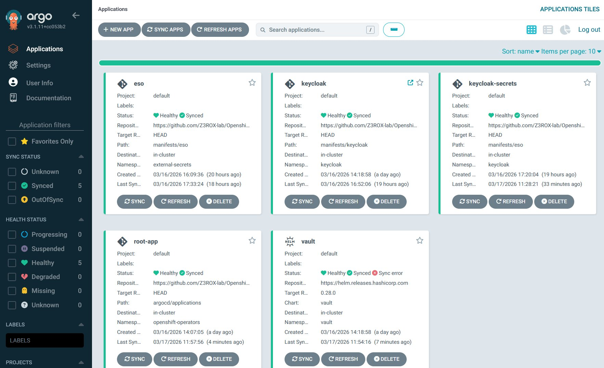

# Phase 2b — ArgoCD App of Apps + HashiCorp Vault + ESO

## Vue d'ensemble

Cette phase met en place le pattern **GitOps complet** sur le cluster OKD SNO :
- ArgoCD en mode **App of Apps** — une seule source de vérité Git
- HashiCorp Vault — gestion centralisée des secrets
- External Secrets Operator (ESO) — synchronisation Vault → K8s Secrets

---

## Architecture générale

```
┌─────────────────────────────────────────────────────────────────────────────────┐
│                          GITHUB REPO (GitOps Source of Truth)                   │
│                                                                                 │
│  manifests/                          argocd/applications/                       │
│  ├── argocd/                         ├── keycloak.yaml                          │
│  │   ├── 00-subscription.yaml        ├── keycloak-secrets.yaml                  │
│  │   ├── 01-argocd-instance.yaml     ├── vault.yaml                             │
│  │   ├── 02-repo-helm-hashicorp.yaml ├── eso.yaml                               │
│  │   └── root-app.yaml               └── (futures apps...)                      │
│  ├── keycloak/                                                                  │
│  │   ├── 00-namespace.yaml           scripts/                                   │
│  │   ├── 00-subscription.yaml        └── vault-bootstrap.sh                     │
│  │   ├── 01-tls-secret.sh (manuel)                                              │
│  │   ├── 02-keycloak-instance.yaml                                              │
│  │   ├── 03-client-secret.yaml                                                  │
│  │   └── 04-oauth-cluster.yaml (manuel)                                         │
│  ├── vault/                                                                     │
│  │   ├── 00-namespace.yaml                                                      │
│  │   ├── values.yaml                                                            │
│  │   └── extras/                                                                │
│  │       ├── 01-route.yaml                                                      │
│  │       └── 02-auth-delegator.yaml (manuel)                                    │
│  └── eso/                                                                       │
│      ├── 00-namespace.yaml                                                      │
│      ├── 00-subscription.yaml                                                   │
│      ├── 01-operatorconfig.yaml                                                 │
│      ├── 01-secret-store.yaml                                                   │
│      └── 02-external-secret.yaml                                                │
└───────────────────────────┬─────────────────────────────────────────────────────┘
                            │
          BOOTSTRAP (2 commandes manuelles une seule fois)
          oc apply -f manifests/argocd/00-subscription.yaml
          oc apply -f manifests/argocd/root-app.yaml
                            │
                            ▼
┌─────────────────────────────────────────────────────────────────────────────────┐
│                              CLUSTER OKD SNO                                    │
│                                                                                 │
│  NS: openshift-operators                                                        │
│  ┌───────────────────────────────────────────────────────────────────────────┐  │
│  │  ArgoCD (App of Apps)                                                     │  │
│  │                                                                           │  │
│  │  root-app ──────────────────────────────────────────────────────────┐    │  │
│  │     │ détecte argocd/applications/                                  │    │  │
│  │     ├──► Application keycloak          ──► NS: keycloak             │    │  │
│  │     ├──► Application keycloak-secrets  ──► NS: keycloak             │    │  │
│  │     ├──► Application vault             ──► NS: vault                │    │  │
│  │     └──► Application eso               ──► NS: external-secrets     │    │  │
│  └───────────────────────────────────────────────────────────────────────┘  │  │
│                                                                               │  │
│  ┌──────────────────┐  ┌──────────────────┐  ┌──────────────────────────┐   │  │
│  │  NS: keycloak    │  │  NS: vault        │  │  NS: external-secrets    │   │  │
│  │                  │  │                   │  │                          │   │  │
│  │  Keycloak Pod    │  │  vault-0 (dev)    │  │  ESO Operator            │   │  │
│  │  ┌────────────┐  │  │  ┌─────────────┐ │  │  ┌────────────────────┐  │   │  │
│  │  │ Realm: okd │  │  │  │ KV v2       │ │  │  │ external-secrets   │  │   │  │
│  │  │ Client:    │  │  │  │ secret/     │ │  │  │ cert-controller    │  │   │  │
│  │  │ openshift  │  │  │  │ ├─keycloak/ │ │  │  │ webhook            │  │   │  │
│  │  └────────────┘  │  │  │ │ ├─config  │ │  │  └────────────────────┘  │   │  │
│  │                  │  │  │ │ ├─admin   │ │  │                          │   │  │
│  │  SecretStore     │  │  │ │ └─client  │ │  │  OperatorConfig          │   │  │
│  │  ┌────────────┐  │  │  │ └─argocd/  │ │  │  └── cluster             │   │  │
│  │  │vault-backend│ │  │  │   └─github  │ │  │                          │   │  │
│  │  │Valid ✅    │  │  │  ├─────────────┤ │  └──────────────────────────┘   │  │
│  │  └─────┬──────┘  │  │  │ Auth:       │ │                                 │  │
│  │        │         │  │  │ kubernetes/ │ │                                 │  │
│  │  ExternalSecret  │  │  │ ├─config    │ │                                 │  │
│  │  ┌────────────┐  │  │  │ │ CA cert ✅│ │                                 │  │
│  │  │keycloak-   │  │  │  │ └─role/     │ │                                 │  │
│  │  │secrets     │  │  │  │   keycloak  │ │                                 │  │
│  │  │Synced ✅   │  │  │  └─────────────┘ │                                 │  │
│  │  └─────┬──────┘  │  │                   │                                 │  │
│  │        │ génère  │  │  Route OKD         │                                 │  │
│  │        ▼         │  │  vault.apps.       │                                 │  │
│  │  K8s Secret      │  │  sno.okd.lab ✅    │                                 │  │
│  │  keycloak-vault  │  └───────────────────┘                                 │  │
│  │  -secrets ✅     │                                                         │  │
│  └──────────────────┘                                                         │  │
└───────────────────────────────────────────────────────────────────────────────┘  │
                                                                                   │
┌──────────────────────────────────────────────────────────────────────────────────┘
│  POST-BOOTSTRAP (manuels, une seule fois ou après reboot)
│
│  source .env && ./scripts/vault-bootstrap.sh  → Kubernetes auth, policies, secrets
│  ./manifests/keycloak/01-tls-secret.sh        → TLS secret Keycloak (après reboot)
│  oc apply -f manifests/keycloak/04-oauth-cluster.yaml → OAuth OKD (une seule fois)
│  oc apply -f manifests/vault/extras/02-auth-delegator.yaml → CRB TokenReview (une fois)
└──────────────────────────────────────────────────────────────────────────────────
```

---

## Pattern App of Apps

ArgoCD utilise le pattern **App of Apps** — une seule Application racine (`root-app`)
pointe vers le dossier `argocd/applications/` et crée automatiquement toutes les
sous-applications.

```
oc apply -f manifests/argocd/root-app.yaml  (une seule fois)
        ↓
ArgoCD détecte argocd/applications/
        ↓
Crée automatiquement : keycloak, vault, eso, keycloak-secrets
        ↓
Chaque app sync ses propres manifests/Helm charts
```

**Avantage** : ajouter une nouvelle application = créer un fichier YAML dans
`argocd/applications/`. ArgoCD la détecte et la déploie automatiquement.

---

## Pattern OLM Subscription GitOps

Sur OpenShift, chaque opérateur installé via OperatorHub est tracé dans Git via
une `Subscription` OLM. ArgoCD applique la Subscription → OLM installe l'opérateur.

```
manifests/<composant>/
├── 00-namespace.yaml      → namespace + label argocd managed-by
├── 00-subscription.yaml   → OLM Subscription (remplace le clic UI OperatorHub)
└── 01-xxx.yaml            → CRs de l'opérateur
```

**Règle** : tout opérateur installé via OperatorHub doit avoir un `00-subscription.yaml`
dans le repo. Le cluster est ainsi 100% reproductible depuis Git.

---

## HashiCorp Vault — configuration

### Choix : mode dev pour le lab

Vault est déployé en mode dev (stockage mémoire, auto-unseal, token root fixe `root`).

| Mode dev | Mode Raft (prod) |
|----------|-----------------|
| Stockage mémoire | Stockage persistant sur disque |
| Auto-unseal | Unseal manuel ou Azure Key Vault |
| Token root fixe | Tokens dynamiques |
| Données perdues au reboot | Données persistantes |

En production : mode Raft + auto-unseal via Azure Key Vault ou Transit Vault.

### Architecture Vault dans le cluster

```
┌─────────────────────────────────────────────────────────────────────┐
│                        VAULT (mode dev)                             │
│                                                                     │
│  ┌─────────────────────────────────────────────────────────────┐   │
│  │                   AUTH METHODS                              │   │
│  │                                                             │   │
│  │  ┌─────────────────────────────────────────────────────┐   │   │
│  │  │           kubernetes/                               │   │   │
│  │  │  ┌─────────────────┐  ┌─────────────────────┐      │   │   │
│  │  │  │  role/keycloak  │  │    role/argocd      │      │   │   │
│  │  │  │  SA: default    │  │  SA: argocd-server  │      │   │   │
│  │  │  │  NS: keycloak   │  │  NS: openshift-ops  │      │   │   │
│  │  │  └────────┬────────┘  └──────────┬──────────┘      │   │   │
│  │  └───────────┼──────────────────────┼─────────────────┘   │   │
│  └──────────────┼──────────────────────┼─────────────────────┘   │
│                 │ policies=             │ policies=                │
│                 ▼                       ▼                          │
│  ┌─────────────────────────────────────────────────────────────┐  │
│  │                      POLICIES                               │  │
│  │  ┌──────────────────────┐  ┌──────────────────────┐        │  │
│  │  │   keycloak-policy    │  │    argocd-policy     │        │  │
│  │  │ secret/keycloak/* RO │  │  secret/argocd/* RO  │        │  │
│  │  └──────────┬───────────┘  └──────────┬───────────┘        │  │
│  └─────────────┼────────────────────────┼─────────────────────┘  │
│                │ autorise accès à        │                         │
│                ▼                         ▼                         │
│  ┌─────────────────────────────────────────────────────────────┐  │
│  │                   SECRETS ENGINE KV v2                      │  │
│  │                                                             │  │
│  │   secret/keycloak/config     secret/argocd/github           │  │
│  │   secret/keycloak/admin      (token GitHub)                 │  │
│  │   secret/keycloak/client-secrets                            │  │
│  └─────────────────────────────────────────────────────────────┘  │
└─────────────────────────────────────────────────────────────────────┘
```

### Bootstrap Vault après reboot

En mode dev, Vault repart à zéro à chaque redémarrage. Le script
`scripts/vault-bootstrap.sh` reconfigure tout automatiquement :

```bash
source .env && ./scripts/vault-bootstrap.sh
```

Variables d'environnement requises (dans `.env`, jamais commité) :
```bash
export KEYCLOAK_ADMIN_PASSWORD="ton-vrai-password"
export KEYCLOAK_CLIENT_SECRET="ton-vrai-client-secret"
export ARGOCD_GITHUB_TOKEN="ton-vrai-token"
```

---

## External Secrets Operator (ESO)

ESO synchronise les secrets de Vault vers des K8s Secrets Kubernetes.

### Flow ESO ↔ Vault ↔ Keycloak

```
┌─────────────────────────────────────────────────────────────────────┐
│                         GITOPS (GitHub)                             │
│                                                                     │
│  argocd/applications/keycloak-secrets.yaml                          │
│  manifests/eso/                                                     │
│  ├── 01-secret-store.yaml    → connexion Vault                      │
│  └── 02-external-secret.yaml → mapping Vault → K8s Secret          │
└──────────────────────────┬──────────────────────────────────────────┘
                           │ ArgoCD sync
                           ▼
┌─────────────────────────────────────────────────────────────────────┐
│                         CLUSTER OKD                                 │
│                                                                     │
│  NS: external-secrets                                               │
│  ┌──────────────────────────────────────────────────────────────┐  │
│  │  External Secrets Operator (ESO)                             │  │
│  │                                                              │  │
│  │  SA: cluster-external-secrets                                │  │
│  │  1. lit les ExternalSecret CRs dans tous les namespaces      │  │
│  │  2. s'authentifie auprès de Vault (Kubernetes auth)          │  │
│  │  3. récupère les secrets                                     │  │
│  │  4. crée/met à jour les K8s Secrets                          │  │
│  └──────────┬───────────────────────────────┬───────────────────┘  │
│             │ auth (SA token)                │ crée/sync            │
│             ▼                                ▼                      │
│  ┌─────────────────────┐      ┌──────────────────────────────────┐ │
│  │  NS: vault          │      │  NS: keycloak                    │ │
│  │                     │      │                                  │ │
│  │  SecretStore        │      │  ExternalSecret                  │ │
│  │  ┌───────────────┐  │      │  ┌──────────────────────────┐   │ │
│  │  │ provider:     │  │      │  │ secretStoreRef: vault    │   │ │
│  │  │  vault:       │  │      │  │ target: keycloak-secrets │   │ │
│  │  │   path:secret │  │      │  │ data:                    │   │ │
│  │  │   auth:       │  │      │  │  - remoteRef:            │   │ │
│  │  │    kubernetes │  │      │  │    key: keycloak/admin   │   │ │
│  │  └───────────────┘  │      │  └──────────┬───────────────┘   │ │
│  │                     │      │             │ génère             │ │
│  │  Vault KV v2        │      │  ┌──────────▼───────────────┐   │ │
│  │  secret/keycloak/*  │      │  │  K8s Secret              │   │ │
│  │  ├── admin          │      │  │  keycloak-vault-secrets   │   │ │
│  │  ├── config         │      │  │  ├── username: admin     │   │ │
│  │  └── client-secrets │      │  │  └── password: ****      │   │ │
│  └─────────────────────┘      └──────────────────────────────────┘ │
│                                         ↺ refresh toutes les 1h    │
└─────────────────────────────────────────────────────────────────────┘
```

---

## Ressources cluster-level — gestion manuelle

Certaines ressources sont **cluster-level** et incompatibles avec ArgoCD en mode
namespaced. Elles sont exclues du sync ArgoCD et appliquées manuellement une seule fois.

| Fichier | Type | Commande |
|---------|------|----------|
| `manifests/keycloak/04-oauth-cluster.yaml` | OAuth OKD | `oc apply -f` une seule fois |
| `manifests/vault/extras/02-auth-delegator.yaml` | ClusterRoleBinding | `oc apply -f` une seule fois |
| `manifests/keycloak/01-tls-secret.sh` | TLS Secret | Script manuel après reboot |

---

## Screenshots

### ArgoCD — Applications Dashboard (Phase 2b complète)



*5 applications Synced + Healthy : eso, keycloak, keycloak-secrets, root-app, vault*

---

## Procédure de bootstrap from scratch

```bash
# 1. Installer ArgoCD via OLM
oc apply -f manifests/argocd/00-subscription.yaml
# Attendre que l'opérateur soit Running
oc get pods -n openshift-operators | grep argocd

# 2. Démarrer le pattern App of Apps
oc apply -f manifests/argocd/root-app.yaml
# ArgoCD déploie automatiquement keycloak, vault, eso

# 3. Labelliser les namespaces (si pas encore fait)
oc label namespace vault argocd.argoproj.io/managed-by=openshift-operators
oc label namespace keycloak argocd.argoproj.io/managed-by=openshift-operators
oc label namespace external-secrets argocd.argoproj.io/managed-by=openshift-operators

# 4. Appliquer les ressources cluster-level (une seule fois)
oc apply -f manifests/keycloak/04-oauth-cluster.yaml
oc apply -f manifests/vault/extras/02-auth-delegator.yaml

# 5. Bootstrap Vault
source .env && ./scripts/vault-bootstrap.sh

# 6. TLS Keycloak (après chaque reboot)
./manifests/keycloak/01-tls-secret.sh
```

---

## Accès aux UIs

| Service | URL | Credentials |
|---------|-----|-------------|
| ArgoCD | https://argocd-server-openshift-operators.apps.sno.okd.lab | admin / voir secret argocd-initial-admin-secret |
| Vault | https://vault.apps.sno.okd.lab | Token: root |
| Keycloak | https://keycloak.apps.sno.okd.lab | admin / voir .env |
