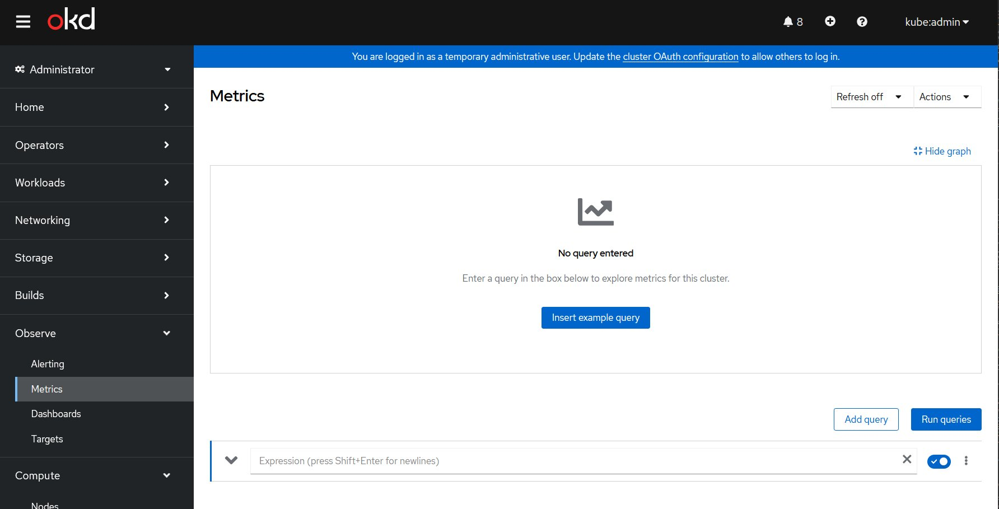
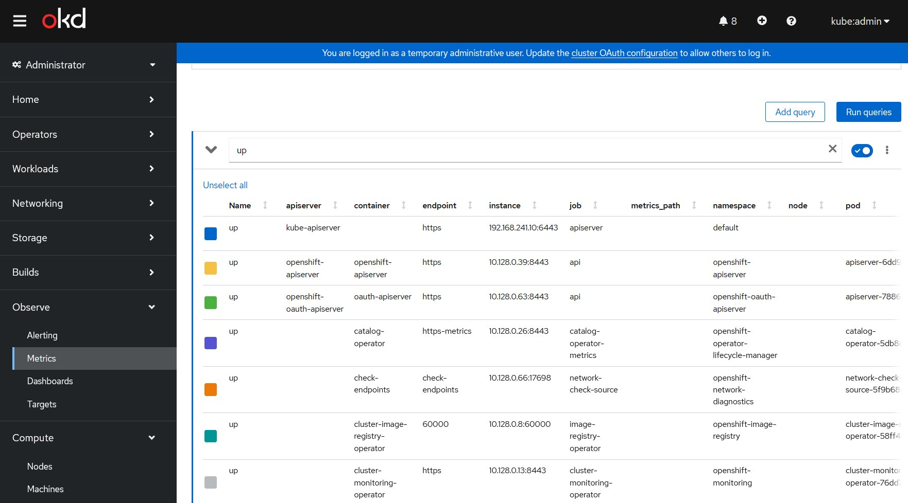
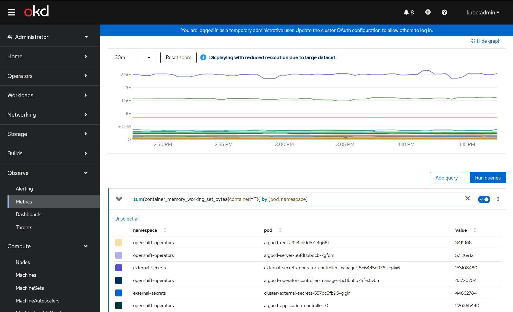
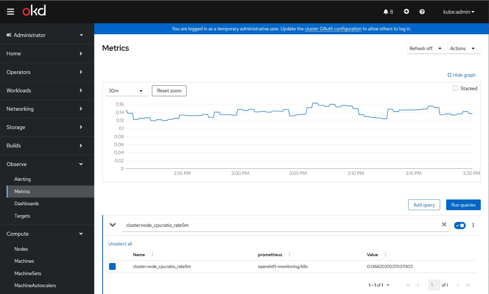
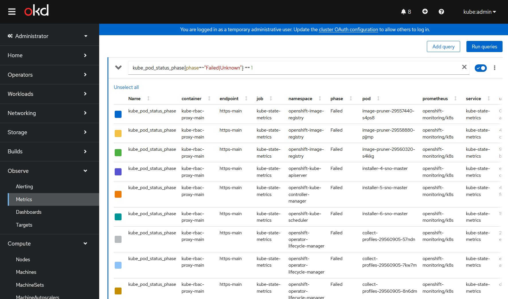
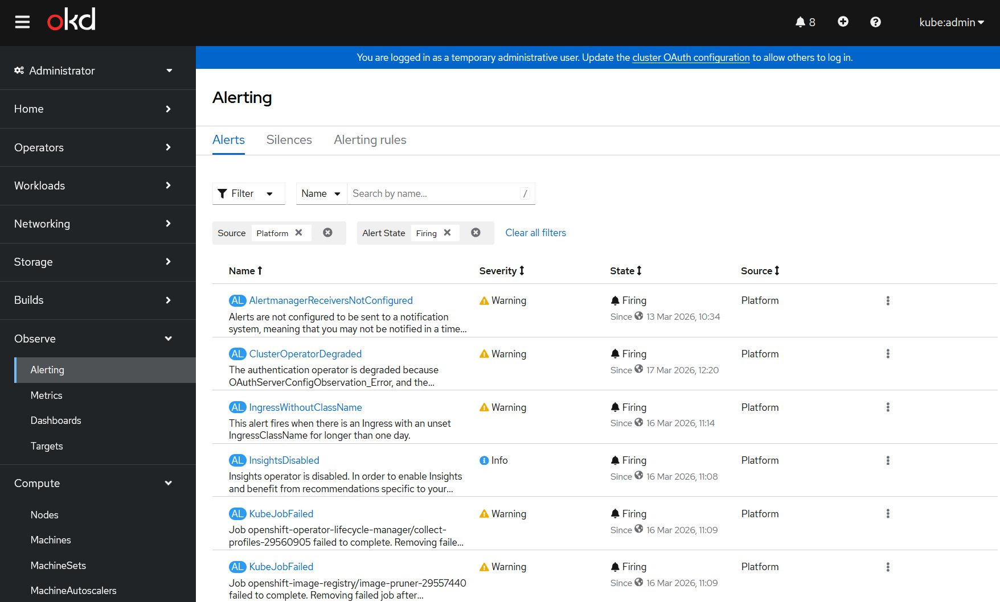
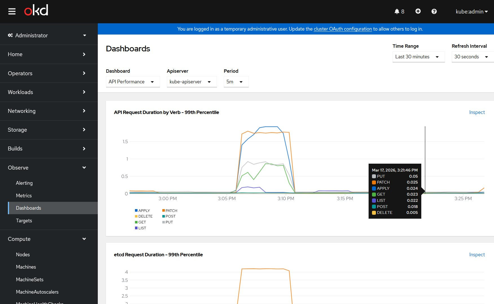

# Phase 2b — Validation Monitoring OKD SNO

> Validation du stack monitoring built-in OKD 4.15
> 17 Mars 2026 — `sno-master` @ `192.168.241.10`

---

## Vue d'ensemble

OKD inclut un stack monitoring complet basé sur Prometheus, **déployé automatiquement**
lors du bootstrap du cluster. Aucune installation supplémentaire n'est nécessaire.

```
NS: openshift-monitoring
├── prometheus-k8s-0          ✅ Running 6/6
├── alertmanager-main-0       ✅ Running 6/6
├── thanos-querier            ✅ Running 6/6
├── kube-state-metrics        ✅ Running 3/3
├── node-exporter             ✅ Running 2/2
├── prometheus-operator       ✅ Running 2/2
├── prometheus-adapter        ✅ Running 1/1
└── cluster-monitoring-operator ✅ Running 1/1
```

**Ce qui manque et sera installé en Phase 3 (airgap) :**
- **Grafana** — dashboards avancés (pas inclus dans OKD)
- **Loki** — logs centralisés (pas inclus dans OKD)

---

## Accès console monitoring

L'interface monitoring est intégrée directement dans la console OKD :

```
https://console-openshift-console.apps.sno.okd.lab
→ Observe → Metrics      (Prometheus queries)
→ Observe → Alerting     (Alertmanager)
→ Observe → Dashboards   (Dashboards intégrés)
→ Observe → Targets      (endpoints scrapés)
```

> ⚠️ Les Routes API monitoring (prometheus-k8s, alertmanager-main) exposent
> uniquement l'API `/api` — pas d'UI. Utiliser la console OKD pour l'interface graphique.

---

## 1. Interface Metrics — Prometheus intégré



*Console OKD → Observe → Metrics — interface Prometheus query intégrée*

---

## 2. Queries de validation

### Query `up` — Targets Prometheus



La query `up` retourne tous les targets Prometheus scrapés avec leur statut.
Tous les composants OKD sont visibles : kube-apiserver, openshift-apiserver,
oauth-apiserver, catalog-operator, cluster-monitoring-operator, etc.

### CPU par node


```promql
sum(rate(container_cpu_usage_seconds_total{container!=""}[5m])) by (node)
```

Node `sno-master` : **0.696 cores** utilisés sur 8 disponibles (~8.7% de charge).
Cluster SNO en bonne santé pour le lab.

### RAM par pod/namespace



```promql
sum(container_memory_working_set_bytes{container!=""}) by (pod, namespace)
```

Les pods les plus consommateurs sont visibles :
- `argocd-application-controller` (openshift-operators) — 226 MB
- `external-secrets-operator-controller-manager` (external-secrets) — 153 MB
- `cluster-external-secrets` (external-secrets) — 44 MB

### Charge CPU cluster



```promql
cluster:node_cpu:ratio_rate5m
```

Ratio CPU cluster : **0.136** (13.6% de charge globale) — très sain pour un SNO lab.

### Pods en erreur



```promql
kube_pod_status_phase{phase=~"Failed|Unknown"} == 1
```

Les pods `Failed` visibles sont **tous normaux** :

| Pod | Namespace | Explication |
|-----|-----------|-------------|
| `image-pruner-*` | openshift-image-registry | Jobs périodiques de nettoyage — comportement normal |
| `installer-4/5/6-sno-master` | openshift-kube-* | Jobs bootstrap de l'installation OKD — terminés |
| `collect-profiles-*` | openshift-operator-lifecycle-manager | Jobs de collecte périodiques — normaux |

> ℹ️ En Kubernetes, un Job qui termine son exécution reste en état `Failed` ou
> `Completed` dans les métriques — c'est le comportement attendu, pas un problème.
>
> **La vraie query pour détecter des crashs réels :**
> ```promql
> kube_pod_container_status_waiting_reason{reason="CrashLoopBackOff"} == 1
> ```
> → Aucun résultat = aucun crash ✅

---

## 3. Alerting — Alertmanager



Alertes actives (Source: Platform, State: Firing) — toutes **normales pour un lab** :

| Alerte | Sévérité | Explication |
|--------|----------|-------------|
| `AlertmanagerReceiversNotConfigured` | Warning | Pas de receiver configuré (Slack, email...) — normal en lab |
| `ClusterOperatorDegraded` | Warning | Authentication operator — OAuthServerConfigObservation_Error — lié à la config Keycloak |
| `IngressWithoutClassName` | Warning | Ingress sans IngressClassName — normal en OKD SNO |
| `InsightsDisabled` | Info | Red Hat Insights désactivé — normal en lab airgap |
| `KubeJobFailed` | Warning | Jobs image-pruner et collect-profiles — normaux |

> ⚠️ `ClusterOperatorDegraded` sur l'authentication operator mérite attention —
> lié à `OAuthServerConfigObservation_Error`. À surveiller après la configuration
> Keycloak OIDC complète.

---

## 4. Dashboards intégrés

### API Performance



Dashboard **API Performance** — kube-apiserver :
- **API Request Duration by Verb (99th percentile)** : pic à ~1.5s sur APPLY/PATCH
  au moment des syncs ArgoCD (normal), retour à <0.05s en régime stable
- **etcd Request Duration (99th percentile)** : pic à ~4s lors des syncs — normal
  pour un SNO avec stockage NVMe local

---

## 5. Targets Prometheus

Accessible via **Observe → Targets** — liste tous les endpoints scrapés par Prometheus.

Vérifications importantes :
- Tous les COs (Cluster Operators) ont un endpoint actif
- Les namespaces applicatifs (vault, keycloak, external-secrets, openshift-operators)
  sont scrapés automatiquement

---

## Récapitulatif monitoring Phase 2b

| Composant | Source | Statut |
|-----------|--------|--------|
| Prometheus | Built-in OKD | ✅ Running |
| Alertmanager | Built-in OKD | ✅ Running |
| Thanos Querier | Built-in OKD | ✅ Running |
| kube-state-metrics | Built-in OKD | ✅ Running |
| node-exporter | Built-in OKD | ✅ Running |
| Dashboards intégrés | Built-in OKD | ✅ Disponibles |
| **Grafana** | À installer | ⏳ Phase 3 (airgap) |
| **Loki (logs)** | À installer | ⏳ Phase 3 (airgap) |

---

## Ce qu'un Platform Engineer vérifie au quotidien

```
Console OKD → Observe
├── Alerting   → filtrer "Firing" + "Critical" → aucune alerte critique ✅
├── Metrics    → queries clés :
│   ├── up                                    → tous targets up ✅
│   ├── cluster:node_cpu:ratio_rate5m         → charge CPU ✅
│   ├── container_memory_working_set_bytes    → consommation RAM ✅
│   └── kube_pod_container_status_waiting_reason{reason="CrashLoopBackOff"}
│                                             → aucun crash ✅
├── Dashboards → API Performance + etcd       → latences normales ✅
└── Targets    → tous endpoints scrapés ✅
```

---

## Prochaine étape — Phase 3 Airgap

Grafana et Loki seront installés **en airgap** depuis Harbor :

```
oc-mirror → mirror grafana-operator + loki-operator → Harbor
ICSP → OKD pull depuis Harbor (zéro Internet)
ArgoCD → déploie Grafana + Loki depuis Harbor
→ Stack observabilité complète en environnement déconnecté ✅
```

→ [Documentation Phase 3 Airgap](phase3-airgap.md)

---

## Screenshots — Index

| Fichier | Contenu |
|---------|---------|
| `phase2b-monitoring-metrics-empty.png` | Console OKD → Observe → Metrics |
| `phase2b-monitoring-query-up.png` | Query `up` — tous targets Prometheus |
| `phase2b-monitoring-query-cpu.png` | Query CPU par node — sno-master 0.696 cores |
| `phase2b-monitoring-query-memory.png` | Query RAM par pod/namespace |
| `phase2b-monitoring-query-cpu-ratio.png` | Query cluster:node_cpu:ratio_rate5m — 13.6% |
| `phase2b-monitoring-query-pod-failed.png` | Query pods Failed — jobs normaux uniquement |
| `phase2b-monitoring-alerting.png` | Alerting — 5 alertes Warning/Info, toutes normales |
| `phase2b-monitoring-dashboard-api.png` | Dashboard API Performance — latences normales |

---

*Projet `Z3ROX-lab/Openshift-OKD-SNO-Airgap-workstation`*
*Phase 2b Monitoring Validation — 17 Mars 2026*
