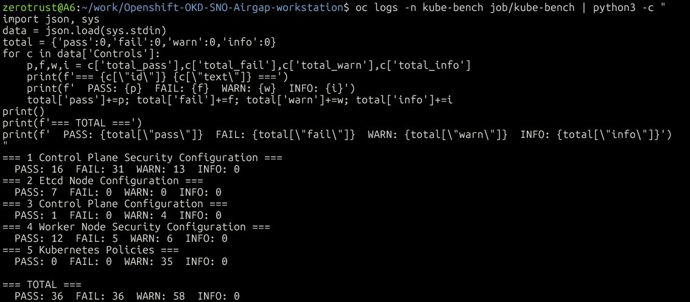
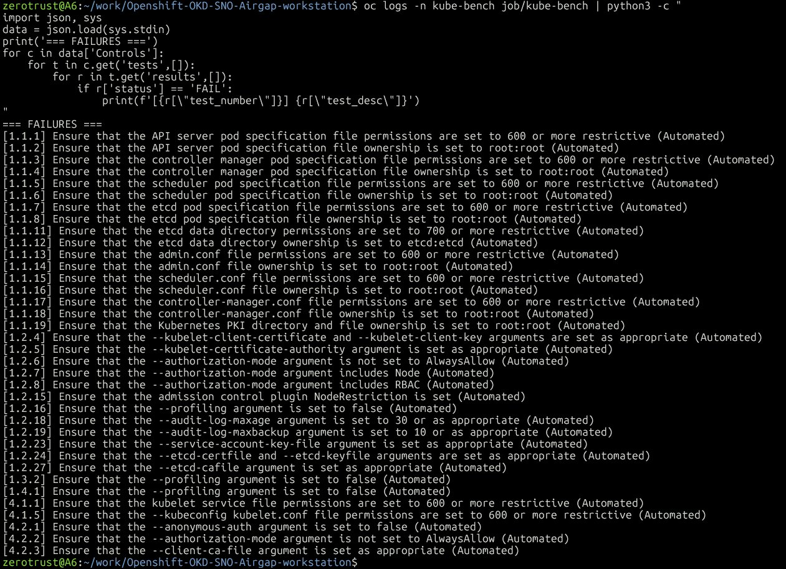
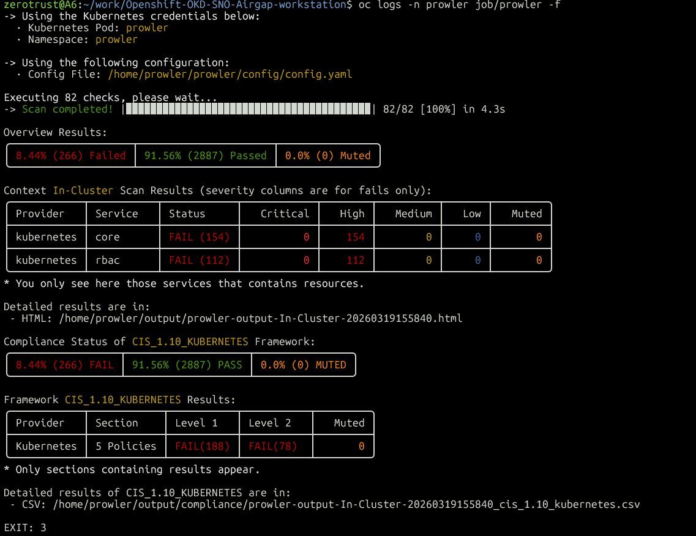
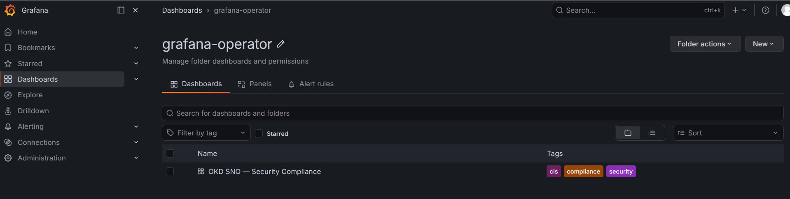
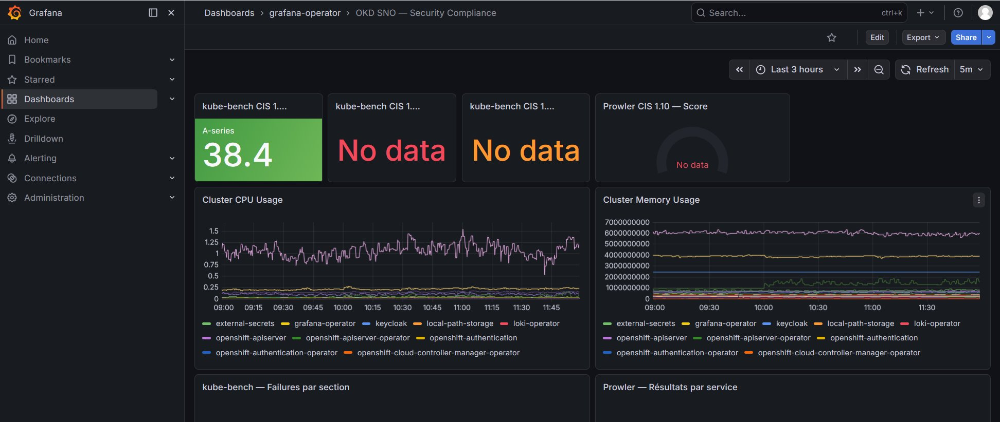

# Phase 3 — Airgap : oc-mirror + Harbor + Grafana + Loki + Compliance

> Simulation d'un environnement déconnecté type grands comptes
> OKD 4.15 SNO — Harbor 2.11 — oc-mirror v4.15
> Mars 2026

---

## Concept airgap

Un cluster **airgap** est un cluster sans accès Internet direct. Toutes les images,
Helm charts et operators passent par des services **internes au réseau**.

C'est la configuration standard sur les environnements sensibles :
- 🏦 Banques / Finance (DORA, PCI-DSS)
- 🛡️ Défense / Gouvernement (ANSSI, SecNumCloud)
- 📡 Télécommunications (Nokia, Orange, Telefónica)

### Airgap progressif vs airgap strict

Dans ce lab, on utilise un **airgap progressif** — pattern réaliste en entreprise :

```
MODE 1 — Airgap strict (défense, gouvernement)
  → Mirror TOUT avant déconnexion
  → Cluster coupé définitivement
  → oc-mirror obligatoire upfront

MODE 2 — Airgap progressif (notre setup — banque, telco)
  → Harbor est la seule registry autorisée par le cluster
  → WSL2/bastion a encore Internet
  → On pousse dans Harbor au fur et à mesure
  → Cluster ne voit jamais Internet directement
  → docker pull (bastion) → docker push (Harbor) → cluster pull (Harbor)
```

**C'est le pattern réel chez Nokia, Orange, Telefónica** — le bastion/DMZ fait le pont,
pas le cluster. Harbor = point de contrôle centralisé avec Trivy scan automatique.

### Comment ajouter des images dans Harbor

Trois méthodes disponibles :

```
1. docker/skopeo push (notre méthode principale)
   docker pull image:tag
   docker push harbor.okd.lab/okd-mirror/image:tag

2. Harbor Replication Rules (UI)
   Harbor UI → Administration → Replications → New Rule
   → Harbor se connecte lui-même à Internet et pull les images
   → Plus besoin de passer par WSL2

3. Harbor Proxy Cache
   Harbor UI → New Project → Proxy Cache ✅
   → Pull-through cache automatique
   → Premier pull → Harbor va chercher sur Internet
   → Suivants → servi depuis Harbor
```

---

## Architecture complète

```
┌─────────────────────────────────────────────────────────────────────────────┐
│                    PLAN AIRGAP — PHASE 3                                    │
│                                                                             │
│  OBJECTIF : OKD peut fonctionner SANS Internet                              │
│  Toutes les images → Harbor (192.168.241.20)                                │
└─────────────────────────────────────────────────────────────────────────────┘

ETAPE 1 — oc-mirror (WSL2, connecté Internet)
┌─────────────────────────────────────────────────────────────────────────────┐
│  quay.io / docker.io / ghcr.io ──► oc-mirror v4.15                         │
│                                     ├── grafana-operator (v5)               │
│                                     ├── loki-operator (alpha)               │
│                                     ├── hashicorp/vault:1.16.1              │
│                                     └── grafana/loki:3.5.5                  │
└──────────────────────────────────────────────────────────────────────────┬─┘
                                                                           │
ETAPE 2 — Harbor reçoit les images                                         │
┌──────────────────────────────────────────────────────────────────────────▼─┐
│  Harbor VM (192.168.241.20) — harbor.okd.lab                               │
│  Project: okd-mirror + Trivy scan auto                                      │
│  ├── okd-mirror/grafana/grafana:latest           ✅                         │
│  ├── okd-mirror/operatorhubio/catalog:latest     ✅ (catalog OLM)           │
│  ├── okd-mirror/aquasec/kube-bench:latest        ✅                         │
│  ├── okd-mirror/toniblyx/prowler:latest          ✅ (push manuel bastion)   │
│  └── okd-mirror/rancher/local-path-provisioner   ✅ (push manuel bastion)   │
└──────────────────────────────────────────────────────────────────────────┬─┘
                                                                           │
ETAPE 3 — ICSP + CatalogSource → OKD redirige vers Harbor                 │
┌──────────────────────────────────────────────────────────────────────────▼─┐
│  ImageDigestMirrorSet generic-0                                             │
│  → quay.io/docker.io/ghcr.io → harbor.okd.lab/okd-mirror                  │
│  CatalogSource community-operators                                          │
│  → harbor.okd.lab/okd-mirror/operatorhubio/catalog:latest                 │
└──────────────────────────────────────────────────────────────────────────┬─┘
                                                                           │
ETAPE 4 — ArgoCD déploie depuis Git (via tinyproxy)                        │
┌──────────────────────────────────────────────────────────────────────────▼─┐
│  GitHub ──► ArgoCD ──► OLM ──► Operators depuis Harbor ✅                  │
│                    ──► Jobs ──► kube-bench / Prowler ✅                     │
│                    ──► Grafana instance + dashboard ✅                      │
│  Zéro accès Internet depuis le cluster ✅                                   │
└─────────────────────────────────────────────────────────────────────────────┘
```

---

## Schéma flux GitOps airgap — Grafana + Loki

```
╔══════════════════════════════════════════════════════════════════════╗
║           GRAFANA + LOKI — DÉPLOIEMENT AIRGAP OKD SNO               ║
╚══════════════════════════════════════════════════════════════════════╝

  WSL2 / Git                    Harbor VM                  OKD SNO
  (192.168.241.1)               (192.168.241.20)           (192.168.241.10)
  ┌─────────────┐               ┌──────────────────┐       ┌──────────────────────────────┐
  │  GitHub     │  git push     │  okd-mirror/     │       │  ArgoCD (root-app)           │
  │  Z3ROX-lab/ │──────────────►│  operatorhubio/  │       │  watches argocd/applications/│
  │  repo       │               │  catalog:latest  │       │  ├── grafana.yaml            │
  └─────────────┘               │  grafana/grafana │       │  └── loki.yaml               │
                                 └────────┬─────────┘       │            │                 │
                                          │  pull images     │  ┌─────────▼──────────────┐ │
                                          │◄─────────────────│  │  OLM                   │ │
                                          │  ✅ No Internet  │  │  CatalogSource Harbor  │ │
                                          │                  │  │  ├── grafana-operator  │ │
                                          │                  │  │  │   CSV v5.22.2       │ │
                                          │                  │  │  └── loki-operator     │ │
                                          │                  │  │      CSV v0.9.0        │ │
                                          │                  │  └────────────────────────┘ │
                                          │                  └──────────────────────────────┘
                                                    ZERO INTERNET TRAFFIC ✅
```

---

## Checklist Phase 3

```
✅ oc-mirror v4.15 installé + libgpgme11
✅ CA Harbor ajoutée au store système WSL2
✅ imageset-config.yaml créé et commité
✅ Projet okd-mirror dans Harbor + Trivy scan auto
✅ Mirror réel — 4.62 GiB dans Harbor
✅ ICSP appliqué — MachineConfigPool UPDATED=True
✅ CatalogSource community-operators → Harbor
✅ Grafana Operator v5.22.2 installé via OLM airgap
✅ Loki Operator v0.9.0 installé via OLM airgap
✅ kube-bench CIS 1.8 — 36 PASS / 36 FAIL / 58 WARN
✅ Prowler CIS 1.10 — 2887 PASS (91.56%) / 266 FAIL
✅ local-path-provisioner StorageClass installée
✅ Grafana instance déployée via ArgoCD
✅ Datasource Prometheus OKD (token via Vault → ESO)
✅ Dashboard Security Compliance (CPU/Memory/compliance)
❌ LokiStack — trop lourd pour SNO lab (Insufficient CPU)
❌ Validation cluster sans Internet
```

---

## Installation Grafana + Loki Operators via OLM airgap

### Stratégie — OLM via OperatorHub airgap

On utilise **OLM (Operator Lifecycle Manager)** plutôt que Helm direct :
- Le catalog `operatorhubio/catalog:latest` est mirrored dans Harbor
- `grafana-operator` et `loki-operator` disponibles via `oc get packagemanifest`
- Approche native OKD — cohérente avec Vault, Keycloak, ESO
- L'utilisateur final voit exactement la même chose que sans airgap

```bash
# Channels et CSVs disponibles
oc get packagemanifest grafana-operator -o jsonpath='{.status.defaultChannel}'
# → v5
oc get packagemanifest grafana-operator -o jsonpath='{.status.channels[0].currentCSV}'
# → grafana-operator.v5.22.2

oc get packagemanifest loki-operator -o jsonpath='{.status.defaultChannel}'
# → alpha
oc get packagemanifest loki-operator -o jsonpath='{.status.channels[0].currentCSV}'
# → loki-operator.v0.9.0
```

### Prérequis namespaces (ArgoCD namespaced mode)

```bash
oc create namespace grafana-operator
oc create namespace loki-operator
oc label namespace grafana-operator argocd.argoproj.io/managed-by=openshift-operators
oc label namespace loki-operator argocd.argoproj.io/managed-by=openshift-operators
```

### Résultat final ArgoCD

```
eso              Synced   Healthy  ✅
grafana          Synced   Healthy  ✅
grafana-instance Synced   Healthy  ✅
keycloak         Synced   Healthy  ✅
keycloak-secrets Synced   Healthy  ✅
loki             Synced   Healthy  ✅
root-app         Synced   Healthy  ✅
vault            Synced   Healthy  ✅
```

---

## kube-bench — CIS Kubernetes Benchmark

### Déploiement

kube-bench se déploie en **Job ponctuel** — image depuis Harbor, zéro Internet.

```bash
oc apply -f manifests/kube-bench/kube-bench-job.yaml
# → Job complété en 13s ✅
# → Image pullée depuis harbor.okd.lab/okd-mirror/aquasec/kube-bench:latest ✅
```

### Résultats CIS 1.8



```
=== 1 Control Plane Security Configuration ===  PASS: 16  FAIL: 31  WARN: 13
=== 2 Etcd Node Configuration ===               PASS: 7   FAIL: 0   WARN: 0
=== 3 Control Plane Configuration ===           PASS: 1   FAIL: 0   WARN: 4
=== 4 Worker Node Security Configuration ===    PASS: 12  FAIL: 5   WARN: 6
=== 5 Kubernetes Policies ===                   PASS: 0   FAIL: 0   WARN: 35
─────────────────────────────────────────────────────────────────────────────
TOTAL                                           PASS: 36  FAIL: 36  WARN: 58
```



> ⚠️ Les 31 FAILs en section 1 sont normaux sur OKD — kube-bench cherche les
> fichiers vanilla Kubernetes alors qu'OKD les gère via Static Pods + MachineConfig.

---

## Prowler — Conformité CIS 1.10 Kubernetes

### Déploiement

Prowler tourne en Job ponctuel. Deux points importants sur OKD :

```bash
# 1. anyuid SCC nécessaire — OKD force UID random, Prowler nécessite UID 1000
oc adm policy add-scc-to-user anyuid -z prowler -n prowler

# 2. hostAliases pour résoudre harbor.okd.lab depuis le pod
# (ajouté dans le spec du Job)
```

### Résultats CIS 1.10



```
82 checks exécutés en 4.3s

PASS : 2887 (91.56%) ✅
FAIL :  266 (8.44%)

kubernetes/core  → FAIL 154 (High)
kubernetes/rbac  → FAIL 112 (High)

CIS_1.10_KUBERNETES :
  Level 1 → FAIL 188
  Level 2 → FAIL 78
```

---

## StorageClass — local-path-provisioner

OKD SNO n'a pas de StorageClass par défaut. On installe `local-path-provisioner`
de Rancher pour les PVCs (LokiStack WAL, compactor, index-gateway) :

```bash
docker pull rancher/local-path-provisioner:v0.0.26
docker push harbor.okd.lab/okd-mirror/rancher/local-path-provisioner:v0.0.26

oc get storageclass
# → local-path (default)   rancher.io/local-path   WaitForFirstConsumer ✅
```

---

## Grafana — Instance + Datasource Prometheus + Dashboard

### Schéma flux secrets Grafana

```
╔══════════════════════════════════════════════════════════════════════════════╗
║              GRAFANA — FLUX COMPLET SECRETS + MÉTRIQUES                     ║
╚══════════════════════════════════════════════════════════════════════════════╝

  Vault (secret/grafana)
  └── prometheus_token: eyJhbGci...    (token SA grafana-prometheus)
            │
            │ ESO lit Vault toutes les 1h
            │ SecretStore vault-backend (role: grafana, policy: grafana-policy)
            ▼
  Secret K8s "grafana-prometheus-token"
  └── token: eyJhbGci...
            │
            │ GrafanaDatasource référence le Secret
            ▼
  Grafana → Authorization: Bearer <token> → Prometheus OKD :9091
                                             └── métriques CPU/RAM/pods ✅

  ServiceAccount grafana-prometheus
  └── rôle cluster-monitoring-view → peut lire toutes les métriques OKD
```

### Déploiement via ArgoCD

```
manifests/grafana-instance/
├── 00-secret-store.yaml          # SecretStore vault-backend
├── 01-external-secret.yaml       # ESO → token Prometheus depuis Vault
├── 01-grafana.yaml               # CR Grafana instance
├── 02-datasource-prometheus.yaml # GrafanaDatasource Prometheus OKD
└── 03-dashboard-compliance.yaml  # GrafanaDashboard Security Compliance
```

### Grafana accessible

```
URL  : https://grafana.apps.sno.okd.lab
User : admin
Pass : admin123!
```

```bash
# Validation datasource Prometheus
curl -sk -u admin:admin123! \
  "https://grafana.apps.sno.okd.lab/api/datasources/proxy/1/api/v1/query?query=up"
# → status: success ✅
```

### Dashboard Security Compliance





Panels du dashboard :
- kube-bench CIS 1.8 — PASS/FAIL/WARN (stat panels)
- Prowler CIS 1.10 — Score global (gauge)
- Cluster CPU Usage par namespace (timeseries)
- Cluster Memory Usage par namespace (timeseries)
- kube-bench Failures par section (table)
- Prowler Résultats par service (piechart)
- Pod Restarts tous namespaces (timeseries)

---

## Note sur ArgoCD en airgap partiel

```
Airgap partiel (Phase 3) :
  Images → Harbor ✅
  Git    → GitHub via tinyproxy ⚠️

Airgap total (Phase 4) :
  Images → Harbor ✅
  Git    → GitLab in-cluster ✅
  CI/CD  → GitLab Runner in-cluster ✅
```

---

## Problèmes rencontrés et solutions

| Problème | Cause | Solution |
|----------|-------|----------|
| `x509: certificate signed by unknown authority` | CA Harbor non reconnue | `sudo update-ca-certificates` avec ca.crt Harbor |
| `cluster level Namespace cannot be managed` | ArgoCD mode namespaced | Exclure `00-namespace.yaml` + créer namespace manuellement |
| `namespace "X" is not managed` | Namespace non labellisé ArgoCD | `oc label namespace X argocd.argoproj.io/managed-by=openshift-operators` |
| `OwnNamespace InstallModeType not supported` | Loki Operator ne supporte pas OwnNamespace | OperatorGroup `spec: {}` (AllNamespaces mode) |
| `prowler executable not found in $PATH` | Entrypoint image = `poetry run prowler` | `command: ["poetry", "run", "prowler", ...]` |
| `unable to start container: uid=1000880000` | OKD force UID random | `oc adm policy add-scc-to-user anyuid` + `runAsUser: 1000` |
| `harbor.okd.lab: no such host` dans pods | DNS Harbor non résolu | `hostAliases` dans le Job spec |
| PVCs Pending `no storage class is set` | StorageClass créée après PVCs | Supprimer PVCs + LokiStack, recréer avec `storageClassName: local-path` |
| `Insufficient CPU` LokiStack | SNO lab limité en CPU | LokiStack retiré — revisiter avec HyperShift + Azure NodePools |
| `NO MATCHING INSTANCES` GrafanaDatasource | Faux positif d'affichage | Vérifier `status.datasources` sur la CR Grafana |

---

## Screenshots — Index

| Fichier | Contenu |
|---------|---------|
| `phase3-harbor-okd-mirror.png` | Projet okd-mirror dans Harbor — 4.62 GiB mirrored |
| `phase3-catalogsource-created.png` | CatalogSource community-operators → Harbor |
| `phase3-icsp-mcp-updated.png` | MachineConfigPool UPDATED=True post-ICSP |
| `phase3-kube-bench-summary.png` | kube-bench — résumé par section (36P/36F/58W) |
| `phase3-kube-bench-failures.png` | kube-bench — liste des 36 failures |
| `phase3-prowler-results.png` | Prowler — 82 checks, 91.56% PASS, CIS 1.10 |
| `phase3-grafana-dashboard-list.png` | Grafana — dashboard Security Compliance dans la liste |
| `phase3-grafana-compliance-dashboard.png` | Grafana — dashboard CPU/Memory/compliance |

---

## Prochaine étape — Phase 4

```
❌ GitLab in-cluster (airgap Git complet)
❌ GitLab CI/CD pipeline (build → Harbor → OKD)
❌ Cosign + Kyverno enforcement
❌ HyperShift + Azure NodePools
❌ LokiStack sur nœuds dédiés Azure
❌ Airgap total validé
```

---

*Projet `Z3ROX-lab/Openshift-OKD-SNO-Airgap-workstation`*
*Phase 3 Airgap — Mars 2026*
