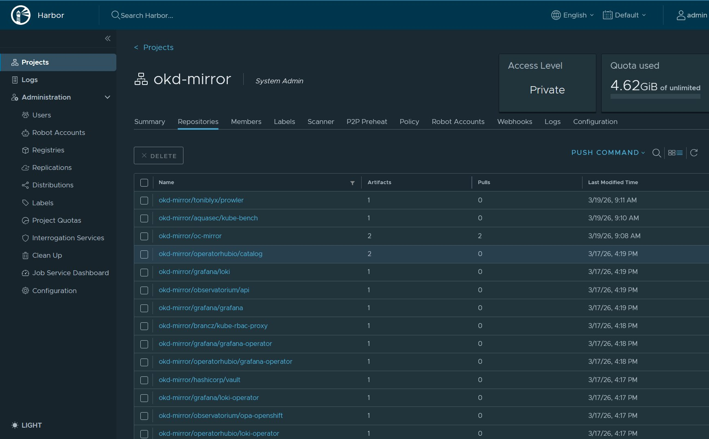
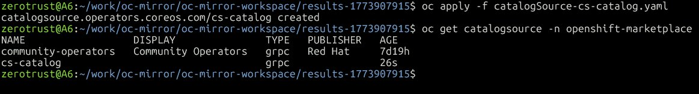
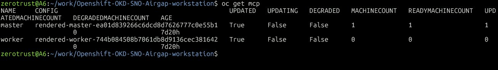

# Phase 3 — Airgap : oc-mirror + Harbor + Grafana + Loki

> Simulation d'un environnement déconnecté type grands comptes
> OKD 4.15 SNO — Harbor 2.11 — oc-mirror v4.15
> Mars 2026

---

## Concept airgap

Un cluster **airgap** est un cluster sans accès Internet direct. Toutes les images,
Helm charts et operators passent par des services **internes au réseau**.

C'est la configuration standard sur les environnements sensibles :
- 🏦 Banques / Finance (DORA, PCI-DSS)
- 🛡️ Défense / Gouvernement (ANSSI, SecNumCloud)
- 📡 Télécommunications (Nokia, Orange, Telefónica)

---

## Architecture complète

```
┌─────────────────────────────────────────────────────────────────────────────┐
│                    PLAN AIRGAP — PHASE 3                                    │
│                                                                             │
│  OBJECTIF : OKD peut fonctionner SANS Internet                              │
│  Toutes les images → Harbor (192.168.241.20)                                │
└─────────────────────────────────────────────────────────────────────────────┘

ETAPE 1 — oc-mirror (WSL2, connecté Internet)
┌─────────────────────────────────────────────────────────────────────────────┐
│                                                                             │
│  Internet                    WSL2 (948G dispo)                              │
│                                                                             │
│  quay.io ──────────────────► oc-mirror v4.15                               │
│  docker.io ────────────────► │                                             │
│  ghcr.io ──────────────────► │  ImageSetConfiguration :                    │
│                              │  airgap/imageset-config.yaml                │
│                              │  ├── operators:                             │
│                              │  │   ├── grafana-operator (v5)              │
│                              │  │   └── loki-operator (alpha)              │
│                              │  └── additionalImages:                      │
│                              │      ├── hashicorp/vault:1.16.1             │
│                              │      └── grafana/loki:3.5.5                 │
│                              │                                             │
│                              ▼                                             │
│                    Images mirrorées (~1.5 Go) :                            │
│                    ├── grafana/grafana:12.4.1                               │
│                    ├── grafana/grafana-operator:v5.22.2                    │
│                    ├── grafana/loki:3.5.5                                  │
│                    ├── grafana/loki-operator:0.9.0                         │
│                    ├── hashicorp/vault:1.16.1                              │
│                    ├── brancz/kube-rbac-proxy:v0.18.1                     │
│                    ├── observatorium/api:latest                            │
│                    └── observatorium/opa-openshift:latest                  │
└──────────────────────────────────────────────────────────────────────────┬─┘
                                                                           │
                              Push direct registry-to-registry
                              docker://harbor.okd.lab/okd-mirror
                                                                           │
ETAPE 2 — Harbor reçoit les images                                         │
┌──────────────────────────────────────────────────────────────────────────▼─┐
│                                                                             │
│  Harbor VM (192.168.241.20)                                                 │
│  harbor.okd.lab                                                             │
│                                                                             │
│  Project: okd-mirror (Private)                                              │
│  ├── okd-mirror/grafana/grafana:12.4.1          ✅                          │
│  ├── okd-mirror/grafana/grafana-operator:v5.22.2 ✅                         │
│  ├── okd-mirror/grafana/loki:3.5.5              ✅                          │
│  ├── okd-mirror/grafana/loki-operator:0.9.0     ✅                          │
│  ├── okd-mirror/hashicorp/vault:1.16.1          ✅                          │
│  ├── okd-mirror/brancz/kube-rbac-proxy:v0.18.1  ✅                         │
│  └── okd-mirror/operatorhubio/catalog:latest    ✅ (catalog index)          │
│                                                                             │
│  Trivy → scan CVE automatique à chaque push ✅                              │
└──────────────────────────────────────────────────────────────────────────┬─┘
                                                                           │
ETAPE 3 — Configurer OKD pour Harbor (ICSP + CatalogSource)               │
┌──────────────────────────────────────────────────────────────────────────▼─┐
│                                                                             │
│  oc apply -f oc-mirror-workspace/results-*/imageContentSourcePolicy.yaml   │
│  │                                                                          │
│  │  ImageContentSourcePolicy (ICSP) = règle de redirection transparente    │
│  │  ┌────────────────────────────────────────────────────────────────┐     │
│  │  │  quay.io/operatorhubio/catalog → harbor.okd.lab/okd-mirror/.. │     │
│  │  │  docker.io/grafana/grafana     → harbor.okd.lab/okd-mirror/.. │     │
│  │  │  ghcr.io/grafana/...           → harbor.okd.lab/okd-mirror/.. │     │
│  │  │  docker.io/hashicorp/vault     → harbor.okd.lab/okd-mirror/.. │     │
│  │  └────────────────────────────────────────────────────────────────┘     │
│  │  Les pods pullent depuis quay.io/docker.io → OKD redirige vers Harbor  │
│  │  Transparence totale — aucun changement dans les manifests              │
│  │                                                                          │
│  oc apply -f oc-mirror-workspace/results-*/catalogSource-*.yaml            │
│  │                                                                          │
│  │  CatalogSource = index operators depuis Harbor                           │
│  │  OperatorHub pointe sur harbor.okd.lab/okd-mirror au lieu d'Internet   │
│  │                                                                          │
│  oc patch OperatorHub cluster --disable-all-default-sources=true           │
│  │                                                                          │
│  │  Désactive les CatalogSources Internet (community-operators, etc.)      │
└──────────────────────────────────────────────────────────────────────────┬─┘
                                                                           │
ETAPE 4 — Installer Grafana + Loki via ArgoCD (airgap)                    │
┌──────────────────────────────────────────────────────────────────────────▼─┐
│                                                                             │
│  GitHub ──► ArgoCD (via tinyproxy) ──► OKD                                 │
│                                                                             │
│  argocd/applications/grafana.yaml   → installe grafana-operator via OLM   │
│  argocd/applications/loki.yaml      → installe loki-operator via OLM      │
│                                                                             │
│  OLM pull catalog depuis harbor.okd.lab/okd-mirror (ICSP) ✅               │
│  Pods pull images depuis harbor.okd.lab/okd-mirror (ICSP) ✅               │
│  Zéro accès Internet requis ✅                                              │
└──────────────────────────────────────────────────────────────────────────┬─┘
                                                                           │
RESULTAT FINAL                                                             │
┌──────────────────────────────────────────────────────────────────────────▼─┐
│                                                                             │
│  AVANT airgap                    APRES airgap                               │
│                                                                             │
│  quay.io ──► OKD                 Harbor ──► OKD (ICSP)                    │
│  docker.io ──► OKD               Harbor ──► OKD (ICSP)                    │
│  OperatorHub ──► Internet        OperatorHub ──► Harbor (CatalogSource)   │
│  ArgoCD ──► github.com           ArgoCD ──► github.com (tinyproxy)        │
│                                                                             │
│  Stack observabilité complète en airgap :                                  │
│  ├── Prometheus    ✅ built-in OKD                                          │
│  ├── Alertmanager  ✅ built-in OKD                                          │
│  ├── Thanos        ✅ built-in OKD                                          │
│  ├── Grafana       ✅ installé depuis Harbor en airgap                     │
│  └── Loki          ✅ installé depuis Harbor en airgap                     │
└─────────────────────────────────────────────────────────────────────────────┘
```

---

## Schéma flux GitOps airgap — Grafana + Loki

```
╔══════════════════════════════════════════════════════════════════════╗
║           GRAFANA + LOKI — DÉPLOIEMENT AIRGAP OKD SNO               ║
╚══════════════════════════════════════════════════════════════════════╝

  WSL2 / Git                    Harbor VM                  OKD SNO
  (192.168.241.1)               (192.168.241.20)           (192.168.241.10)
  ┌─────────────┐               ┌──────────────────┐       ┌─────────────────────────────────┐
  │             │               │                  │       │                                 │
  │  GitHub     │               │  okd-mirror/     │       │  ┌─────────────────────────┐   │
  │  repo       │               │  operatorhubio/  │       │  │  ArgoCD (root-app)      │   │
  │             │               │  catalog:latest  │       │  │  openshift-operators    │   │
  └─────────────┘               │                  │       │  │                         │   │
        │                       │  operatorhubio/  │       │  │  watches                │   │
        │  git push             │  grafana-operator│       │  │  argocd/applications/   │   │
        │                       │                  │       │  │  ├── grafana.yaml  ──┐  │   │
        ▼                       │  operatorhubio/  │       │  │  └── loki.yaml    ──┼─►│   │
  ┌─────────────┐               │  loki-operator   │       │  └─────────────────────┼─┘│   │
  │  GitHub     │               │                  │       │                        │   │   │
  │  Z3ROX-lab/ │               │  grafana/grafana │       │  ┌─────────────────────▼─┐│   │
  │  repo       │               │  grafana/loki    │       │  │  OLM                  ││   │
  └─────────────┘               └────────┬─────────┘       │  │  openshift-marketplace││   │
                                         │                  │  │                       ││   │
                                         │  pull images     │  │  CatalogSource        ││   │
                                         │◄─────────────────│  │  community-operators  ││   │
                                         │                  │  │  → harbor.okd.lab/    ││   │
                                         │  ✅ No Internet  │  │    okd-mirror/        ││   │
                                         │     needed       │  │    operatorhubio/     ││   │
                                         │                  │  │    catalog:latest     ││   │
                                         │                  │  │                       ││   │
                                         │                  │  │  PackageManifest      ││   │
                                         │                  │  │  ├── grafana-operator ││   │
                                         │                  │  │  └── loki-operator    ││   │
                                         │                  │  └───────────┬───────────┘│   │
                                         │                  │              │            │   │
                                         │                  │  ┌───────────▼──────────┐ │   │
                                         │                  │  │  grafana-operator ns │ │   │
                                         │                  │  │  ├── OperatorGroup   │ │   │
                                         │                  │  │  ├── Subscription    │ │   │
                                         │                  │  │  └── CSV v5.22.2     │ │   │
                                         │                  │  │                      │ │   │
                                         │                  │  │  loki-operator ns    │ │   │
                                         │                  │  │  ├── OperatorGroup   │ │   │
                                         │                  │  │  ├── Subscription    │ │   │
                                         │                  │  │  └── CSV v0.9.0      │ │   │
                                         │                  │  └──────────────────────┘ │   │
                                         │                  └───────────────────────────┘   │
                                         └──────────────────────────────────────────────────┘
                                                    ZERO INTERNET TRAFFIC ✅
```

---

## Prérequis accomplis

```
✅ oc-mirror v4.15 installé + libgpgme11
✅ CA Harbor ajoutée au store système WSL2 (update-ca-certificates)
✅ imageset-config.yaml créé et commité (airgap/imageset-config.yaml)
✅ Projet okd-mirror créé dans Harbor (Public + Trivy scan auto)
✅ docker login harbor.okd.lab effectué
✅ Dry-run validé — 1.543 GiB à mirror
✅ Mirror réel — 4.62 GiB dans Harbor (Grafana + Loki + Vault + kube-bench + Prowler)
✅ ICSP appliqué — MachineConfigPool UPDATED=True (reboot SNO ~5 min)
✅ CatalogSource community-operators → Harbor (Option B transparente)
✅ CA Harbor → image.config.openshift.io/cluster
✅ community-operators Internet désactivé
✅ Grafana Operator v5.22.2 installé via OLM airgap
✅ Loki Operator v0.9.0 installé via OLM airgap
❌ kube-bench — rapport CIS Kubernetes Benchmark
❌ Prowler — rapport conformité NIS2/ISO27001
❌ Validation cluster sans Internet
```

---

## Screenshots

### Harbor — Projet okd-mirror (4.62 GiB mirrored)



*Projet okd-mirror dans Harbor — toutes les images mirrorées depuis quay.io/docker.io/ghcr.io*

### CatalogSource créée



*CatalogSource community-operators créée — pointe sur harbor.okd.lab (Option B)*

### MachineConfigPool — ICSP appliqué



*MachineConfigPool master UPDATED=True après reboot post-ICSP — redirection images active*

---

## ImageSetConfiguration

```yaml
# airgap/imageset-config.yaml
apiVersion: mirror.openshift.io/v1alpha2
kind: ImageSetConfiguration
storageConfig:
  local:
    path: /home/zerotrust/work/oc-mirror/workspace
mirror:
  operators:
    - catalog: quay.io/operatorhubio/catalog:latest
      packages:
        - name: grafana-operator
          channels:
            - name: v5
        - name: loki-operator
          channels:
            - name: alpha
  additionalImages:
    - name: docker.io/hashicorp/vault:1.16.1
    - name: docker.io/grafana/loki:3.5.5
```

### Images détectées automatiquement par oc-mirror

| Image | Source | Version | Via |
|-------|--------|---------|-----|
| grafana | docker.io/grafana | 12.4.1 | operator bundle |
| grafana-operator | ghcr.io/grafana | v5.22.2 | operator bundle |
| loki | docker.io/grafana | 3.5.5 | bundle + additionalImages |
| loki-operator | docker.io/grafana | 0.9.0 | operator bundle |
| vault | docker.io/hashicorp | 1.16.1 | additionalImages |
| kube-rbac-proxy | quay.io/brancz | v0.18.1 | operator bundle |
| observatorium/api | quay.io/observatorium | latest | operator bundle |
| opa-openshift | quay.io/observatorium | latest | operator bundle |

**Total : ~1.543 GiB**

---

## Commandes oc-mirror

### Installation oc-mirror

```bash
# Télécharger oc-mirror v4.15
wget https://mirror.openshift.com/pub/openshift-v4/clients/ocp/4.15.0/oc-mirror.tar.gz
tar xvf oc-mirror.tar.gz
sudo mv oc-mirror /usr/local/bin/
chmod +x /usr/local/bin/oc-mirror

# Dépendance libgpgme
sudo apt install -y libgpgme11

# Vérification
oc-mirror version
```

### Ajouter la CA Harbor au store système

```bash
scp harbor@192.168.241.20:~/harbor/certs/ca.crt /tmp/harbor-ca.crt
sudo cp /tmp/harbor-ca.crt /usr/local/share/ca-certificates/harbor-ca.crt
sudo update-ca-certificates

# Vérification
curl -v https://harbor.okd.lab/v2/ 2>&1 | grep "SSL certificate verify"
# → SSL certificate verify ok ✅
```

### Dry-run (validation sans téléchargement)

```bash
oc-mirror --config airgap/imageset-config.yaml \
  --dry-run \
  docker://harbor.okd.lab/okd-mirror
```

### Mirror réel

```bash
cd ~/work/oc-mirror

oc-mirror --config ~/work/Openshift-OKD-SNO-Airgap-workstation/airgap/imageset-config.yaml \
  docker://harbor.okd.lab/okd-mirror 2>&1 | tee /tmp/oc-mirror-run.txt
```

### Appliquer ICSP et CatalogSource

```bash
# Résultats générés dans oc-mirror-workspace/results-*/
ls oc-mirror-workspace/results-*/

# Appliquer la politique de redirection d'images
oc apply -f oc-mirror-workspace/results-*/imageContentSourcePolicy.yaml

# Appliquer le catalogue d'operators depuis Harbor
oc apply -f oc-mirror-workspace/results-*/catalogSource-*.yaml

# Désactiver les sources Internet
oc patch OperatorHub cluster --type json \
  -p '[{"op":"add","path":"/spec/disableAllDefaultSources","value":true}]'
```

### Vérification post-ICSP

```bash
# Vérifier que le nœud redémarre bien (MachineConfig update)
oc get nodes
oc get mcp

# Vérifier les CatalogSources
oc get catalogsource -n openshift-marketplace

# Vérifier OperatorHub depuis la console
# → Operators → OperatorHub → filtrer par "grafana" ou "loki"
# → Doit apparaître depuis harbor.okd.lab
```

---

## Installation Grafana + Loki via ArgoCD (airgap)

### Stratégie — OLM via OperatorHub airgap

On utilise **OLM (Operator Lifecycle Manager)** plutôt que Helm direct, car :
- Le catalog `operatorhubio/catalog:latest` est déjà mirrored dans Harbor
- `grafana-operator` et `loki-operator` sont disponibles via `oc get packagemanifest`
- C'est l'approche native OKD — cohérente avec Vault, Keycloak, ESO

```bash
# Vérifier la disponibilité dans le catalog Harbor
oc get packagemanifest | grep -iE "grafana|loki"
# → grafana-operator   ✅
# → loki-operator      ✅

# Channels et CSVs disponibles
oc get packagemanifest grafana-operator -o jsonpath='{.status.defaultChannel}' && echo
# → v5
oc get packagemanifest grafana-operator -o jsonpath='{.status.channels[0].currentCSV}' && echo
# → grafana-operator.v5.22.2

oc get packagemanifest loki-operator -o jsonpath='{.status.defaultChannel}' && echo
# → alpha
oc get packagemanifest loki-operator -o jsonpath='{.status.channels[0].currentCSV}' && echo
# → loki-operator.v0.9.0
```

### Manifests GitOps

**Structure créée :**

```
manifests/
├── grafana/
│   ├── 00-namespace.yaml       ← exclu ArgoCD (namespaced mode)
│   ├── 01-operatorgroup.yaml
│   └── 02-subscription.yaml
└── loki/
    ├── 00-namespace.yaml       ← exclu ArgoCD (namespaced mode)
    ├── 01-operatorgroup.yaml
    └── 02-subscription.yaml

argocd/applications/
├── grafana.yaml
└── loki.yaml
```

**manifests/grafana/01-operatorgroup.yaml :**

```yaml
apiVersion: operators.coreos.com/v1
kind: OperatorGroup
metadata:
  name: grafana-operator-group
  namespace: grafana-operator
spec:
  targetNamespaces:
    - grafana-operator
```

**manifests/grafana/02-subscription.yaml :**

```yaml
apiVersion: operators.coreos.com/v1alpha1
kind: Subscription
metadata:
  name: grafana-operator
  namespace: grafana-operator
spec:
  channel: v5
  name: grafana-operator
  source: community-operators
  sourceNamespace: openshift-marketplace
  startingCSV: grafana-operator.v5.22.2
  installPlanApproval: Automatic
```

**manifests/loki/02-subscription.yaml :**

```yaml
apiVersion: operators.coreos.com/v1alpha1
kind: Subscription
metadata:
  name: loki-operator
  namespace: loki-operator
spec:
  channel: alpha
  name: loki-operator
  source: community-operators
  sourceNamespace: openshift-marketplace
  startingCSV: loki-operator.v0.9.0
  installPlanApproval: Automatic
```

**argocd/applications/grafana.yaml :**

```yaml
apiVersion: argoproj.io/v1alpha1
kind: Application
metadata:
  name: grafana
  namespace: openshift-operators
  finalizers:
    - resources-finalizer.argocd.argoproj.io
spec:
  project: default
  source:
    repoURL: https://github.com/Z3ROX-lab/Openshift-OKD-SNO-Airgap-workstation
    targetRevision: HEAD
    path: manifests/grafana
    directory:
      exclude: '{*.sh,00-namespace.yaml}'
  destination:
    server: https://kubernetes.default.svc
    namespace: grafana-operator
  syncPolicy:
    automated:
      prune: false
      selfHeal: true
    syncOptions:
      - CreateNamespace=true
      - ServerSideApply=true
```

**argocd/applications/loki.yaml :**

```yaml
apiVersion: argoproj.io/v1alpha1
kind: Application
metadata:
  name: loki
  namespace: openshift-operators
  finalizers:
    - resources-finalizer.argocd.argoproj.io
spec:
  project: default
  source:
    repoURL: https://github.com/Z3ROX-lab/Openshift-OKD-SNO-Airgap-workstation
    targetRevision: HEAD
    path: manifests/loki
    directory:
      exclude: '{*.sh,00-namespace.yaml}'
  destination:
    server: https://kubernetes.default.svc
    namespace: loki-operator
  syncPolicy:
    automated:
      prune: false
      selfHeal: true
    syncOptions:
      - CreateNamespace=true
      - ServerSideApply=true
```

### Prérequis namespaces (ArgoCD namespaced mode)

ArgoCD Community Operator tourne en mode **namespaced** — il ne peut gérer que
les namespaces explicitement labellisés. Les namespaces doivent être créés
manuellement avant le déploiement :

```bash
# Créer les namespaces manuellement
oc create namespace grafana-operator
oc create namespace loki-operator

# Autoriser ArgoCD à gérer ces namespaces
oc label namespace grafana-operator argocd.argoproj.io/managed-by=openshift-operators
oc label namespace loki-operator argocd.argoproj.io/managed-by=openshift-operators
```

> ⚠️ **Pattern cohérent avec le projet** : tous les namespaces infrastructure
> (keycloak, vault, grafana-operator, loki-operator) sont créés manuellement.
> ArgoCD gère uniquement les ressources **dans** ces namespaces.

### Déploiement via GitOps

```bash
# Commit + push → root-app détecte et déploie automatiquement
git add manifests/grafana/ manifests/loki/ \
        argocd/applications/grafana.yaml \
        argocd/applications/loki.yaml
git commit -m "feat: add Grafana Operator v5 and Loki Operator v0.9.0 via OLM airgap"
git push

# Surveiller
watch oc get applications -n openshift-operators
```

### Résultat final

```
eso              Synced   Healthy  ✅
grafana          Synced   Healthy  ✅
keycloak         Synced   Healthy  ✅
keycloak-secrets Synced   Healthy  ✅
loki             Synced   Healthy  ✅
root-app         Synced   Healthy  ✅
vault            Synced   Healthy  ✅
```

---

## Problèmes rencontrés et solutions

| Problème | Cause | Solution |
|----------|-------|----------|
| `x509: certificate signed by unknown authority` | CA Harbor non reconnue par oc-mirror | `sudo update-ca-certificates` avec ca.crt Harbor |
| `BAD_REQUEST: invalid repository name` | Projet Harbor inexistant | Créer projet `okd-mirror` dans Harbor UI |
| `channel does not exist: lokistack-1.0` | Mauvais channel loki-operator | Utiliser channel `alpha` |
| `401 UNAUTHORIZED quay.io/grafana` | Version inexistante | Supprimer de additionalImages (inclus via bundle) |
| `fatal: not a git repository` | Mauvais dossier courant | `cd ~/work/Openshift-OKD-SNO-Airgap-workstation` |
| `cluster level Namespace cannot be managed (namespaced mode)` | ArgoCD mode namespaced — ne gère pas les ressources cluster-level | Exclure `00-namespace.yaml` + créer namespace manuellement |
| `namespace "grafana-operator" is not managed` | Namespace non labellisé pour ArgoCD | `oc label namespace grafana-operator argocd.argoproj.io/managed-by=openshift-operators` |

---

## Note sur ArgoCD en airgap partiel

Dans ce lab, ArgoCD continue d'accéder à GitHub via **tinyproxy** (10.128.0.2:8888).
Ce n'est pas un airgap total — c'est un airgap **images uniquement**.

Le vrai airgap Git complet nécessiterait GitLab installé dans le cluster
(prévu en Phase 4), ce qui rendrait le cluster totalement autonome :

```
Airgap partiel (Phase 3) :
  Images → Harbor ✅
  Git    → GitHub via tinyproxy ⚠️

Airgap total (Phase 4) :
  Images → Harbor ✅
  Git    → GitLab in-cluster ✅
  CI/CD  → GitLab Runner in-cluster ✅
```

---

## Prochaine étape — Phase 3 suite

```
✅ Grafana Operator v5.22.2 — Synced/Healthy
✅ Loki Operator v0.9.0     — Synced/Healthy
❌ kube-bench               — rapport CIS Kubernetes Benchmark
❌ Prowler                  — rapport conformité NIS2/ISO27001
❌ Validation cluster sans Internet
```

---

*Projet `Z3ROX-lab/Openshift-OKD-SNO-Airgap-workstation`*
*Phase 3 Airgap — Mars 2026*
